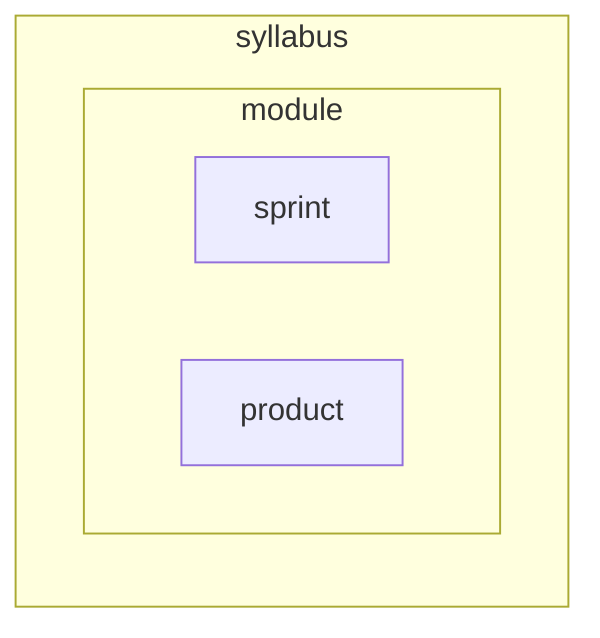

+++
title = 'Menus, menu_level'
time = 2

[build]
  render = 'never'
  list = 'local'
  publishResources = false
+++

We mostly use [Hugo menus](https://gohugo.io/content-management/menus/). Assign your modules to menus to group them by theme or purpose.

Any section assigned to `syllabus` will show in the main slideout menu. This is currently hardcoded to `syllabus` but it's simple to change this to a variable set in `hugo.toml` and we probably will at some point. You can assign a section to multiple menus.

```toml
menu = ["syllabus", "layouts"]
```

#### Menu level



Hugo doesn't like repeated names in Menus, but we want all our modules and sprints to have consistent, repeated (predictable) names. So we use the `menu_level` parameter in the front matter to assign directories to a menu _level_ based on where it is nested.

```toml
menu_level = "module"
```

Values: `module`, `sprint`, `product`
<--->




