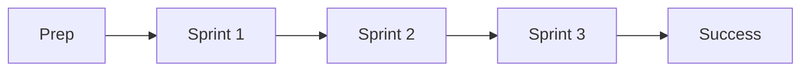

+++
title = 'Module index'
description = 'Prep, an ordered list of sprints, a product, and success view'
layout = 'module'
+++

### Quickstart

Generate a template module by running `./module_create.sh <module-name>` in the root of your website. This script produces a complete module structure with all the necessary files and folders from the Hugo archetypes stored in the `archetypes` folder. Create any single archetype by running `hugo new --kind $ARCHETYPE_NAME $PATH_TO_NEW_FILE`.

The template module contains a prep view to express all your entry criteria and setup instructions for the module, 4 template sprints to plan the weekly work, a product folder to organise the module project, and a success view to express the exit criteria and handoff details.

Edit this basic setup to suit your needs. The module folder is located at content/$MODULE_NAME and it creates pages matching the folder structure on your website.

If you don't want this module to show up on the default menu, remove `menu = ['syllabus']` from the front matter. The pages will still be accessible via the URLs.
