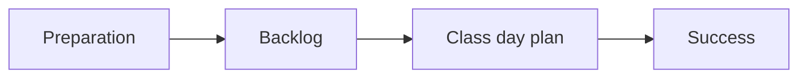

+++
title = 'Sprint index'
description="A structured index of activities for this block of time"
layout = 'sprint'
weight = 2
+++

This is an index to organise the views for a sprint block. If you want to remove this sprint from the menu, remove the `menu_level` parameter from the front matter. We don't use Hugo menus as Hugo doesn't like having duplicate items, but we want all our modules and sprints to have consistent, repeated (predictable) names.

A sprint is a chunk of work within a module. It might be a week or it might be two or three. It is a block of time where we focus on a specific set of learning objectives, which are listed in the success view. We use the sprint index to organise the activities for this block of time, which always include preparation (prep view), a backlog of assignments and tasks, at least one class day plan, and a success/completion checklist.
