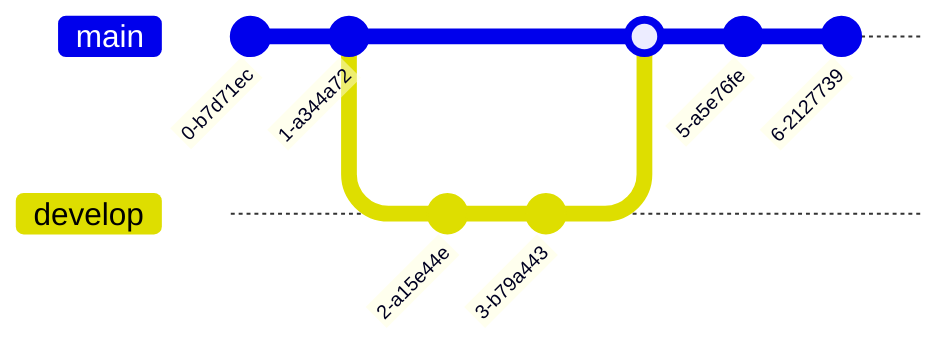
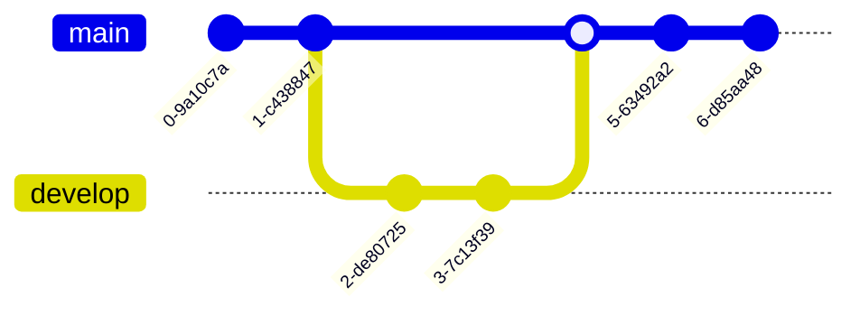

+++
title="Mermaid"
description="Convert text to diagrams"
menu=["hooks"]
+++

[Mermaid](https://mermaid.live/) [works on Github](https://docs.github.com/en/get-started/writing-on-github/working-with-advanced-formatting/creating-diagrams), too, and any diagrams you write in a readme or issue will render here too. There're flowcharts, sequence diagrams, gantt charts, mindmaps, and more.

### Invoke



````

````

<--->




