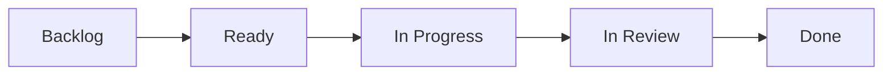

+++
title="Backlog"
headless="true"
time= 30
vocabulary="Backlog"
[objectives]
    1="Find the backlog"
    2="Copy your tickets to your own backlog"
    3="Manage your tickets on your board"

+++

You will find your backlog in the [Backlog](../backlog/). This is a list of all the tickets for the module. You can also go week by week by looking in the sprint backlog.

Copy the tickets you are working on to your own backlog. Organise your tickets on your board and move them to the right column as you work through them. It's a flowchart:



1. Find the sprint backlog
2. Copy your tickets to your own backlog
3. Organise your tickets on your board


