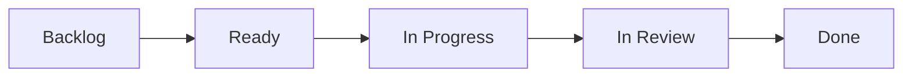

+++
title="Backlog"
headless="true"
time= 30
vocabulary="Backlog"
[objectives]
    1="Find the backlog"
    2="Copy your tickets to your own backlog"
    3="Manage your tickets on your board"

+++

In software development, we break down complex projects into smaller, manageable parts, which we work on for a week or two. These periods are called "sprints."

A sprint backlog is like a to-do list. It lists what the team has decided to work on this sprint. It's chosen from a larger list, usually called the "product backlog," which holds the entire project to-do list.

For your course, the mandatory work has been scheduled already. You will add any other tickets you want to work on to your backlog and schedule them according to your own goals and capacity. Use your planning board to do this.

You will find your backlog in the [Backlog](../backlog/).

Copy the tickets you are working on to your own backlog. Organise your tickets on your board and move them to the right column as you work through them. It's a flowchart:



1. Find the sprint backlog
2. Copy your tickets to your own backlog
3. Organise your tickets on your board


