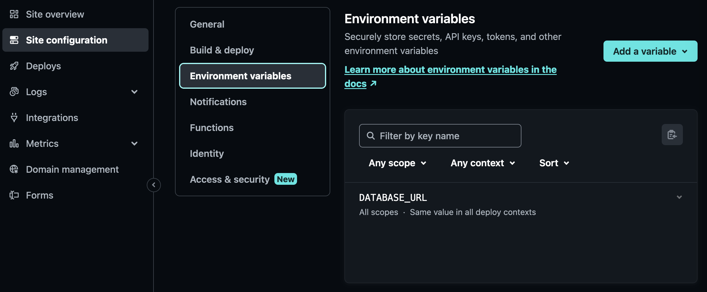

Netlify Functions is a feature of Netlify allowing you to deploy some backend systems. While it is mainly designed to host backends written in one of the serverless frameworks, it does have some support for Express.JS as well with some limitations. To deploy your Express.JS based backend please follow the following guide.

First you need to make sure your backend adheres to the following:

1. All of your backend paths should start with `/api`. For example `/api/videos`, `/api/bookings/1`, etc. Every other URL will be considered as part of the frontend.

2. Your backend code should be split into the following files:
   a. `/server/api.js` contains your actual backend functionality. You can include other modules from this file if you wish to split the file into multiple modules. This is the file that will be used by Netlify.
   a. `/server/server.js` and/or `/server/app.js` should contain code to start up your express.js server and contain settings to load up `api.js` to serve everything under `/api`. This file will be used when running your backend locally, but will not be used at all under Netlify.

3. Your backend should not use global variables to save data between requests. All persistence has to be done through the database or by using cookies.

Once you have made sure your backend adheres to the above, you are ready to add support for Netlify:

1. If it doesn't exist yet, create a `netlify.toml` in your root repository with the following content. If the file already exist, make sure to append the code below:

```toml
[functions]
  directory = "server/functions"
  external_node_modules = ["express"]
  node_bundler = "esbuild"
[[redirects]]
  force = true
  from = "/api/*"
  status = 200
  to = "/.netlify/functions/app/:splat"
```

2. Create a file called `app.mjs` inside `/server/functions`. Make sure it has the following content:

```js
// Netlify wrapper for express.js

// This will convert your express.JS application into a serverless lambda that is compatible by AWS Lambda and Netlify Functions.
// Note that this has a large performance impact as your entire express system needs to load up for every single request.
// Also each request runs in isolation so you are unable to share or cache values in your codebase.
// For example the database connection will be recreated at every call

import express from "express";
import serverless from "serverless-http";
import apiRouter from "../api";

const app = express();

app.use(express.json());
app.use("/api/", apiRouter);

export const handler = serverless(app);
```

If you need to use any middleware apart from `express.json()` make sure that is also included.

3. Add `serverless-http` into your `package.json` file:

```bash
npm i --save serverless-http
```

4. If your backend uses a database make sure you properly set it up in Netlify. If you are following the curriculum then you'll need to set up a `DATABASE_URL` environment variable inside Netlify to point to your database. Check the guides on your chosen database provider to see how to obtain this value.



5. Try deploying your application. If all is well then your backend paths should be accessible under `https://<name-of-your-app>.netlify.app/api/`

If you are stuck you can check [this project](https://github.com/sztupy/Full-Stack-Project-Assessment/tree/netlify_000) that showcases the above requirements. As an example check this [API call](https://cyf-fsa-solution.netlify.app/api/videos)
