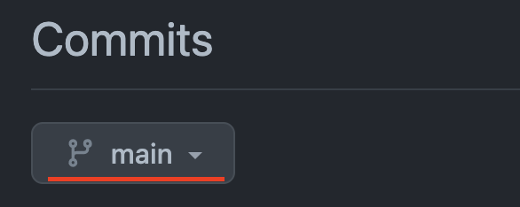

+++
title = '🌳 Branching'
headless = true
time ="60"
facilitation = false
emoji= '🧩'
[objectives]
    1='Figure out what we need to do next in the course'
    2='Locate the prep view on the curriculum'
    3='Practice asking for guidance/help when we are stuck'
+++

We can check the commits on the remote repository as before:

On the left page of the page, we see additional information:

> So what is **`main`**?

`main` is a **branch**.

Commits form a sequence that look like this:

```mermaid
gitGraph
       commit
       commit
       commit
```

A branch represents a particular history of development in a project - the different versions there have been.



A **branch** is a sequence of commits in a project.



There can be different branches with different names, which may have different versions.

For example, if we were testing out some different visual styles, maybe we would have one branch with some extra changes which make the website more blue, and a different branch with some extra changes which make the website more purple. These branches may share some commits in history, but have some extra different commits separately.

```mermaid
gitGraph
        commit
        commit
        branch "try-purple"
        commit
        commit
        checkout main
        branch "try-blue"
        commit
```

The **`main`** branch is often treated as a special branch - it's where we put commits which people working on the project have agreed on. Other branches (e.g. the experimental purple branch) may have extra changes, and if people working on the project agree the changes are good, we'll add those changes to the main branch.

When we're working on something new, we haven't agreed with other people that our new thing is good yet, so we often don't add our changes to the main branch straight away. Instead we make our own branch to experiment on.

We can start to create independent branches like this:

```mermaid
gitGraph
        commit
        commit
        branch "week-1-coursework"
        commit
        commit
        commit
```

In the diagram above, we can continue to commit on the "week-1-coursework" branch without altering the history of the `main` branch.



### Creating a local branch

1. Open the `education-blog` repository in VSCode.

2. [Open the terminal](https://code.visualstudio.com/docs/terminal/basics) in VSCode

3. Use the command line to check your current working directory and list the contents of the current directory. Double check you're in the right place.

4. Using this clip, create a new branch called `update-blog-1` in your local repository 👉 https://youtube.com/clip/UgkxvXsnm_98Rx0NUZq25apQWA6POccRoQzw

📋 How can you check that you've successfully created a branch?


