+++
title = '⏳ Asynchrony : outside time'
headless = true
time = 40
facilitation = false
emoji= '🧩'
[objectives]
1="Define asynchrony"
2="Explain why we need asynchrony"
3="Identify an asynchronous method we have already used"
+++

We can handle latency using run code in a different order. To understand asynchrony we first need to be clear about run code in the order it is written..

We have written a lot of JavaScript programs that execute sequentially. This means that each line of code is run in order, one after the other.


#### For example:

```js
console.log("first");
console.log("second");
console.log("third");
```

<--->

#### Outputs:

```console
first
second
third
```


Each line of code is run in order. This is synchronous execution. We do this because JavaScript is 
A single thread can do one thing at a time. JavaScript is a single threaded language.
.

When we call a function, the function will run to completion before the next line of code is executed. But what if we need to wait for something to happen? What if we need to wait for our data to arrive before we can show it? In this case, we can use **asynchronous execution**.



We have already used asynchronous execution. We have defined `eventListener`s that _listen_ for events to happen, _then_ execute a callback function. But here's a new idea: eventListeners are part of the [Event API](https://developer.mozilla.org/en-US/docs/Web/API/Event). They are not part of JavaScript! 🤯 This means you can't use them in a Node REPL, but they are implemented in web browsers. The core of JavaScript is the same everywhere, but different contexts may add extra APIs.

When you set an eventListener you are really sending a call to a Web API and asking it do something for you.

```js
const search = document.getElementById("search");
search.addEventListener("input", handleInput);
```

The callback `handleInput` cannot run until the user types. With `fetch`, the callback function cannot run until the data arrives. In both cases, we are waiting for something to happen before we can run our code.

We use a function as a way of wrapping up the code that needs to be run later on. This means we can tell the browser _what_ to do when we're done waiting.



<iframe src="http://latentflip.com/loupe/?code=JC5vbignYnV0dG9uJywgJ2NsaWNrJywgZnVuY3Rpb24gb25DbGljaygpIHsKICAgIGNvbnNvbGUubG9nKCdZb3UgY2xpY2tlZCB0aGUgYnV0dG9uIScpOyAgICAKfSk7Cgpjb25zb2xlLmxvZygiSGkhIik7Cgpjb25zb2xlLmxvZygiV2VsY29tZSB0byB0aGUgZXZlbnQgbG9vcCIpOw%3D%3D!!!PGJ1dHRvbj5DbGljayBtZSE8L2J1dHRvbj4%3D" width="100%" height="480px"></iframe>



### 🧠 Recap our concept map

```mermaid
graph LR
    TimeProblem[🗓️ Time Problem] --> |caused by| SingleThread[🧵 Single thread]
    SingleThread --> |send tasks to| ClientAPIs
    TimeProblem --> |solved by| Asynchrony[🛎️ Asynchrony]
    Asynchrony --> | delivered with | ClientAPIs{💻 Client APIs}
    ClientAPIs --> |like| setTimeout[(⏲️ setTimeout)]
    ClientAPIs --> |like| eventListener[(🦻🏾 eventListener)]
    ClientAPIs --> |like| fetch[(🐕 fetch)]
```


