+++
title = '🐕 Fetching data'
headless = true
time = 20
facilitation = false
emoji= '🧩'
[objectives]
    1='Define a client side Web API'
    2='Define a server side API'
+++

So far we have displayed film data stored in our JavaScript code. But real applications fetch data from servers over the internet. We can restate our problem as follows:

> _Given_ an **API that serves** film data
> _When_ the page first loads
> _Then_ the page should `fetch` and display the list of film data, including the film title, times and film certificate

We will use [`fetch()`](https://developer.mozilla.org/en-US/docs/Web/API/Fetch_API/Using_Fetch), a 
A client side [Web API](https://developer.mozilla.org/en-US/docs/Web/API) lives in the browser. They provide programmatic access _to_ built-in browser functions _from_ JavaScript. . Fetch will fetch our data from the 
A server side API lives on a server. They provide programmatic access _to_ data or functions stored on the server _from_ JavaScript. .

APIs are useful because they let us get information which we don't ourselves know. The information may change over time, and we don't need to update our application. When we ask for the information, the API will tell us the latest version.

We also don't need to know how the API works in order to use it. It may be written in a different programming language. It may talk to other APIs we don't know about. All we need to know is how to talk to it. This is called the **interface**.

_Using_ fetch is simple. But we want to understand what is happening more completely. So let's take ourselves on a journey through time.

```mermaid
graph TD
    fetch[(🐕 fetch)] --> |sends a| Request{📤 Request}
    Request --> |has a latency| TimeProblem[🗓️ Time Problem]
    Request --> |to| ServerAPIs
    fetch --> |is a| ClientAPIs

    TimeProblem --> |caused by| SingleThread[🧵 Single thread]
    Callbacks{{🪃 Callbacks}} --> |run on| SingleThread
    SingleThread --> |handled by| EventLoop[🔁 Event Loop]
    EventLoop --> |queues| Callbacks
    SingleThread --> |send tasks to| ClientAPIs
    SingleThread --> |handled by| Asynchrony

    TimeProblem --> |solved by| Asynchrony[🛎️ Asynchrony]
    Asynchrony --> |delivered with| Promise{{🤝 Promises}}
    Asynchrony --> | delivered with | ClientAPIs
    Promise --> |resolve to a| Response{📤 Response}
    Promise --> |join the| EventLoop{{Event Loop 🔁}}
    Promise --> |syntax| async{{🏃‍♂️ async}}
    async --> |syntax| await{{📭 await}}
    await --> |resolves to| Response
    Response ---> |sequence with| then{{✔️ then}}


    APIs((🧰 APIs)) --> |live in your browser| ClientAPIs{💻 Client side APIs}
    ClientAPIs --> |like| setTimeout[(⏲️ setTimeout)]
    ClientAPIs --> |like| eventListener[(🦻🏾 eventListener)]
    APIs --> |live on the internet| ServerAPIs{🌐 Server side APIs}
    ServerAPIs --> |serve our| Data[(💾 Data)]
    Data --> |as a| Response

```

 

👉🏾 Unfurl to see the journey (we will explain this in little pieces)

😵‍💫 This is a lot to take in. Let's break it down and make sense of it.

