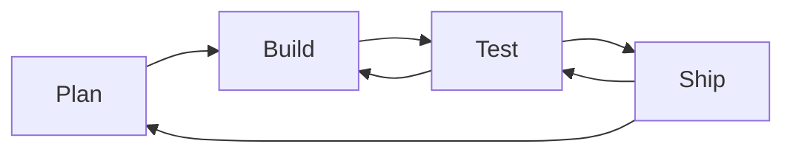

+++
title = 'Product'
description = 'You will build your own website, add an interactive feature using CYF Blocks, and deploy it to Netlify.'
layout = 'product'
emoji= '🎁'
menu_level = ['module']
weight=6
+++

