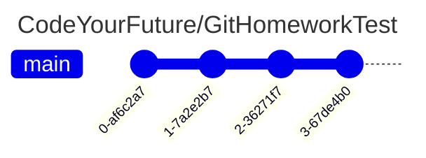
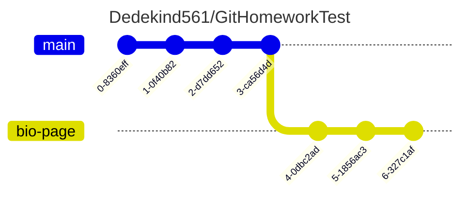
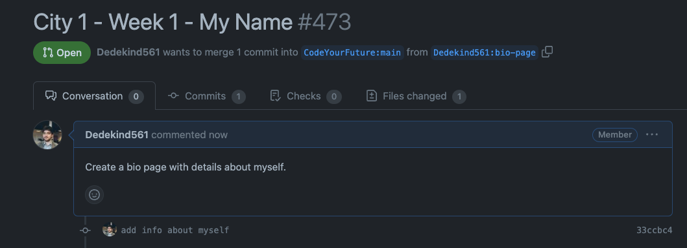

## Learning objectives

```objectives
- [ ] Locate remote branches on GitHub
- [ ] Create a pull request
- [ ] Update pull request with title and a relevant description
```

## 🔃 Comparing changes

As developers, we often develop new features on a branch.

When we've completed the feature , we need to **merge** our changes into another branch.

So we'll need a way to compare changes between two different branches on Github.

Let's consider the following situation:

We have a repository like this:

### Original repository



And there's another forked repository belonging to owner **Dedekind561**.
Dedekind561 has created a branch called `bio-page` with the new feature.

### 🍴 Forked repository



> 🎯 Goal: Merge changes from the `bio-page` branch into the CodeYourFuture/GitHomeworkTest repo

## Pull Request

To merge changes from one branch to another, we need to let other users know👍

- what the changes are
- which branches we're comparing
- additional context about the proposed change

For this purpose, we can use a **pull request**.



A **pull request** is a request to merge code from one branch into another.



## Creating a new pull request

During the course, we'll use Pull Requests to review your work. You'll need to submit your work on a branch and compare it

We can use the Github interface to create a new Pull Request.

The steps below assume you have a forked a repository called `GitHoneworkTest` and you've pushed a branch to this remote repository.

### Step 1

Go to your forked repository. The page should look like this:


Double check your url, it should be `github.com/YOUR_USERNAME/GitHomeworkTest

### Step 2

Locate the branches button on this page.


### Step 3

📝 Double check you're on a branches view like this.


### Step 4

Locate the **New pull request** button for the `bio-page` branch.


### Step 5

Double check you cans see the **Open a pull request** view.


#### Questions:

a) Double check the base repository ( it should be set to `CodeYourFuture/GitHomeworkTest` )
b) Double check the head repository ( this should be the forked repository `YOUR_GITHUB_USERNAME/GitHomeworkTest` )
c) Double check the base branch ( this should be set to `main` )
d) Double check the head branch ( this should be set to `bio-page` )

### Step 6

Update the Pull Request title to include your **region**, **name** and the **week** the coursework is for.


### Step 7

Update the Pull Request description with information about the changes on your branch.

Below we've added a description "Create a bio page with details about myself"


### Step 8

Finally, click on **Create pull request**.

Double check you end up with a pull request like this:



#### Questions

a) Locate the **Files changed** tab and check the change you've added in your branch
b) Locate the **Commits** tab and check the commits from your `bio-page` branch

## Using a Pull Request template

Often you can create a new pull request using a **template**.

Check the description field for any instructions to complete the pull request.

Check out the example below:


