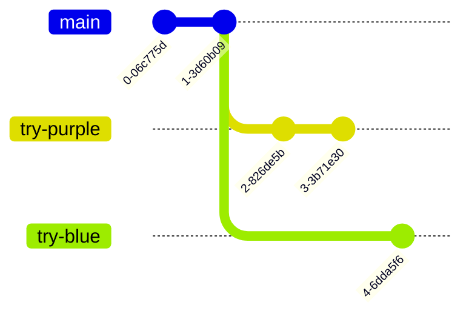

+++
title = 'prep'
description = 'You can use these notes and activities to prepare for the first in-person session of the software development course'
layout = 'prep'
emoji= '📝'
menu_level = ['sprint']
weight = 1
backlog= 'Module-Induction'
backlog_filter= 'Induction'
[objectives]
1='Define a repository'
2='Define a commit'
3='Explain why we use Git'
4='Explain why we use Github'
5='Given a remote or local repository, identify the number of commits'
6='Given a remote or local repository, identify the author, time and message of a given commit'
7='Given a remote or local repository, identify the files and folders from any commit in a version timeline'
8='Describe the purpose of version control'
9='Explain the difference between Git and Github'
10='Get a local copy of a repository on your local machine'
11='Create a fork of a repository'
12='Create a local branch'
13='Explain the difference between a fork and a clone'
+++

## Learning objectives

## 📝 CYF blog

Imagine that two people are writing a blog.
Ahmed and Naima are writing a blog together about their struggles learning coding.

The published blog is live here 👉 [CYF educational blog](https://git-demo-week1.netlify.app/)


Explore the [CYF educational blog](https://git-demo-week1.netlify.app/). Click on the link on the site and check to see if it is working.


## 🧰 Development process

Ahmed and Naima are using the following **development process** for writing their blog:

> - writing the blog in a single file on a **single** computer
> - saving multiple versions of the file on the same computer
> - taking turns to use the computer during the day

At the moment, the computer has a folder with the blog that looks like this:



Describe some of the challenges that Ahmed and Naima face when trying to write a blog together in this way.

Create or join a thread 🧵 on Slack to share your answers. Did your cohort colleagues think of similar things?



## ⌛ Version control software

> To improve their way of working, Ahmed and Naima realise they need the following:
>
> - a way to both know what the most recent version is
> - a way to know what the old versions were, and in what order (i.e. how they got to the current version, and what content they may have deleted that they may want to get back)

To manage the different versions of the blog project, they decide to use **Git**.



Git is **version control software** that allows developers to create and manage different versions of a project.



In Git, we create different versions of a project over time by creating **commits**.

A **commit** is a snapshot of our project at a particular point in time. You can also think of a **commit** as a particular version of a project.

**Commits** store the following information:

- what changed in this commit

- who created the change

- what time the change happen

- what the previous commit was

A typical timeline of commits might look like this:


Commits also have a **hash** associated with them. A **hash** is a long string of characters used to identify a particular commit.

A typical hash will look like this: `fec6909d6de23c75e77960986a9b6a7aee7feec7` but you will often see them abbreviated to the first 7 characters like this: `fec6909`



## 🗄️ 🌐 Sharing history

Earlier on, Ahmed and Naima realised they also need the following:

> a way to share the history of the project between different users and different computers

To share a project and its history, we can use an online platform called **GitHub**

**GitHub** is a platform where teams can store projects along with a history of their different versions.

By storing projects on GitHub, multiple users can gain access to the history of a project.


On GitHub we call our project and its history a **repository**.




### Explore 🔍

In this exercise, you'll need to explore a **GitHub repository.**

You'll need to look around and figure out where to find different files and find out information about them.

**⚠️ You won't be expected to know what the files do at this stage.**

Go to the following link: https://github.com/CodeYourFuture/education-blog

It will take you to a GitHub repository called **education-blog**.

Answer the following questions using the page linked to above:

a) View the **README.md** file. What do the instructions tell you?
b) How many files are there inside the `blogs` folder?
c) How many lines are there in the **package.json** file?
d) Find the file with the blog content you can see on the live site here [blog 1](https://git-demo-week1.netlify.app/blogs/1)

You'll learn more about these type of files throughout the course.



> We can use the Github interface to explore the different **commits** (versions) of a project too.



### Explore 🔍

Go to the following link: https://github.com/CodeYourFuture/education-blog/commits/main

Try answering the following questions:

Go to the commit that says "add test p element to index page"

#### Questions

- How many files were changed in this commit?
- Who created the change?
- What time did the change take place?





### Explore 🔍

Go to the following link: https://github.com/CodeYourFuture/education-blog/commits/main

#### Questions:

Go to the commit that says "remove \ and # from start of paragraph"

#### Questions:

- How many files were changed in this commit?
- What change was made in this commit?



## 🔍 Check out a commit

Recall that a commit is a snapshot of our project at some point in time.

Therefore, we should be able to check out a previous version of our project and look at the files and folders there.
We can use the Github interface to check out the files and folders at a previous commit.



Go back to this page https://github.com/CodeYourFuture/education-blog/commits/main

Locate the the commit with hash `4e78b32` and then look for the icon that that says "Browse the repository at this point in the history".
Explore the code at this point in the history. What differences do you notice?

Do the same but for the commit `cd981a0`.



## 📜 Previous versions

We can view the different commits of a project on Github.

This means we can see what the website looked like before, in previous versions.



Here are some different versions of the same CYF educational backlog.

[Deployed version A educational blog](https://64b6f9a2b9c00a00082bbeeb--git-demo-week1.netlify.app/)

<!---
Version A should have a test p element on the index page
-->

[Deployed version B educational blog](https://64b6fd80d14d510008aab4aa--git-demo-week1.netlify.app/)

<!---
Version B should have nothing on the index page
-->

[Deployed version C educational blog](https://64b971b0adae9e00089d7531--git-demo-week1.netlify.app/)

<!---
Version C should be same as production deployment but with some rogue characters on the page
-->

#### Questions:

a) What is the difference between Version A and Version B on the index page (the page you first land on after clicking on the link)
b) What is the difference between Version C and the main version of the site.
c) Which commit from the [**education-blog**](https://github.com/CodeYourFuture/education-blog/commits/main) repo correspond to Version C? Remember to check the git history.
d) Which commit from the [**education-blog**](https://github.com/CodeYourFuture/education-blog/commits/mainLive) repo correspond to Version A?



## 🍴 Forking a repository

Often we want to take an existing project and start working on it independently: in other words, we start making our own versions of the project separate from the original project.

We may have a repo will the following url:

We might want to start creating our version of this project in isolation from the original project.

So we can create a **fork**.


A **fork** is a copy of a repository that exists on Github



When we create a fork on Github, the new forked repository gets a new url:



### 🍴 Forking a repo

Visit the following https://github.com/CodeYourFuture/education-blog.

Firstly locate the **Fork** button on this page.

Click on the Fork button to create a new fork of the repository and set yourself as the owner of the fork.

📋 How can you check you successfully forked the original repository?

Hint: Check the URL of your forked repository



## 💻 Working locally

We can also use Git on our local machine to perform similar tasks as we do on GitHub. So we need to address the following question:



How can we get a copy of an existing GitHub repository on our local machine?



In other words, we need to get a local copy of the repository which is on GitHub.



We call a local copy of a GitHub repository a **clone**.

The process of copying a remote repository on to a local machine is known as **cloning**.

A repository on GitHub is said to be **remote**.

A repository on our own computer is said to be **local**.





###

> 🎯 Goal: Clone a remote repository to your local machine

You'll need to clone **your fork** of the education blog repo.

Follow through the steps in this video 👉 https://www.youtube.com/watch?v=ILJ4dfOL7zs (Remember to use the url for your fork of the education-blog repo when you are cloning)



## 📘 Viewing the files

Once you've got a local copy of a codebase on your local machine you can start to view the files and folders in that codebase. You can use a code editor like VSCode.

VSCode is an application that enables developers to view and edit files on their local machine.



### Explore VSCode

Figure out how to open the cloned repository on your local machine in VSCode.

Explore the repository in VSCode and use the code editor to look at the various files and folders.

Try opening the Integrated Terminal in your VSCode window



## 🌳 Branching

We can check the commits on the remote repository as before:

On the left page of the page, we see additional information:

> So what is **`main`**?

`main` is a **branch**.

Commits form a sequence that look like this:

A branch represents a particular history of development in a project - the different versions there have been.



A **branch** is a sequence of commits in a project.



There can be different branches with different names, which may have different versions.

For example, if we were testing out some different visual styles, maybe we would have one branch with some extra changes which make the website more blue, and a different branch with some extra changes which make the website more purple. These branches may share some commits in history, but have some extra different commits separately.

The **`main`** branch is often treated as a special branch - it's where we put commits which people working on the project have agreed on. Other branches (e.g. the experimental purple branch) may have extra changes, and if people working on the project agree the changes are good, we'll add those changes to the main branch.

When we're working on something new, we haven't agreed with other people that our new thing is good yet, so we often don't add our changes to the main branch straight away. Instead we make our own branch to experiment on.

We can start to create independent branches like this:

In the diagram above, we can continue to commit on the "week-1-coursework" branch without altering the history of the `main` branch.



### Creating a local branch

1. Open the `education-blog` repository in VSCode.

2. [Open the terminal](https://code.visualstudio.com/docs/terminal/basics) in VSCode

3. Use the command line to check your current working directory and list the contents of the current directory. Double check you're in the right place.

4. Using this clip, create a new branch called `update-blog-1` in your local repository 👉 https://youtube.com/clip/UgkxvXsnm_98Rx0NUZq25apQWA6POccRoQzw

📋 How can you check that you've successfully created a branch?



### 🎁 Wrapping up



📋 Double check the learning objectives from this section. Make a note of those objectives that you're still struggling with.

Now you'll need to **create a commit**.

You can use this video 👉 https://www.youtube.com/watch?v=B8RSMBSzFuA to figure out how to create a commit.

We'll cover this topic in class on Saturday too.

1. Try opening your clone of education-blog in VSCode
2. Try fixing a typo in the `README.md` file
3. Try using the video to create a commit of your work.


