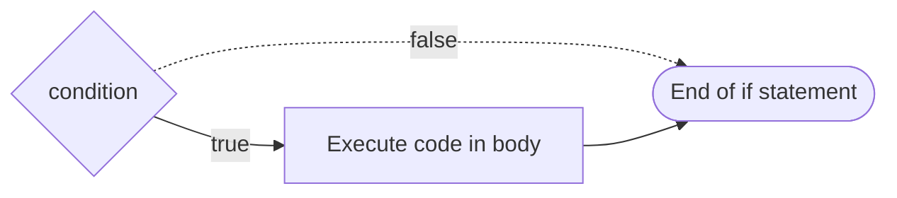

+++
title = '❓ Conditionally executing code'
headless = true
time = 30
facilitation = false
emoji= '🧩'
[objectives]
1 = 'Construct a flow diagram that describes how to produce an output from a given input'
2 = 'Explain when it is necessary to use a conditional statement'
3 ='Identify the syntactic features of an `if` statement'
4='Analyse a conditional statement to determine whether or not the statement will be executed'
5='Determine the output of a program that uses a conditional statement'
+++

> Recall: JavaScript programs are built up from sequences of **statements**.

In programming, we can use an **`if` statement **to execute some code when a given condition is `true`.  
In JavaScript, we can write an `if` statement as follows:

```js {title="main.js"}
if (condition) {
  // do some code in here
}
```

The `if` statement consists of:

1. `if` keyword: this is the start of the `if` statement
2. `(condition)`: condition is an expression that evaluates to true or false
3. `{}`: a block statement: any code we want to execute if the condition is true goes inside the curly braces here

We can represent this with a diagram too:




Write a program that defines a variable `eleniAge`.

If Eleni is less than 18, the program should print out nothing to the console.

If Eleni is 18 years old or older, the program should print out:

```bash
Eleni is old enough to drive
```





Modify the program above so that if Eleni is less than 18 the program prints out:

```bash
Eleni is not old enough to drive
```


