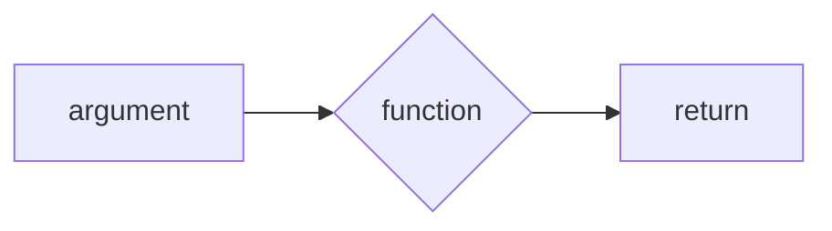
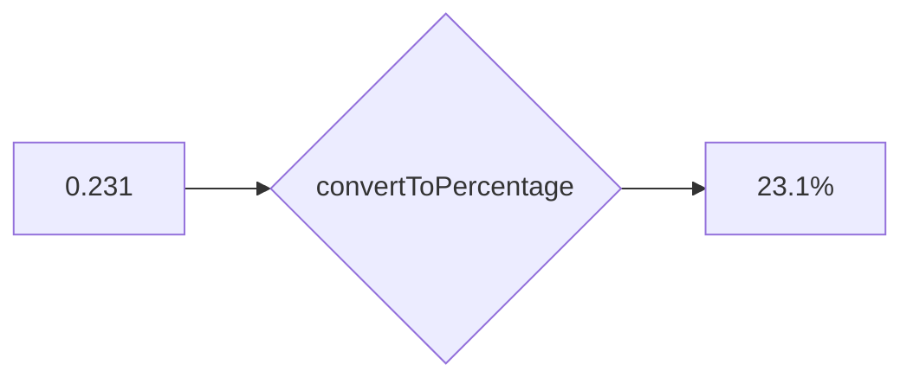

+++
title = 'Parameterising a function'
headless = true
time = 20
facilitation = false
emoji= '🗄️'
[objectives]
    1='Define a parameter'
    2='Identify the value assigned to a parameter when a function is invoked'
    3='Differentiate between parameters and arguments'
    4='Invoke a given function with an appropriate argument to produce some target output'

+++

To make a function work for any number, we need to handle inputs. We do this using a  A parameter is a special kind of variable: its value is defined by the caller.
.

`decimalNumber` is still a variable - but as a **parameter** we don't assign `decimalNumber` a value inside the function's body. We pass an input to the function, and the value of that input is assigned to the `decimalNumber` parameter when the function is called. This happens automatically.

We can add a parameter `decimalNumber` to our function:

```js {linenos=table,hl_lines=[1] ,linenostart=1}
function convertToPercentage(decimalNumber) {
  // now decimalNumber is a parameter of convertToPercentage
  const percentage = `${decimalNumber * 100}%`;
  return percentage;
}

const output1 = convertToPercentage(0.5);
const output2 = convertToPercentage(0.231);
```

In the example above, we're calling `convertToPercentage` twice: first with an **input** of `0.5` and second with an **input** of `0.231`.
In JavaScript instead of **input** we use the word Arguments are inputs given to a function inside `()`. An argument means an input. The parameter is `decimalNumber`. The **argument** is `0.231`.

We're calling `convertToPercentage` twice: first with an **argument** of `0.5` and next with an **argument** of `0.231`.

Think of a function as a box. We put data in and then act on it using the rules in the box; at the end, the box gives us new data back. In programming we say that we _pass arguments_ into a function, the function's code is executed and we get a return value after the function has finished executing. Here's a diagram:



Here's a diagram of what happens when `makeGreeting` is passed a specific **argument**:



In this interactive widget we have defined a parameter `decimalNumber` in the function declaration inside parentheses after the function name `convertToPercentage`. In our mental model, a function call means going to `convertToPercentage` and running the code inside the function.


<iframe title="interactive widget" width="800" height="450" frameborder="0" src="https://pythontutor.com/iframe-embed.html#code=function%20convertToPercentage%28decimalNumber%29%20%7B%0A%20%20const%20percentage%20%3D%20%60%24%7BdecimalNumber%20*%20100%7D%25%60%3B%0A%20%20return%20percentage%3B%0A%7D%0A%0Aconst%20output1%20%3D%20convertToPercentage%280.5%29%3B%0Aconst%20output2%20%3D%20convertToPercentage%280.23%29%3B&codeDivHeight=400&codeDivWidth=350&cumulative=false&curInstr=0&heapPrimitives=nevernest&origin=opt-frontend.js&py=js&rawInputLstJSON=%5B%5D&textReferences=false"> </iframe>

Use the interactive widget to see what happens when the code above is executed. Look closely at the lines where `convertToPercentage` is called.

