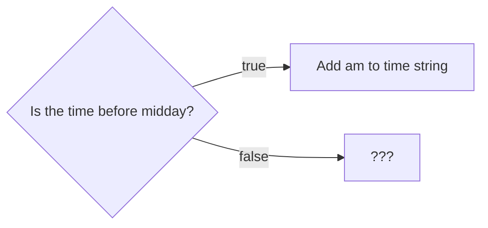
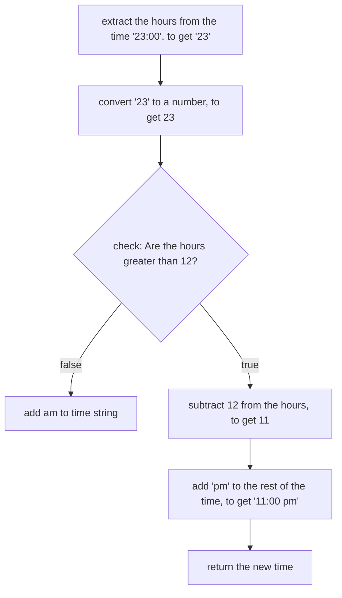

+++
title = '↙️ ↘️ Making a choice'
headless = true
time = 30
facilitation = false
emoji= '🧩'
[objectives]
    1='Propose a strategy for solving a problem'
+++

Our function works for morning inputs like `"08:00"`.
In this case, the function returns the target output of `"08:00 am"` as required.

However, at the moment, the output of `formatAs12HourClock("23:00")` is `"23:00 am"`.

> 💡 We need to execute some different logic when the time is beyond midday

We can interpret this behaviour as a question:

We need to work out what to do in the case when the time input is later than midday.

## 🧭 Describing the strategy

Let's describe the strategy for dealing with an input that is after midday.

Earlier we observed that when the time goes beyond midday then **we can subtract 12 from the hours time to get the new hours for the 12 hour clock time**.

_Before_ writing code, we can define our approach in steps using a flowchart:

Starting with an input like `"23:00"`:

This approach involves running some code **conditionally**.

In this case, we're only going to continue doing Steps 4-6 if the condition **hours are greater than 12** is `true`.
