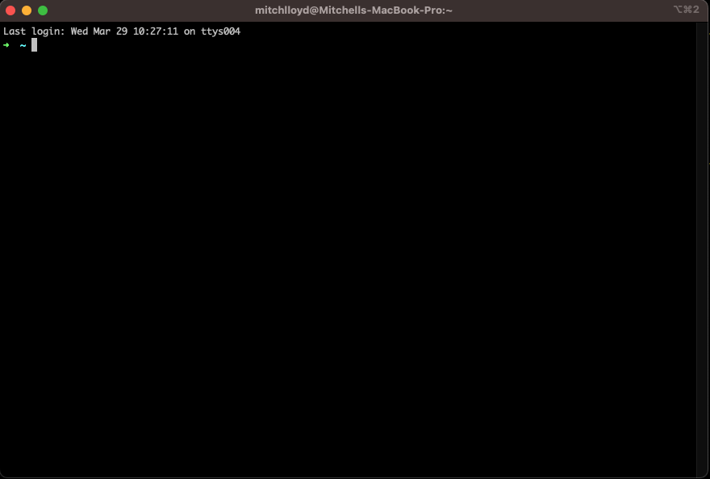
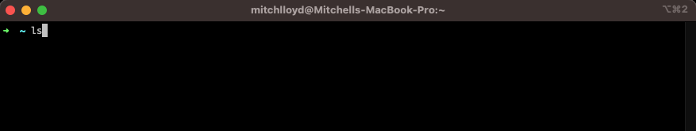
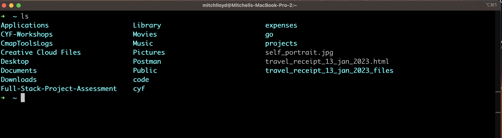
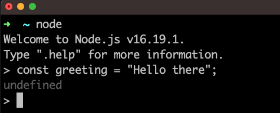
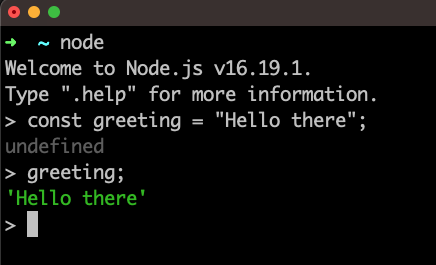
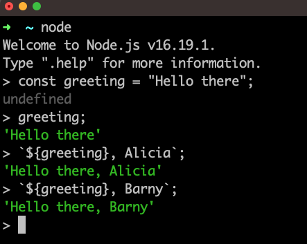
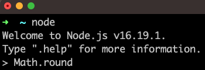
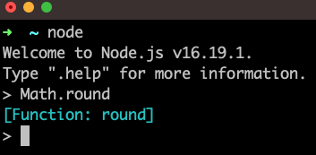

+++
title = 'prep'
layout = 'prep'
emoji= '📝'
menu_level = ['sprint']
weight = 1
backlog= 'Module-JS1'
backlog_filter= 'Week 1'
+++

## Prerequisites

- Basic arithmetic
- Access to a Linux/MacOS terminal

## Learning objectives

- Define a terminal
- Describe the purpose of VSCode
- Define the Node REPL
- Define an expression
- Identify the syntactic features of a variable declaration
- Explain why we use variable declarations
- Describe what template literals do
- Create strings using variables and template literals
- Explain how we use basic arithmetical operators
- Evaluate basic JavaScript expressions using the Node REPL
- Predict the result of evaluating an expression in JavaScript
- Define a function
- Define a function call
- Define the term “implementation opaque”
- Identify the key features of a function call expression: identifier; parentheses, argument
- Run and print the output of some basic JavaScript functions
- Execute a JavaScript file using Node
- Log JavaScript expressions to the terminal
- Predict the console output when a basic JS program is executed using Node

## Key vocabulary

terminal, console, function, call, invoke, argument, parentheses, REPL, evaluate, implementation, opaque

## Notes

### Interacting with computers 💻

Modern computers are highly complex devices. It would be too difficult to list all the components that make up a modern computer. We don't need to understand the inner workings of a computer ( how it is built) so we can start with a simplified definition:



A computer is a device used to store and process data. Computers have the capacity to store data through their memory and the ability to change this data through its processing capacity.



As a user, we don't need to understand the complexities of the computer's inner workings. As users we need to harness the computer's memory and processing ability to perform certain tasks.

### 🕹️ Using an interface

As a user, we want to interact with a computer without understanding how it is built. Every day we interact with machines to carry out some certain tasks: in most of these cases we have no idea how these machines are built. It would be impossible to use complex technology if we had to know how these machines were built at the same time.

Instead we make use of **interfaces**. An interface can be thought of as a boundary that allows communication between user and machine.
The user will ask the machine to carry out certain tasks via the interface. We can think of the interface as a gateway between the user and the machine.

For example, we may want to withdraw money from an ATM machine. We go to a machine in the wall with a screen and a keypad. The **screen and the keypad** form the user interface in this case. We can use this user interface to ask the machine to carry out certain tasks - like give my balance, or please withdraw some money from my account.



Try and define the **user interface** for the following machines:

- a calculator
- a microwave
- a desktop lamp



### Terminal interface

As with any other machine, programmers need computer interfaces to ask machines to carry out tasks.

A computer terminal is an **interface** where users can issue commands to a computer. On a Mac, the terminal looks like this:



The terminal appears as a window on the computer, prompting users for instructions. So we can input a command into the prompt and hit enter for the computer to execute this command. For example, we can input the `ls` command into the terminal:



We can then press enter to issue this command to the computer and get a response:



As users enter text instructions and receive text output, we say that the terminal is a **text-based interface**.

### Writing computer instructions

We've seen we can issue commands to the computer using the terminal. These commands are instructions that the computer knows how to interpret. Given the `ls` command, the computer knows this is an instruction to list the files and directories in the current directory.
However, we can make use of other programming languages too.

A programming language is a particular set of rules for writing computer instructions.

A computer will store data in memory, which will be modified during the execution of a program.
So we can think of a programming language as allowing us to describe **data** and **operations** on that data.


**Data** consists of information in different forms: for example, numbers and text could be different forms of data. The data in a executing program is sometimes referred to as the **state**.



**Operations** are anything that take data and modify existing data or create new data from the current data in the program.


In other words, any computer program will specify what data we've got and how it will be processed.

### Classifying data

In this course, we’re going to focus on the JavaScript programming language.

A programming language will have certain ways of organising data. They split data up into different categories called **data types**.


A **data type** is a grouping of data with some particular properties.


In JavaScript, we have several different data types, like **numbers** and **strings**.

For example, `10` is part of the number data type.  
`3.14` is also part of the number data type, as we include both integers non-integers in this data type.

We also have the string data type in JavaScript. A string is a sequence of characters. In JavaScript a string is denoted using opening quotation marks and closing quotation marks.

### Creating expressions

Let's consider the numbers 10 and 32. Given these 2 numbers, we might want to ask several questions about these numbers:

a) What is the **sum** of 10 and 32?  
b) What is the **product** of 10 and 32?  
c) What is the **remainder** when 32 is divided by 10?

From question a), instead of saying "the sum of 10 and 32" we can rewrite this description using numbers and a symbol. So “the sum of 10 and 32” can be written as `10 + 32` as follows:

```raw title="symbolic form"
10 + 32
```

In symbolic form, `+` is an operator: an **operator** is a symbol that is used to represent some kind of operation. In this example, `+` is used to represent the add operation “add the 2 numbers together”.  
The actual combination of symbols `10 + 32` we say is an **expression**.


An **expression** is a value or any valid combination of values and symbols that results in a single value.

We say that expressions **evaluate** to a single value.

So we say that `10 + 32` **evaluates** to the value `42`.



### Evaluating expressions

We can take an expression like `36 * 45` and ask what it evaluates to. If we understand what the `*` operator represents ( in this case multiplication ) and if we understand some basic rules of arithmetic we can evaluate this expression.

However, we can use computers to evaluate expressions.

**NodeJS** is an application that allows us to run JavaScript programs. In other words, NodeJS can understand and execute programs written in the JavaScript language.

NodeJS can be used in a number of different ways; however, one particular mode is the **REPL**.



ℹ️ Definition: REPL is a special type of program that stands for

**Read**  
**Evaluate**  
**Print**  
**Loop**



The Node REPL enables us to input JavaScript instructions that are then executed by NodeJS. The REPL will then print out the result of this execution.

We can type each of the following expressions into the REPL and then press enter to check the result.

```bash
10 + 32
```

```bash
32 / 10
```

```bash
3 ** 4
```



In this activity, you'll check that you're set up to use the Node REPL on your machine.
Follow the instructions below and check you can do each step:

1. Start a terminal application on your computer
2. Check you've got Node installed on your computer
3. Start the Node REPL in your terminal
4. Enter the expressions above and evaluate them using the Node REPL

Note: If you don't know how to do any of the steps above, then try searching for an appropriate command online - searching for things when you're stuck is super important part of being a developer!





Try creating your own expressions and entering them into the Node REPL. In each case, before hitting enter, try predicting what the output will be in the REPL.



### 🏷️ Saving expressions

In programming we often want to reuse a particular expressions. Therefore, we need a way to refer back to particular expressions. Let’s consider the following string:

```js
"Hello there";
```

Suppose we want to reuse this string in several different places. For example, we may want to create different greetings for different users, like:

```bash
"Hello there, Alicia";
```

```bash
"Hello there, Barny"
```

We can use a **variable** to store this string value so that it can be used again.



🏷️ A **variable** is a label for a piece of data. We can assign a piece of data to a particular label and then refer back to this label.


We can create a variable in our program by writing a **variable declaration**, in the following way:

```js title="variable declaration"
const greeting = "Hello there";
```

We can break down the different syntactic elements of this variable declaration:

- `const` is a keyword used to indicate we're creating a variable.
- `greeting` is the variable name - like the name of the label for our piece of data.
- `=` this is the assignment operator. It means assign to the label `greeting` the expression on the right hand side.
- `"Hello there"` - this is the value we're assigning to the label `greeting`.

We can type this variable declaration into the REPL:



Now we can refer to the label `greeting` again in the REPL:



Now we have the `greeting` variable stored in memory we can reuse it to build more expressions:



In the example above, we're using backticks to create a template literal. With template literals, we can insert expressions into strings to produce new strings. Any time we want to reference a variable inside a template literal we use a dollar sign and a set of curly braces. The variable name itself is then placed inside the curly braces. The value this variable holds is then placed inside the string.

### Reusing instructions

Let’s consider another scenario. Instead of adding or multiplying numbers, we’ll consider a number like `10.3`.  
Given the number `10.3`, we could ask:

> 🤔 "What is the nearest whole number to `10.3`?"

The process of finding the nearest whole number to 10.3 is called **rounding**. So we could rephrase the previous question to be:

> 🤔 "What does the number `10.3` **round** to?”

Again we can use Node REPL in order to round the number 10.3 to the nearest whole number. However, in this case, there is no arithmetical operator for rounding the number `10.3` in JavaScript.
However, we will often want to carry out some kind of operation or series of operations repeatedly. For example, we will often want to round numbers again and again. So in this case we can use a **function**.



Definition: A function is a reusable set of instructions.



In particular, we can make use of a function called `Math.round`. Recalling the definition, a function is a reusable set of instructions: so `Math.round` contains instructions for rounding any number. Functions will often take **inputs** and then **apply their set of instructions to the inputs** in order to produce an **output**.

So we can write `Math.round` in the Node REPL:



After we've hit enter to evaluate, we then get the following:



So in this case, the REPL output `[Function: round]` is indicating that `Math.round` is a function.

### Calling a function

Once we have the name for a function, we need to get Node to read the function's instructions and execute them. Execution means the computer reads the instructions and carries them out. So we can write the following in the REPL:


Notice now we have `(` and `)` parentheses after the name of the function and a number inside the parentheses. The parentheses indicate that we are calling the function. The number inside the parentheses is the **input** we're passing to the function.



Calling a function means telling the computer to read the function's instructions and carry out its instructions. When calling a function we can also pass inputs to the function.



`Math.round(10.3)` is a call expression: it can be thought of as saying apply the set of instructions for `Math.round` to the number `10.3`.

If we type `Math.round(10.3)` then again we get the result 10. So once more we can say that `Math.round(10.3)` evaluates to 10.


Important to note that `Math.round` is **implementation opaque**. **Implementation opaque** means we can’t read the set of instructions for `Math.round`. This is because `Math.round` was authored by the developers that created NodeJS.


### Running scripts

So far we’ve seen how expressions can be evaluated when using the Node REPL. The Node REPL is a very useful tool for evaluating expressions quickly. However, most of the time, we need to write more complex programs that consist of many lines. So we need to write our program in a file. Instead of using the Node REPL, we can use Node to execute the instructions in a file.

We can use the node command to run a JavaScript file. A JavaScript file ends with `.js` - this is known as the file extension.

Let’s suppose we have a file `sums.js` like this:

```js title="sums.js"
10 + 3;
10 * 3;
10 / 3;
```

In this case, we can write the command `node sums.js`.

This command is an instruction to execute the program written inside index.js. Our program consists of 3 lines, each line an expression. So the machine will start:

`10 + 3;` the computer will evaluate this expression  
`10 * 3;` the computer will evaluate this expression  
`10 / 3;` the computer will evaluate this expression

Once the computer evaluates these expressions the execution of the program is complete. But, we’re left with a problem. With the REPL, the user inputs an expression, the computer evaluates it and then prints the result. It then loops back and prompts the user for another input. But now the computer will go and execute each line sequentially until completion.

So this new problem can be expressed as a question:

> #### ❓ Problem
>
> "How can we inspect the data in our program during runtime?"
> In other words: "how can I print values to the terminal when my program is being executed?"

In order to do this, we can use another function.

### Printing to the terminal

In order to print an expression’s result to the terminal we can make use of a function called `console.log`.  
`console.log` will allow us to print expressions to the console. We also say that we log values to the console. This is very useful for complex programs when we need to inspect the result of certain expressions.
Let's see how to use `console.log`

In a file called `example.js`, we can write name of the function `console.log`.

```js title="example.js"
console.log;
```

However, if we run this file with Node, we won't be able to see anything in the terminal.
As with `Math.round` we need to use the syntax for calling this function.
So we can add parentheses after the function name to indicate we're calling this function:

```js title="example.js"
console.log("hello there!");
```

Now if we our terminal, we should see the string "hello there!" logged out in the terminal.

### Saving function output

Often in programs we may want to refer to a particular expression over and over again.

With our knowledge of functions and variables, we can use variables to store the output from a function.
Let’s consider the following file, `arithmetic.js`;

```js title="arithmetic.js"
const result = Math.round(10.3);
```

When this program is executed, it creates a variable called result and assigns to it **the output of the function**, in this case the rounded number.
So `result` will evaluate to `10`.

Let’s consider what happens with the following file, `log.js`:

```js title="log.js"
const result = console.log("hello world");
```

When this program is executed, the variable `result` will evaluate to `undefined`. This is potentially confusing as `console.log` contains instructions that do something. `console.log` _does_ have an effect: it logs values to the console. However, inside our program, `console.log` doesn't produce an output that we can store in a variable.

:::info
`undefined` is a data type in JavaScript often used to represent the absence of a specific value
:::

We could add another log to our program in order to verify this claim. Essentially, console.log’s output will always be undefined.



Key fact: `console.log` is used to print its inputs to the terminal. It doesn’t produce an output in the running program.



### Further reading
