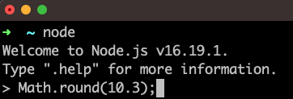

+++
title = 'prep'
layout = 'prep'
emoji= '📝'
menu_level = ['sprint']
weight = 1
backlog= 'Module-JS1'
backlog_filter= 'Week 1'
[[blocks]]
name= "Critical Thinking"
src= "https://cyf-pd.netlify.app/blocks/prep-critical-thinking/readme/"
[objectives]
1='Double check Git is installed on your local machine'
2='Define a terminal'
3='Define the Node REPL'
4='Define an expression'
5='Identify the syntactic features of a variable declaration'
6='Explain why we use variable declarations'
7='Describe what template literals do'
8='Create strings using variables and template literals'
9='Explain how we use basic arithmetical operators'
10='Evaluate basic JavaScript expressions using the Node REPL'
11='Predict the result of evaluating an expression in JavaScript'
12='Define a function'
13='Define a function call'
14='Identify the key features of a function call expression: identifier; parentheses, argument(s)'
15='Call and print the output of some basic JavaScript functions'
16='Execute a JavaScript file using Node (not in a REPL)'
17='Log JavaScript expressions to the terminal (not in a REPL)'
18='Predict the console output when a basic JS program is executed using Node'
+++

## Prerequisites

- Basic arithmetic
- Access to a Linux/MacOS terminal

## Key vocabulary

terminal, console, expression, function, call, invoke, argument, parentheses, REPL, evaluate, implementation opaque

## 💻 Interacting with computers

Modern computers are highly complex devices: it would be too difficult and time-consuming to list all the components that make up a modern computer. To begin understanding, we can start with a simple definition of a computer:



A computer is a device used to store and perform operations on data.



## 🕹️ Using an interface

As a user, we want to interact with computers _without_ understanding how they are built. Every day we interact with machines to carry out specific tasks: in most of these cases we have no idea how these machines are designed and constructed. It would be impossible to make use of new technology if we had to know how all these machines were built at the same time.

Instead we make use of **interfaces**.



An **interface** can be thought of as a boundary that allows communication between a user and a machine.
The user asks the machine to carry out certain tasks via the interface. We can think of the interface as a gateway between the user and the machine.



For example, we may want to withdraw money from an ATM machine. We go to a machine in the wall with a screen and a keypad. The **screen and the keypad** form the user interface in this case. We can use this user interface to ask the machine to carry out certain tasks - like giving my balance, or withdrawing some money from my account.



Try and define the **user interface** for the following devices:

- a calculator
- a microwave
- a desktop lamp
- Facebook
- Alexa
- ChatGPT



## Terminal interface

As with other machines, programmers need to use interfaces to get computers to carry out tasks.

A computer terminal is an **interface** where programmers can issue commands to a computer. On a Mac, the terminal looks like this:


The terminal appears as a window on the computer, prompting users for instructions. We can input a command into the prompt and hit enter. After hitting enter, the terminal interface passes this command along for the computer to execute. For example, we can input the `ls` command into the terminal:


We can then press enter to issue this command to the computer and get a response:


Because users enter text instructions and receive text output, we say that the terminal is a **text-based interface**.

## Writing computer instructions

We can issue commands to the computer using the terminal. These commands are instructions that the computer knows how to interpret. Given the `ls` command, the computer knows this is an instruction to list the files and directories in the current directory.

However, we can make use of other programming languages too.
A programming language is a particular set of rules for writing computer instructions.
During the execution of a computer program, a computer will store and modify data.

So we can think of a programming language as allowing us to create **data** and **operations** on that data.


**Data** consists of information. The information may be in different forms: for example, some data may be in the form of text and other data may be in the form of images.

The data in a executing program is sometimes referred to as the **state**.



**Operations** are anything that take data and modify existing data or create new data from the current data in the program.

For example, adding one to a number, subtracting one number from another, or converting some text into ALL UPPER CASE are all operations.


## Classifying data

In this course, we’re going to focus on the JavaScript programming language.

A programming language will have certain ways of organising data. They split data up into different categories called **data types**.


A **data type** is a grouping of data with some particular properties.


In JavaScript, we have several different data types, like **numbers** and **strings**.

`10` is an example of the number data type.
`3.14` is also part of the number data type, as we include both integers and non-integers in this data type.

We also have the string data type in JavaScript. A string is a sequence of characters.
In JavaScript a string is denoted using opening quotation marks and closing quotation marks. `"Code Your Future"` is an example of a string.

## Creating expressions

Let's consider the numbers 10 and 32. Given these 2 numbers, we can ask several questions:

a) What is the **sum** of 10 and 32?  
b) What is the **product** of 10 and 32?

From question a), instead of saying "the sum of 10 and 32" we can rewrite this description using numbers and a symbol. Just like in mathematics, “the sum of 10 and 32” can be written as `10 + 32` as follows:

```raw
10 + 32
```

In JavaScript, `+` is an operator: an **operator** is a symbol that is used to represent some kind of operation. In this example, `+` is used to represent the sum operation “make the sum of the numbers”.  
The actual combination of symbols `10 + 32` we say is an **expression**.


An **expression** is a value or any valid combination of values and symbols that results in a single value.

We say that expressions **evaluate** to a single value.

So we say that `10 + 32` **evaluates** to the value `42`.

`10` is also an expression. It **evalutes** to the value `10`.



## Evaluating expressions

We can take an expression like `36 * 45` and ask what it evaluates to. If we understand what the `*` operator represents (in this case multiplication) and if we understand the arithmetic rules represented by the operation we can evaluate this expression.

However, we can use computers to evaluate expressions for us.

**NodeJS** is an application that allows us to run JavaScript programs. In other words, NodeJS can understand and execute programs written in the JavaScript language.

NodeJS can be used in a number of different ways; however, one particular mode is the **REPL**.



ℹ️ Definition: REPL is a special type of program. REPL stands for:

**Read** - Users enter an expression that Node will **read**
**Evaluate** - Node will then **evaluate** this expression
**Print** - Node will **print** the result to the terminal
**Loop** - Node will **loop** back to the beginning and prompt users to input another expression

A REPL allows us to run bits of code in a programming language and see what values are evaluated by them.



The Node REPL enables us to input JavaScript instructions that are then executed by NodeJS. The REPL will then print out the result of this execution.

We can type each of the following expressions into the REPL one at a time and then press enter to check the result.

```bash
10 + 32;
```

```bash
32 / 10;
```

```bash
3 ** 4;
```



In this activity, you'll check that you're set up to use the Node REPL on your machine.
Try and complete each step below:

1. Start a terminal application on your computer
2. Check you've got Node installed on your computer
3. Start the Node REPL in your terminal
4. Enter the expressions above and evaluate them using the Node REPL

Note: If you don't know how to do any of the steps above, then try searching for an appropriate command online - searching for things when you're stuck is super important part of being a developer!





Try creating your own expressions and entering them into the Node REPL. In each case, before hitting enter, try predicting what the output will be in the REPL.



## 🏷️ Saving expressions

In programming we often want to reuse particular expressions.
Therefore, we need a way to refer back to particular expressions. Let’s consider the following string:

```
"Hello there"
```

Suppose we want to reuse this string in several different places. For example, we may want to create different greetings for different users, like:

```
"Hello there, Alicia"
```

```bash
"Hello there, Barny";
```

We can use a **variable** to store this string value so that it can be used again.



🏷️ A **variable** is a label for a piece of data. We can assign a piece of data to a particular label and then refer back to this label.


We can create a variable in our program by writing a **variable declaration**, in the following way:

```js title="variable declaration"
const greeting = "Hello there";
```

We can break down the different syntactic elements of this variable declaration:

- `const` is a keyword used to indicate we're creating a variable.
- `greeting` is the variable name - like the name of the label for our piece of data.
- `=` this is the assignment operator. It means assign to the label `greeting` the value of the expression on the right hand side.
- `"Hello there"` - this is the expression whose value we're assigning to the label `greeting`.

We can type this variable declaration into the REPL:


Now we can refer to the label `greeting` again in the REPL:


Now we have the `greeting` variable stored in memory we can reuse it to build more expressions:


In the example above, we're using backticks to create a template literal. With template literals, we can insert expressions into strings to produce new strings. Any time we want to reference a variable inside a template literal we use a dollar sign and a set of curly braces. We can put any expression (e.g. a variable name) inside the curly braces. The value that expression evaluates to is then placed inside the string.

When an operation uses an expression, that expression is immediately evaluated, and how it was written is forgotten about. That means that the `greetAlicia` variable is the same in all three of these cases:

```js
const greetAlicia = "Hello there, Alicia";
```

---

```js
const name = "Alicia";
const greetAlicia = `Hello there, ${name}`;
```

---

```js
const greeting = "Hello there";
const name = "Alicia";
const greetAlicia = `${greeting}, ${name}`;
```

The `greetAlicia` variable doesn't remember whether you used variables to make it or not - in all three cases, `greetAlicia` contains the string `"Hello there, Alicia"`. Once a value is made, it doesn't matter _how_ it was made.

## Reusing instructions

Let’s consider another scenario. Instead of adding or multiplying numbers, we’ll consider a number like `10.3`.  
Given the number `10.3`, we could ask:

> 🤔 "What is the nearest whole number to `10.3`?"

The process of finding the nearest whole number to a decimal number is called **rounding**. So we could rephrase the previous question to be:

> 🤔 "What does the number `10.3` **round** to?”

Again we can use the Node REPL to round the number 10.3 to the nearest whole number. However, in this case, there is no arithmetical operator for rounding the number `10.3` in JavaScript.

However, we will often want to carry out some sequence of operations **again and again**.
For example, we will often want to round numbers again and again.

So in this case we can use a **function**.



A function is a reusable set of instructions.



`Math.round` is an example of a function. Recalling the definition, a function is a reusable set of instructions: `Math.round` contains instructions for rounding any number.

Functions will often take **inputs** and then **apply their set of instructions to the inputs** to produce an **output**.

We can write `Math.round` in the Node REPL:


After we've hit enter to evaluate our expression, we then get the following:


So in this case, the REPL output `[Function: round]` is indicating that `Math.round` is a function.

## 📲 Calling a function

Once we have the name for a function, we need to get Node to read the function's instructions and execute them. Execution means the computer reads the instructions and carries them out. So we can write the following in the REPL:



Notice now we have `(` and `)` parentheses after the name of the function and a number inside the parentheses. The parentheses indicate that we are calling the function. The number inside the parentheses is the **input** we're passing to the function.



**Calling a function** means telling the computer to read the function's instructions and carry out its instructions. When calling a function we can also pass inputs to the function.



`Math.round(10.3)` is a call expression: it can be thought of as saying:

"apply the set of instructions for `Math.round` to the number `10.3`."

If we type `Math.round(10.3)` then we get the result 10.
So we say that `Math.round(10.3)` returns 10.

A **call expression** is an **expression** which **evaluates** to the value returned by the function when it is called. So the expression `Math.round(10.3)` evalutes to the value `10`.

This means that if we assign that expression to a variable, or use it in a string, we'll get the value `10`. So we can write:

```js
const roundedValue = Math.round(10.3);
```

or we can write:

```js
const roundedValueInAString = `10.3 rounds to ${Math.round(10.3)}`;
```

Both of these instructions **evaluate** the call expression `Math.round(10.3)` to the returned value `10` as soon as the call expression appears. The variable `roundedValue` will have a numeric value `10` (just like if we'd written `const roundedValue = 10;`), and the variable `roundedValueInAString` will have a string value `"10.3 rounds to 10"`.


It's important to note that `Math.round` is **implementation opaque**.
**Implementation opaque** means we can’t read the set of instructions for `Math.round`. This is because `Math.round` was authored by the developers that created NodeJS.


## 📁 Running scripts

So far we’ve seen how expressions can be evaluated using the Node REPL. The Node REPL is a very useful tool for evaluating expressions quickly.

However, most of the time, we need to write more complex programs in files that consist of many instructions.
Instead of using the REPL mode, we can get Node to execute the instructions written in our file.

We can use the node command to run a JavaScript file.
A JavaScript file ends with `.js` - this is known as the file extension.

Let’s suppose we have a file `sums.js` like this:

```js title="sums.js"
10 + 3;
10 * 3;
10 / 3;
```

In this case, we can write the command `node sums.js` in our terminal.

This terminal command is an instruction to execute the program written inside sums.js. Our program consists of 3 lines, each line an expression. So the computer will go through the file line by line:

`10 + 3;` the computer will evaluate this expression  
`10 * 3;` the computer will evaluate this expression  
`10 / 3;` the computer will evaluate this expression



Try out the following steps below to check you can run a file with Node:

1. In your terminal, create a new file called `example.js`.

2. Try writing a few expressions in the file like the ones above.

3. Get Node to run this file. (Don't use the REPL now - you should run a command to execute the whole file.)



Once the computer evaluates these expressions the execution of the program is complete. But, we’re left with a problem. With the REPL, the user inputs an expression, the computer evaluates it and then prints the result. But now the computer will go and execute each line sequentially until completion _without_ printing the values of each expression it evaluates.

So this new problem can be expressed as a question:

> ❓ Problem
>
> "How can we check what the values evaluated to in our program when it is being executed?"

## 🖨️ Printing to the terminal

In order to check the values when our program runs, we can make use of a function called `console.log`.  
`console.log` will allow us to log the result of expressions to the console while our program is executing. This is very useful for complex programs when we need to check the values expressions evaluate to in our program.

Let's see how to use `console.log`

In a file called `example.js`, we can write the name of the function `console.log`.

```js title="example.js"
console.log;
```

However, if we run this file with Node, we won't be able to see anything in the terminal.
As with `Math.round` we need to use the syntax for calling a function.
So we can add parentheses after the function name to indicate we're calling this function:

```js title="example.js"
console.log("hello there!");
```

We should see the string "hello there!" logged out in the terminal.

## Saving function output

We can use variables to store the output from a function.

Let’s consider the following file, `arithmetic.js`;

```js title="arithmetic.js"
const result = Math.round(10.3);
```

When this program is executed, it creates a variable called result and assigns to it **the output of the function**, in this case the rounded number.

So `result` will store the value `10`.

## 🔭 Logging vs function output

Some functions return values that we can use in our program.

`Math.round` takes an input, does a calculation and then outputs values that we can use when our program is running.

However, some functions don't produce useful outputs in our running program; however they can still cause **effects**. Consider the following line:

```js
const result = console.log("hello world");
```



Try predicting what `result` will evaluate to when the code above runs. Try executing this line in the Node REPL and then evaluating the value of the `result` variable to observe what happens.



When this program runs, the variable `result` will evaluate to `undefined`.



`undefined` is a data type in JavaScript often used to represent the absence of a specific value

Unlike the `number` data type, which contains many possible values (`1`, `2`, `10.3`, etc), the `undefined` data type has exactly one value, `undefined`.



This is potentially confusing as `console.log` is a function with a set of instructions. `console.log` _does_ have an effect: it logs values to the console. However, `console.log` doesn't produce an output that we can use _inside_ the rest of our running program



Key fact: `console.log` is used to print values to the terminal. It doesn’t produce an output in the running program.


