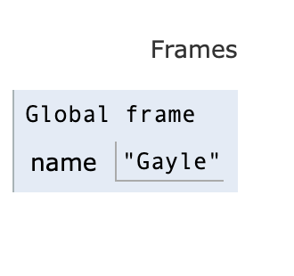
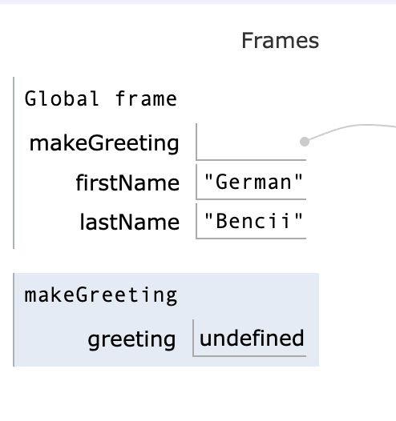
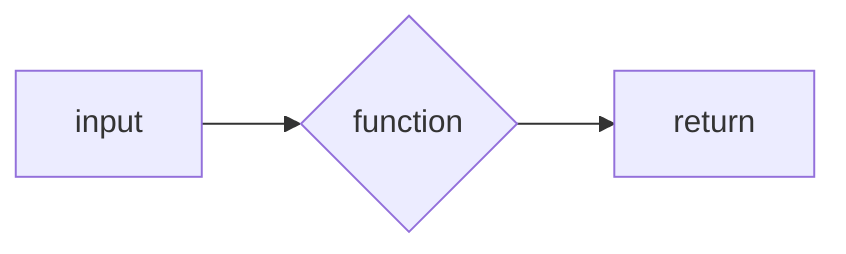
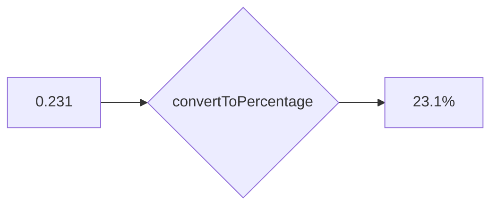

+++
title = 'prep'
layout = 'prep'
emoji= '📝'
menu_level = ['sprint']
weight = 1
backlog= 'Module-JS1'
backlog_filter= 'Week 2'
[[blocks]]
name="Roles in Tech"
src="https://cyf-pd.netlify.app/blocks/prep-roles-in-tech/readme/"
+++

## Learning objectives

- Label and describe the syntactic features of a function declaration
- Identify a call site
- Differentiate between a function declaration and a function invocation
- Construct simple expressions to represent a calculation
- Define a _parameter_
- Identify the return value evaluated at a call site given its function declaration
- Identify the value assigned to a parameter when a function is invoked
- Given a short program, state the number of times a given function is called
- Differentiate between parameters and arguments
- Invoke a given function with appropriate arguments to produce some target output
- Describe how to log the return value of a function
- Analyse each line in a given program and state what the line does when the program executes
- Explain the difference between returning a value and logging a value
- Assess and explain whether a function can reference a given variable or not
- Explain how to reuse some code to perform a specific task
- Propose clear and meaningful parameter names for a function
- Give examples of how functionality can be generalised

## 🧩 Percentages

Let's start off by defining a problem.

> Given a _decimal number_ I want to convert it into a _percentage format_.

For example, given the decimal number `0.5` we should get the string `"50%"`.
And given the decimal number `0.231` we should get `"23.1%"` and so forth.

## Restating the problem

We want to implement some functionality to convert _any_ given number into a percentage.
Previously, we saw how to perform a given task using some functions. Here are some examples:

```js {linenos=table,linenostart=1}
console.log("hello world"); // logs "hello world" to the console
Math.round(3.141); // evaluates to 3
```

All these expressions are _function calls_: we’re passing input (`"hello world"` or `3.141`) to the functions (`console.log` or `Math.round`) to use their functionality. In the case of `Math.round` and `console.log` these functions have been created and made available to use whenever we start running a program with NodeJS.

However, no such pre-built function allows us to convert any number to a percentage. So we're going to create a function called `convertToPercentage` with the following requirements:

- takes any number input
- converts it to a string in percentage form, and returns that string.

```js {linenos=table,linenostart=1}
convertToPercentage(0.5); // should return "50%"
```

```js {linenos=table,linenostart=1}
convertToPercentage(0.231); // should return "23.1%"
```

## Useful expressions

It is often helpful to solve a problem in one specific instance before doing it for all cases.

In programming, we always try the simplest thing first. Let’s consider how to convert just one number in to a percentage.
Let’s consider the variable declaration below:

```js {linenos=table,linenostart=1}
const decimalNumber = 0.5;
```

We want to create an expression for the percentage using the value of `num`.
To convert to a percentage, we can multiply the number by 100 and then add a `"%"` sign on the end.

So we can write:

```js {linenos=table,linenostart=1}
const decimalNumber = 0.5;
const percentage = `${num * 100}%`;
```

Recalling template literals, the expression in the curly braces will be evaluated first and then inserted into the string, giving us the percentage string.



The following variables represent the dimensions of a rectangle:

```js
const height = ; // could have a value like 10
const width = ; // could have a value like 30
```

Create variables `area` and `perimeter` for the area and perimeter of the rectangle, by creating expressions from the `height` and `width` variables.

```js
const area = FILL_ME_IN;
const perimeter = FILL_ME_IN;
```

Try putting in different numeric values of `height` and `width` to check the `area` and `perimeter` values are still correct.





The following variable represents the cost of something in pence:

```js
const price = ; // could have a value like 130
```

Write an expression for the price in pounds. The price in pounds should start with a "£" symbol.
The price should be to 2 decimal places.



## ♻️ Wrapping up functionality

Now we want to wrap up the expression we’ve created and reuse it to convert any number into a percentage.

We can write a function declaration to reuse some code. A function declaration looks like this:

```js {linenos=table,linenostart=1}
function convertToPercentage() {}
```

The `function` declaration consists of the following syntactic elements:

- `function` keyword, denotes the beginning of a function declaration
- `convertToPercentage` - this is the name of the function
- `()` - any input to the function will go between these (our function above doesn't take any input (yet), but it still needs the `()`s)
- `{}` - the body of the function is written inside the curly braces (our function above doesn't do anything yet, but it still needs the `{}`s)

We can wrap the functionality we want to reuse inside the curly braces by writing:

```js {linenos=table,linenostart=1}
function convertToPercentage() {
  const decimalNumber = 0.5;
  const percentage = `${num * 100}%`;
}
```

## 🔎 Checking the output

Earlier we saw how to store a function's return value in a variable.

```js
const result = Math.round(10.3);
```

In the example from before, we call `Math.round` which takes the input `10.3` and then returns the rounded number `10`. So `result` stores a value of `10`.

Now we want to call the function `convertToPercentage` and store the return value in a variable.
We can store the return value in a variable in exactly the same way:

```js {linenos=table,hl_lines=["5"],linenostart=1}
function convertToPercentage() {
  const decimalNumber = 0.5;
  const percentage = `${num * 100}%`;
}
const result = convertToPercentage(0.3);
```

Then we can print the value of the result to the terminal using `console.log`.

```js {linenos=table,hl_lines=["6"],linenostart=1}
function convertToPercentage() {
  const decimalNumber = 0.5;
  const percentage = `${num * 100}%`;
}
const result = convertToPercentage(0.3);
console.log(result);
```


Given the code above, try predicting what `result` will evaluate to.



If our function behaves as intended, we expect the value of `result` to be `"30%"`, and to see `30%` (without the quotes) printed in the terminal.

## Undefined values

When we log `result`'s value to the terminal we get `undefined`.
We need to specify the value we want to return from our function. If we don't state what our function should return, the default return value will be `undefined`.

## Setting a return value

We write a return statement to specify a function's return value (what an expression calling the function will evaluate to).

If your function call is like a question, the return statement is the answer. It's what comes back.

We can add a return statement to the function as follows:

```js {linenos=table,hl_lines=["4"],linenostart=1}
function convertToPercentage() {
  const decimalNumber = 0.5;
  return `${num * 100}%`;
}
```

However, we can also keep the variable `percentage` and refer to it in the return statement:

```js {linenos=table,hl_lines=["4"],linenostart=1}
function convertToPercentage() {
  const decimalNumber = 0.5;
  const percentage = `${num * 100}%`;
  return percentage;
}
```

Now that our function contains a `return` statement we can re-run our script to check the output.

## Checking with different inputs

Now we have a function declaration we can check if our function works for any number. We can call `convertToPercentage` with different arguments and check the return value we get each time.

```js {linenos=table,hl_lines=["7-8"],linenostart=1}
function convertToPercentage() {
  const decimalNumber = 0.5;
  const percentage = `${num * 100}%`;
  return percentage;
}

const output1 = convertToPercentage(0.5);
const output2 = convertToPercentage(0.231);

console.log(output1);
console.log(output2);
```

When we execute the code we _want_ to log the target output for each input `0.5` and `0.231`:

```
50%
23.1%
```

However, _given the function's current implementation_, we get the following logs:

```
50%
50%
```

## 💻 Playing computer

> To understand how `convertToPercentage` currently behaves we must build a mental model of how the computer executes our code.

To make sense of how the computer executes our code, we use a method called **playing computer**.


**Playing computer** means simulating how the computer executes our code.
We have to step through the code line by line and work out what the computer does when it encounters a particular instruction.

This is difficult at first: however with practice, we develop a powerful tool for understanding how our code works.


## ➡️ Current line of code

We can make use of execution diagrams to step through our code.

Firstly, we need a way to track the **line of code that is currently executing.**



In the interactive widget below, we use an arrow to indicate which line of code is currently being executed.
Each line is an instruction to the computer that will produce some effect.
For example, a line of code with a variable declaration means "store a new variable with a particular value".

Click on next to observe what happens when the computer executes the variable declaration.

<iframe width="800" height="300" frameborder="0" src="https://pythontutor.com/iframe-embed.html#code=const%20name%20%3D%20'Gayle'%3B&codeDivHeight=400&codeDivWidth=350&cumulative=false&curInstr=0&heapPrimitives=nevernest&origin=opt-frontend.js&py=js&rawInputLstJSON=%5B%5D&textReferences=false"> </iframe>



## 🖼️ Storing things in memory

As variables are declared, we need a way to track the memory stored as our program executes.
In our diagrams, we keep track of memory using a _frame_.

For now, we can think of a frame as a space in our diagram that represents the variables stored in memory.

The _global frame_ is always the first frame that gets created when our program starts executing. We can think of the _global frame_ as a location for variables created outside of any function. When we run the variable declaration above, we get a string `"Gayle"` stored in the Global frame:



## 📲 Calling functions

So far, we've seen two things:

- lines of code are executed from top to bottom
- we keep track of variables stored in memory using a global frame

However, we must consider what happens when we declare and call a function in our program.
Let's consider another example:

<iframe width="850" height="375" frameborder="0" src="https://pythontutor.com/iframe-embed.html#code=const%20firstName%20%3D%20'German'%3B%0Aconst%20lastName%20%3D%20'Bencii'%3B%0A%0Afunction%20makeGreeting%28%29%20%7B%0A%20%20%20%20const%20greeting%20%3D%20%60Hello%20there%60%3B%20%0A%7D%0A%0AmakeGreeting%28%29%3B&codeDivHeight=400&codeDivWidth=350&cumulative=false&curInstr=5&heapPrimitives=nevernest&origin=opt-frontend.js&py=js&rawInputLstJSON=%5B%5D&textReferences=false"> </iframe>

The first thing in the program is the function declaration for `makeGreeting`.

`makeGreeting` is stored in the Global frame as an **object**. We don't need to explore objects as this point - all we need to understand at this stage is that objects are a data type in JavaScript. We will return to objects in more depth later on in the course.

On line 7 we have a function call:

```js {linenos=table,hl_lines=["7"],linenostart=1}
function makeGreeting() {
  const greeting = "Hello there!";
}

const firstName = "German";
const lastName = "Bencci";

makeGreeting();
```

A function call means "go execute the instructions in the body of a function".

🤔 In our diagram we need a way to show what happens to the current executing line when a function is called.


Given the code above, try using the visualisation diagrams to work out what happens when `makeGreeting` is called on line 7.

What happens to the arrow indicating the current line of code that we're executing.
What else do you notice when `makeGreeting` is called above?



The arrow representing the current line of execution now moves to the first line inside the function: this shows that the computer now starts running instructions inside the function.

In addition, another frame is created when we call `makeGreeting`:



Like the global frame, the `makeGreeting` frame will be used to track variables that are created when `makeGreeting` is executed.

## 📥 Returning from a function

Earlier we defined the value a function call evaluates to by writing a return statement with a return value.

<iframe width="800" height="350" frameborder="0" src="https://pythontutor.com/iframe-embed.html#code=function%20makeGreeting%28%29%20%7B%0A%20%20%20%20const%20greeting%20%3D%20%60Hello%20there%60%3B%0A%20%20%20%20return%20greeting%3B%0A%7D%0A%0Aconst%20firstName%20%3D%20'German'%3B%0Aconst%20lastName%20%3D%20'Bencii'%3B%0A%0A%0A%0AmakeGreeting%28%29%3B&codeDivHeight=400&codeDivWidth=350&cumulative=false&curInstr=0&heapPrimitives=nevernest&origin=opt-frontend.js&py=js&rawInputLstJSON=%5B%5D&textReferences=false"> </iframe>

However, we can see that the `return` keyword also has additional effects. As well as defining the value the function call will evaluate to, it also tells us to "return" to the place in our code where the function was called.


Try using the visualisation diagram above to work out what happens when the computer executes the return statement.



## 🧩 Putting everything together

So now we have some idea of how the computer executes our code, we can apply these ideas to a program for our current implementation of `convertToPercentage`:

<iframe width="800" height="350" frameborder="0" src="https://pythontutor.com/iframe-embed.html#code=function%20convertToPercentage%28%29%20%7B%0A%20%20const%20num%20%3D%200.5%3B%0A%20%20const%20percentage%20%3D%20%60%24%7Bnum%20*%20100%7D%25%60%3B%0A%20%20return%20percentage%3B%0A%7D%0A%0Aconst%20output1%20%3D%20convertToPercentage%280.5%29%3B%0Aconst%20output2%20%3D%20convertToPercentage%280.3%29%3B&codeDivHeight=400&codeDivWidth=350&cumulative=false&curInstr=0&heapPrimitives=nevernest&origin=opt-frontend.js&py=js&rawInputLstJSON=%5B%5D&textReferences=false"> </iframe>



Earlier we noted that when the computer executes the code above, we get the following output:

```bash
50%
50%
```

Given the code above, try using the visualisation diagrams to "play computer" with this example. Try stepping through each line of code to explain why the program is giving this output



## Checking our code

Given our code below:

```js {linenos=table,hl_lines=[7] ,linenostart=1}
function convertToPercentage() {
  const decimalNumber = 0.5;
  const percentage = `${num * 100}%`;
  return percentage;
}

const output1 = convertToPercentage(0.5);
const output2 = convertToPercentage(0.23);
```

when the function `convertToPercentage` is called, the variable `num` gets recreated in the `convertToPercentage` frame and set to `0.5` every time we call the function. Instead of `num` being set to `0.5` every time the function is called, we want to make use of the input that is passed to the function `convertToPercentage` each time it is called.

## Parametrising a function

To make this function reusable for any number, we need to handle inputs. We do this using a **parameter**.

🔑 A parameter is a special kind of variable that enables us to reference the input to a function.

We can add a parameter `num` to our function, as with the execution diagram below:

We can think of a function as a "box". We pass inputs to into it, the function's code is executed and we get a return value at the end. We can visualise this as follows:



We could visualise what happens when `makeGreeting` is passed a specific argument:



This time we have a difference in that we have defined a parameter `num` in the function declaration inside parentheses after the function name `convertToPercentage`. In our current mental model, a function call means going to `convertToPercentage` and running the code inside the function.

<iframe width="800" height="350" frameborder="0" src="https://pythontutor.com/iframe-embed.html#code=function%20convertToPercentage%28num%29%20%7B%0A%20%20const%20percentage%20%3D%20%60%24%7Bnum%20*%20100%7D%25%60%3B%0A%20%20return%20percentage%3B%0A%7D%0A%0Aconst%20output1%20%3D%20convertToPercentage%280.5%29%3B%0Aconst%20output2%20%3D%20convertToPercentage%280.3%29%3B&codeDivHeight=400&codeDivWidth=350&cumulative=false&curInstr=0&heapPrimitives=nevernest&origin=opt-frontend.js&py=js&rawInputLstJSON=%5B%5D&textReferences=false"> </iframe>


Use the visualiation diagram to see what happens when the code above is executed. Pay special attention the lines where `convertToPercentage` is called.



Use the visualiation digram to see what happens when the code is above is executed. Pay special attention the lines when `convertToPercentage` is called.

