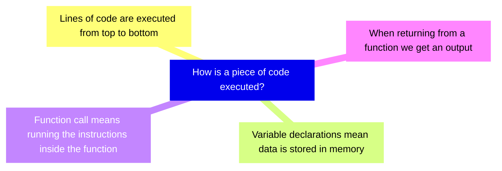
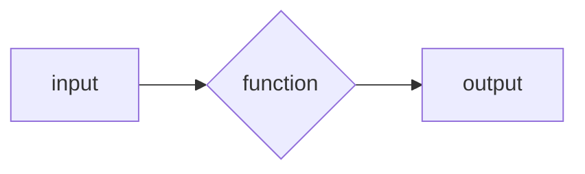
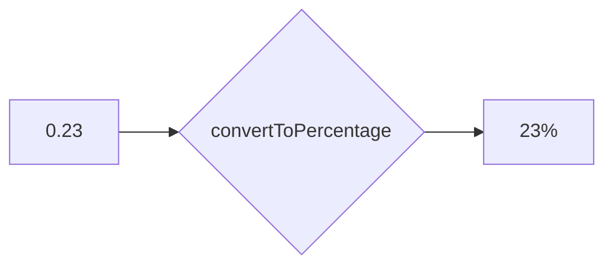

+++
title = 'prep'
layout = 'prep'
emoji= '📝'
menu_level = ['sprint']
weight = 1
backlog= 'Module-JS1'
backlog_filter= 'Week 2'
[[blocks]]
name="Roles in Tech"
src="https://cyf-pd.netlify.app/blocks/prep-roles-in-tech/readme/"
+++

## Learning objectives

- Label and describe the syntactic features of a function declaration
- Identify a call site
- Differentiate between a function declaration and a function invocation
- Propose a function definition to satisfy some problem requirements
- Given a short program, determine which variable names are _bad_ choices
- Give examples of when the `undefined` data type may occur in a JavaScript program
- Construct simple expressions to represent a set of operations
- Define a _parameter_
- Identify the return value a call site given its function declaration
- Identify the value assigned to a parameter when a function is invoked
- Identify the type of a return value given some call site
- Given a short program, state the number of times a given function is called
- Differentiate between parameters and arguments
- Invoke a given function with appropriate arguments to produce some target output
- Describe how to log the output of a function
- Analyse each line in a given program and state what the line does when the program executes
- Explain the difference between returning a value and logging a value
- Assess and explain whether a function can reference a given variable or not
- Explain what is meant by the term "implementation opacity"
- Explain how to reuse some code to perform a specific task
- Propose clear and meaningful parameter names for a function
- Given a problem, suggest clear semantic names for a function designed to solve the given problem
- Give examples of how functionality can be generalised

## Notes

### 🧩 Percentages

Given a number I want to convert it into a percentage format.

For example, given the number `0.5` we should get `"50%"`
And given the number `0.23` we should get `"23%"` and so forth.

### Restating the problem

We want to implement some functionality to convert _any_ given number into a percentage.
Previously, we saw how to use some functions to perform a given task. Here are some examples:

```js {linenos=table,linenostart=1}
console.log("hello world"); // prints "hello world" to the console
Math.round(3.141); // will output 3
```

All these expressions are _function calls_: we’re passing input to the functions, `console.log` or `Math.round` to use their functionality. In the case of `Math.round` and `console.log` these functions have been created and made available to use whenever we start running a program with NodeJS.

However, there is so no such pre-built function that allows us to convert any number to a percentage. So we're going to create a function called `convertToPercentage` with the following properties:

- takes any number input
- converts it to a string output in percentage form.

```js {linenos=table,linenostart=1}
convertToPercentage(0.5); // should return "50%"
```

```js {linenos=table,linenostart=1}
convertToPercentage(0.23); // should return "23%"
```

<br>

### Useful expressions

It is often helpful to solve a problem in one specific instance before doing it for all cases.

In programming, we always try the simplest thing first. Let’s consider how to convert just one number in to a percentage.
Let’s consider the variable declaration below:

```js {linenos=table,linenostart=1}
const num = 0.5;
```

We want to create an expression for the percentage using the value of `num`.
To convert to a percentage, we can multiply the number by 100 and then add a `"%"` sign on the end.

So we can write:

```js {linenos=table,linenostart=1}
const num = 0.5;
const percentage = `${num * 100}%`;
```

Recalling template literals, the expression in the curly braces will be evaluated first and then inserted into the string, giving us the percentage string.



The following variables represent the dimensions of a rectangle:

```js
height; // could have a value like 10
width; // could have a value like 30
```

Write expressions for the following in terms of the variables above:
a) area of the rectangle
b) perimeter of the rectangle





The following variable represents the cost of something in pence:

```js
price; // could have a value like "130p"
```

Write an expression for the price in pounds. The price in pounds should start with a "£" symbol. The price should be to 2 decimal places.



<br>

### ♻️ Wrapping up functionality

Now we want to wrap up the expression we’ve created and reuse it to convert any number into a percentage.

We can write a function declaration to reuse some code. A function declaration looks like this:

```js {linenos=table,linenostart=1}
function convertToPercentage() {}
```

The `function` declaration consists of the following syntactic elements:

- `function` keyword, denotes the beginning of a function declaration
- `convertToPercentage` - this is the name of the function
- `{}` - the body of the function is written inside the curly braces

We can wrap the functionality we want to reuse inside the curly braces by writing:

```js {linenos=table,linenostart=1}
function convertToPercentage() {
  const num = 0.5;
  const percentage = `${num * 100}%`;
}
```

<br>

### 🔎 Checking the output

Earlier we saw how to store a function's output in a variable.

```js
const result = Math.round(10.3);
```

In the code above, we call `Math.round` which takes the input `10.3` and then outputs the rounded number `10`. So `result` stores a value of `10`.

Now we want to call the function `convertToPercentage` and store the output in a variable.
We can store the return value in a variable in exactly the same way:

```js {linenos=table,hl_lines=["5"],linenostart=1}
function convertToPercentage() {
  const num = 0.5;
  const percentage = `${num * 100}%`;
}
const result = convertToPercentage(0.3);
```

Then we can print the value of the result to the terminal using `console.log`.

```js {linenos=table,hl_lines=["6"],linenostart=1}
function convertToPercentage() {
  const num = 0.5;
  const percentage = `${num * 100}%`;
}
const result = convertToPercentage(0.3);
console.log(result);
```

If our function behaves as intended, we expect the output to be `"30%"`.

<br>


Given the code above, try predicting what `result` will evaluate to.



### Undefined values

When we log result's value to the terminal we get a new data type - `undefined`.  
`undefined` is a data type used to represent the absence of a value.  
We need to specify the value want to output from our function. If we don't state what our function should output then the default output will be `undefined`.

<br>

### Setting an output

To specify a function's output, we write a `return` statement.

If your function call is like a question, the return statement is the answer. It's what comes back.

We can add a return statement to the function as follows:

```js {linenos=table,hl_lines=["4"],linenostart=1}
function convertToPercentage() {
  const num = 0.5;
  const percentage = `${num * 100}%`;
  return percentage;
}
```

Now that our function contains a `return` statement we can re-run our script to check the output.

### Checking with different inputs

Now we have a function declaration we can check if our function works for any number. We can call `convertToPercentage` with different arguments and check the outputs we get each time.

```js {linenos=table,hl_lines=["7-8"],linenostart=1}
function convertToPercentage() {
  const num = 0.5;
  const percentage = `${num * 100}%`;
  return percentage;
}

const output1 = convertToPercentage(0.5);
const output2 = convertToPercentage(0.3);
```

When we execute the code we _want_ to log the target output for each input `0.5` and `0.3`:

```bash
50%
23%
```

However, _given the function's current implementation_, we get the following logs:

```bash
50%
50%
```

### 💻 Playing computer

To understand how our function currently behaves we must start building an understanding of how our code is executed. We might currently have some ideas of how code is executed in our program:



### ➡️ Current line of code

We can make use of execution diagrams to visualise how a program is executed by a computer.

Firstly, we need a way to track the **line of code that is currently executing.** In the diagrams below, we use an arrow to indicate which line of code is currently being executed. Each line is an instruction to the computer that will produce some effect. For example, a line of code with a variable declaration means "store a new variable with a particular value".

Let's consider an example:

<iframe width="800" height="300" frameborder="0" src="https://pythontutor.com/iframe-embed.html#code=const%20name%20%3D%20'Gayle'%3B&codeDivHeight=400&codeDivWidth=350&cumulative=false&curInstr=0&heapPrimitives=nevernest&origin=opt-frontend.js&py=js&rawInputLstJSON=%5B%5D&textReferences=false"> </iframe>

In the example above, we have a single variable declaration:

```js
const name = "Gayle";
```

which means store a string `"Gayle"` in memory.

### 🖼️ Storing things in memory

As variables are declared, we need a way to keep track of the memory that is stored as our program executes.
In our diagrams, we keep track of memory using a _frame_.

For now, we can think of a frame as a space in our diagram that represents the variables stored in memory in some part of our code.

The _global frame_ is always the first frame that gets created when our program starts executing. We can think of the _global frame_ as a location for variables created outside of any function. When we run the variable declaration above, we get a string `"Gayle"` stored in the Global frame:


### 🏃 Executing functions

So far we've seen 2 things:

- lines of code are executed from top to bottom
- we keep track of variables stored in memory using a global frame

However, we need to consider what happens when we declare and call a function in our program.
Let's consider another example:

<iframe width="850" height="375" frameborder="0" src="https://pythontutor.com/iframe-embed.html#code=const%20firstName%20%3D%20'German'%3B%0Aconst%20lastName%20%3D%20'Bencii'%3B%0A%0Afunction%20makeGreeting%28%29%20%7B%0A%20%20%20%20const%20greeting%20%3D%20%60Hello%20there%60%3B%20%0A%7D%0A%0AmakeGreeting%28%29%3B&codeDivHeight=400&codeDivWidth=350&cumulative=false&curInstr=5&heapPrimitives=nevernest&origin=opt-frontend.js&py=js&rawInputLstJSON=%5B%5D&textReferences=false"> </iframe>

The first thing in the program is the function declaration for `makeGreeting`.

`makeGreeting` is stored in the Global frame as an **object**. We don't need to explore objects as this point - all we need to understand at this stage is that objects are a data type in JavaScript. We will return to objects in more depth later on in the course.

On line 11 we have a function call:

```js {linenos=table,hl_lines=["7"],linenostart=1}
function makeGreeting() {
  const greeting = "Hello there!";
}
const firstName = "German";
const lastName = "Bencci";

makeGreeting();
```

A function call means "go execute the instructions in the body of a function".

🤔 In our diagram we need a way to show what happens to the current executing line when a function is called.


Given the code above, try using the visualisation diagrams to work out what happens when `makeGreeting` is called on line 8.

What happens to the arrow indicating the current line of code that we're executing.
What else do you notice when `makeGreeting` is called above?



The arrow representing the current line of execution now moves to the first line inside the function: this shows that the computer now starts running instructions inside the function.

In addition, another frame is created when we call `makeGreeting`:


Like the global frame, the `makeGreeting` frame will be used to track variables that are created when `makeGreeting` is executed.

<br>

### 📥 Returning from a function

Earlier we defined output for the function by writing a return statement and setting a return value.

<iframe width="800" height="350" frameborder="0" src="https://pythontutor.com/iframe-embed.html#code=function%20makeGreeting%28%29%20%7B%0A%20%20%20%20const%20greeting%20%3D%20%60Hello%20there%60%3B%0A%20%20%20%20return%20greeting%3B%0A%7D%0A%0Aconst%20firstName%20%3D%20'German'%3B%0Aconst%20lastName%20%3D%20'Bencii'%3B%0A%0A%0A%0AmakeGreeting%28%29%3B&codeDivHeight=400&codeDivWidth=350&cumulative=false&curInstr=0&heapPrimitives=nevernest&origin=opt-frontend.js&py=js&rawInputLstJSON=%5B%5D&textReferences=false"> </iframe>

However, we can see that the `return` keyword also has additional effects. As well as defining the output, it also tells us to "return" to the place in our code where the function was called.


Try using the visualisation diagram above to work out what happens when the computer executes the return statement.



<br>
<br>
<br>

### 🧩 Putting everything together

So now we have some idea of how the computer executes our code, we can apply these ideas to a program for our current implementation of `convertToPercentage`:

<iframe width="800" height="350" frameborder="0" src="https://pythontutor.com/iframe-embed.html#code=function%20convertToPercentage%28%29%20%7B%0A%20%20const%20num%20%3D%200.5%3B%0A%20%20const%20percentage%20%3D%20%60%24%7Bnum%20*%20100%7D%25%60%3B%0A%20%20return%20percentage%3B%0A%7D%0A%0Aconst%20output1%20%3D%20convertToPercentage%280.5%29%3B%0Aconst%20output2%20%3D%20convertToPercentage%280.3%29%3B&codeDivHeight=400&codeDivWidth=350&cumulative=false&curInstr=0&heapPrimitives=nevernest&origin=opt-frontend.js&py=js&rawInputLstJSON=%5B%5D&textReferences=false"> </iframe>

<br>
<br>



Earlier we noted that when the computer executes the code above, we get the following output:

```bash
50%
50%
```

Given the code above, try using the visualisation diagrams to "play computer" with this example. Try stepping through each line of code to explain why the program is giving this output



<br>
<br>

### Checking our code

Given our code below:

```js {linenos=table,hl_lines=[7] ,linenostart=1}
function convertToPercentage() {
  const num = 0.5;
  const percentage = `${num * 100}%`;
  return percentage;
}

const output1 = convertToPercentage(0.5);
const output2 = convertToPercentage(0.23);
```

when the function `convertToPercentage` is called, the variable `num` gets recreated in the `convertToPercentage` frame and set to `0.5` every time we call the function. Instead of `num` being reset every time the function is called, we want to make use of the input that is passed to the function `convertToPercentage` every time it is called.

<br>

### Parametrising a function

To make this function reusable for any number, we need to handle inputs. We do this using a **parameter**.

🔑 A parameter is a variable that enables us to reference the input to a function.

We can add a parameter `num` to our function, as with the execution diagram below:

We can think of a function as a "box". We pass inputs to into it, the function's code is executed and we get an output at the end. We can visualise this as follows:



We could visualise what happens when `makeGreeting` is passed a specific argument:



This time we have a difference in that we have defined a parameter `num` in the function declaration inside parentheses after the function name `convertToPercentage`. In our current mental model, a function call means going to `convertToPercentage` and running the code inside the function.

<iframe width="800" height="350" frameborder="0" src="https://pythontutor.com/iframe-embed.html#code=function%20convertToPercentage%28num%29%20%7B%0A%20%20const%20percentage%20%3D%20%60%24%7Bnum%20*%20100%7D%25%60%3B%0A%20%20return%20percentage%3B%0A%7D%0A%0Aconst%20output1%20%3D%20convertToPercentage%280.5%29%3B%0Aconst%20output2%20%3D%20convertToPercentage%280.3%29%3B&codeDivHeight=400&codeDivWidth=350&cumulative=false&curInstr=0&heapPrimitives=nevernest&origin=opt-frontend.js&py=js&rawInputLstJSON=%5B%5D&textReferences=false"> </iframe>


Use the visualiation digram to see what happens when the code is above is executed. Pay special attention the lines when `convertToPercentage` is called.



Use the visualiation digram to see what happens when the code is above is executed. Pay special attention the lines when `convertToPercentage` is called.

