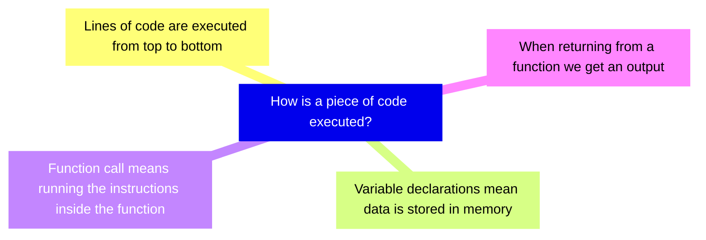
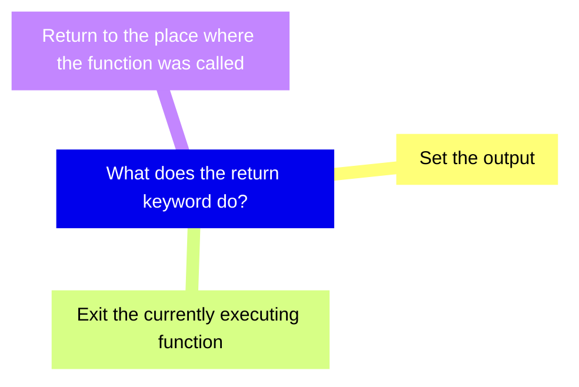
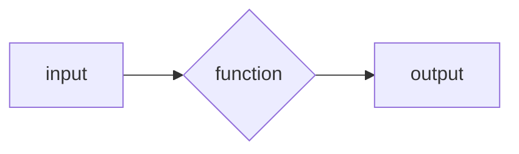
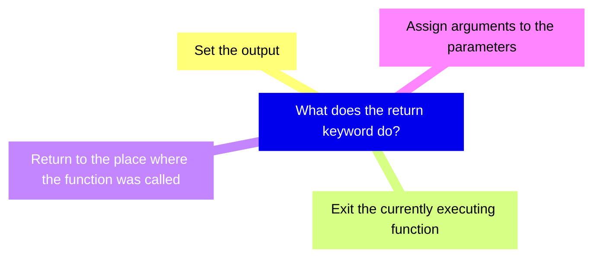

+++
title = 'prep'
layout = 'prep'
emoji= '📝'
menu_level = ['sprint']
weight = 1
backlog= 'Module-JS1'
backlog_filter= 'Week 2'
+++


## Learning objectives

- Label and describe the syntatic features of a function declaration
- Identify a call site
- Differentiate between a function declaration and a function invocation
- Propose a function definition to satisfy some problem requirements
- Given a short program, determine which variable names are _bad_ choices
- Give examples of when the `undefined` data type may occur in a JavaScript program
- Construct simple expressions to represent a set of operations
- Define a _parameter_
- Identify the return value a call site given its function declaration
- Identify the value assigned to a parameter when a function is invoked
- Identify the type of a return value given some call site
- Given a short program, state the number of times a given function is called
- Differentiate between parameters and arguments
- Invoke a given function with appropriate arguments to produce some target output
- Describe how to log the output of a function
- Analyse each line in a given program and state what the line does when the program executes
- Given a short program, specify the line in which a ReferenceError is thrown
- Define _local scope_
- Explain the difference between returning a value and logging a value
- Assess and explain whether a function can reference a given variable or not
- Explain what is meant by the term "implementation opacity" 
- Explain how to reuse some code to perform a specific task
- Propose clear and meaningful parameter names for a function
- Given a problem, suggest clear semantic names for a function designed to solve the given problem
- Give examples of how functionality can be generalised

## Notes 

### 🧩 Percentages


Given a number I want to convert it into a percentage format.

For example, given the number 0.5 we should get "50%"
And given the number 0.23 we should get "23%" and so forth.


### Restating the problem


We want to implement some functionality to convert _any_ given number into a percentage.
Previously, we saw how to use some functions to perform a given task. Here are some examples:

```js
console.log("hello world"); // prints "hello world" to the console
Math.round(3.141); // will output 3
```

All these expressions are _function calls_:  - we’re passing input to the functions, `console.log` or `Math.round` to use their functionality. 

In this case, we want to convert any number to a percentage. We can build a function to convert a specific number to a percentage. We can now say that we want to create a function that:


- takes any number input
- converts it to a string output in percentage form.


### Useful expressions


We want to convert any number into a percentage string. It is often helpful to solve a problem in one specific instance before doing it in any case.

Let’s consider how to convert just one number to a percentage. In programming, we always try the simplest thing first.
Let’s consider the variable declaration below:

```js
const num = 0.5;
```


We want to create an expression for the percentage using the value of num. 
To convert to a percentage, we can multiply the number by 100 and then add a `"%"` sign on the end.

So we can write:

```js
const num = 0.5;
const percentage = `${num * 100}%`;
```


Recalling template literals, the expression in the curly braces will be evaluated first and then inserted into the string, giving us the percentage string.


### ♻️ Wrapping up functionality


Now we want to wrap up the expression we’ve created and reuse it to convert any number into a percentage.

We can write a function declaration to reuse some code. A function declaration looks like this:


```js
function convertToPercentage() {

}
```

The `function` declaration consists of the following elements:
- `function` keyword, denotes the beginning of a function declaration
- convertToPercentage` - this is the name of the function 
- `{}` - the body of the function is written inside the curly braces

We can wrap the functionality we want to reuse inside the curly braces by writing:

```js {linenos=table,linenostart=1}
function convertToPercentage() {
   const num = 0.5;
   const percentage = `${num * 100}%`;`
}
```


### 🔎 Checking the output


Now we can call our function and store the output from the function.
We can write:


```js
const result = convertToPercentage(0.3);
```

Then we can print the value of the result to the terminal using `console.log`.

```js
const result = convertToPercentage(0.3);
console.log(result);
```


### Undefined values


When we log the value of the result to the terminal we observe a new data type - `undefined`. `undefined` is a data type used to represent the absence of some value. 

A function’s output is always `undefined` whenever we don’t set the output.
However, we need to get a percentage from our function every time it is called.


### Setting an output


In the body of our function, we can write a `return` statement, specifying the value we want to output.  
If your function call is a question, the return statement is the answer. It's what comes back.
We write a return statement as follows:

```js {linenos=table,hl_lines=4,linenostart=1}
function convertToPercentage() {
    const num = 0.5;
    const percentage = `${num * 100}%`;
    return percentage; 
}
```


Now that our function contains a `return` statement we can re-run our script to check the output.


### Calling with different arguments


Now we have a function declaration we can check if our function works for any number. We can call `convertToPercentage` with different arguments and check the outputs we get each time.

```js
console.log(convertToPercentage(0.5));
console.log(convertToPercentage(0.3));
```

When we execute the code we _want_ to log the target output for each input `0.5` and `0.3`:

```bash
50%
23%
```

However, _given the function's current implementation_, we get the following logs:

```bash
50%
50%
```


However, at the moment, our console output isn’t quite the same. See the diagram below:


###  💻 Playing computer

To understand how our function currently behaves we must start building a mental model to understand how our code is executed. Our current mental model may consist of the following ideas:





Let’s start by looking at our code:


```js {linenos=table,hl_lines=["1-5"] ,linenostart=1}
function convertToPercentage() {
    const num = 0.5;
    const percentage = `${num * 100}%`;
    return percentage;
}

console.log(convertToPercentage(0.5));
console.log(convertToPercentage(0.23));
```


### Storing things in memory

At the beginning of our script, we encounter a function declaration:

```js {linenos=table,hl_lines=["1-5"] ,linenostart=1}
function convertToPercentage() {
    const num = 0.5;
    const percentage = `${num * 100}%`;
    return percentage;
}

console.log(convertToPercentage(0.5));
console.log(convertToPercentage(0.23));
```

The function declaration `convertToPercentage` means a function is stored in memory.
We could write this as follows:


Mention that `convertToPercentage` is stored in memory but the code inside the body of `convertToPercentage` is not executed yet.


### Order of function calls

Now we encouter line 7:

```js {linenos=table,hl_lines=[7] ,linenostart=1}
function convertToPercentage() {
    const num = 0.5;
    const percentage = `${num * 100}%`;
    return percentage;
}

console.log(convertToPercentage(0.5));
console.log(convertToPercentage(0.23));
```


The statement `console.log(convertToPercenatage(0.5))` involves 2 function calls. We're calling `console.log` and we're also calling `convertToPercentage`. In this situation, `convertToPercentage` will get executed first: the program needs to evaluate `convertToPercentage` before logging the value.

So now we can run the code inside `convertToPercentage`.

###  ⬇️ Top to bottom

We can now start working from top to bottom inside the body of `convertToPercentage`. The first line in `convertToPercentage` is a variable declaration: so we can write this as follows:
 
```js {linenos=table, hl_lines=[2] ,linenostart=1}
function convertToPercentage() {
    const num = 0.5;
    const percentage = `${num * 100}%`;
    return percentage;
}

console.log(convertToPercentage(0.5));
console.log(convertToPercentage(0.23));
```

So now we can write memory as follows:


<iframe width="800" height="500" frameborder="0" src="https://pythontutor.com/iframe-embed.html#code=%0A%0A%0Afunction%20convertToPercentage%28%29%20%7B%0A%20%20%20%20const%20num%20%3D%200.5%3B%0A%20%20%20%20const%20percentage%20%3D%20%60%24%7Bnum%20*%20100%7D%25%60%3B%0A%20%20%20%20return%20percentage%3B%0A%7D%0A%0Aconsole.log%28convertToPercentage%280.5%29%29%3B%0Aconsole.log%28convertToPercentage%280.23%29%29%3B%0A%0A&codeDivHeight=400&codeDivWidth=350&cumulative=false&curInstr=0&heapPrimitives=nevernest&origin=opt-frontend.js&py=js&rawInputLstJSON=%5B%5D&textReferences=false"> </iframe>


### 📥 Returning from a function


Earlier we defined output for the function by writing a return statement and setting a return value.

However, the `return keyword` also has additional consequences. As well as defining the output, it also indicates where we go next during execution. The return keyword indicates we stop executing inside the current function and return to the location where the function was originally called.

So the return statement is a powerful statement which does 3 things:




<br>
<br>

### Logging the output


Mention here that we return out of the function and then make a call to console.log and hence get an output printed to the terminal.


### 💻 Playing computer 

Now we reach the line with the same form:

Good place for an activity inviting trainees to step through this line of code themselves in a similar fashion.


### Generalising functionality 

The variable `num` gets recreated and set to `0.5` every time we call the function `convertToPercentage`.  
So we need a way to access the input passed to the function each time. This will allow us to generalise our functionality: in other words, we’ll be able to reuse this function for any number we like.


### parametrising a function

To make this function reusable for any number, we need to introduce a parameter.


🔑 A parameter is a variable that enables us to reference the input to a function. 

We can write this as follows:

```js {linenos=table,hl_lines=1,linenostart=1}
function convertToPercentage(num) {
    const percentage = `${num * 100}%`;
    return percentage;
}

console.log(convertToPercentage(0.5));
console.log(convertToPercentage(0.23));
```


We can think of a function as a "box". We pass inputs to into it, the function's code executed and we get an output afterwards. We can visualise as follows:



This time we have a difference in that we have defined a parameter `num` in the function declaration inside parentheses after the function name `convertToPercentage`. In our current mental model, a function call means going to `convertToPercentage` and running the code inside the function.

We can now update the model and say if we have a parameter then we declare a variable called num first and assign it a value of the input that was passed to the function




### 🔭 Local scope


The variable `num` we described above is said to be in the local scope of `convertToPercentage`. 

When we say a variable is in local scope we are saying that num is only accessible within the body of `convertToPercentage`, the section of code enclosed by curly braces. 

We can prove that num is local to `convertToPercentage` by trying to reference `num` outside the body of `convertToPercentage`.

Let’s consider the code in a slightly modified form:

```js {linenos=table,hl_lines=4,linenostart=1}
function convertToPercentage(num) {
    return `${num * 100}%`;
}
console.log(num);

console.log(convertToPercentage(0.5));
console.log(convertToPercentage(0.23));
```

In this situation, num is a local variable and we’re attempting to reference it outside of `convertToPercentage`.


### Errors during execution


In the situation above, the runtime will throw an error. This means that the execution of the program will stop and we’ll get an error message telling us why the program execution was terminated. 
Will need to add more info about the ReferenceError here. 


