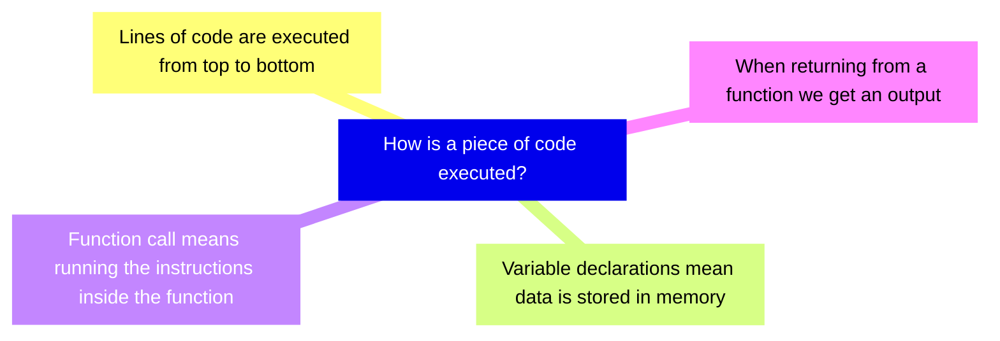
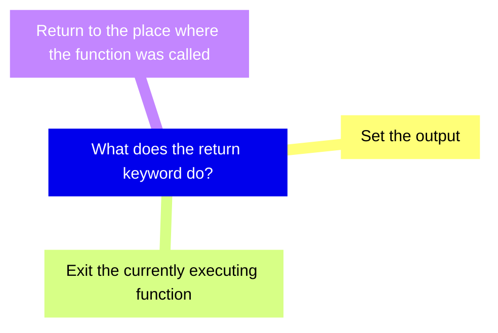
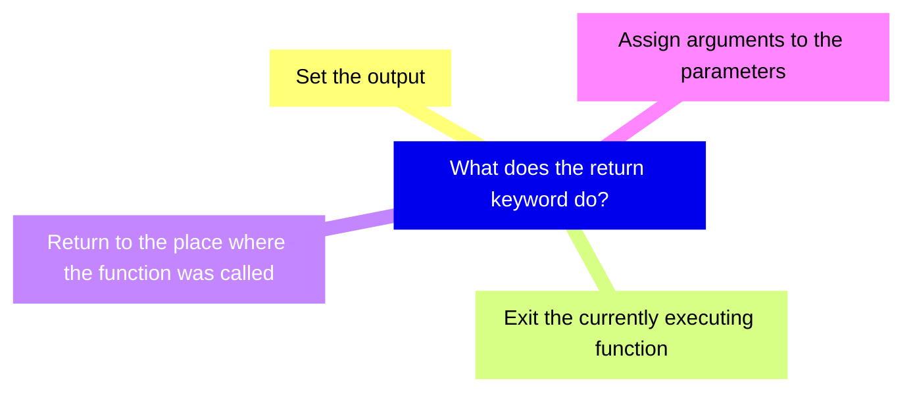

+++
title = 'prep'
layout = 'prep'
emoji= '📝'
menu_level = ['sprint']
weight = 1
backlog= 'Module-JS1'
backlog_filter= 'Week 2'
[[blocks]]
name="Roles in Tech"
src="https://cyf-pd.netlify.app/blocks/prep-roles-in-tech/readme/"
+++


### 🧩 Defining a problem


Given a number I want to convert it into a percentage format.

For example, given the number 0.5 we should get "50%"
And given the number 0.23 we should get "23%" and so forth.


### Restating the problem


So we want to implement some functionality that will enable us to convert any given number into a percentage.
Previously, we saw how to use some functions to perform a given task. Here are some examples:

```js
console.log("hello world"); // prints "hello world" to the console
Math.round(3.141); // will output 3
```

All these expressions above are _function calls_:  - we’re passing input to the functions, `console.log` or `Math.round` to use their functionality. 

In this case, we want to build functionality to convert any number to a percentage. As the previous examples indicate, we can build a function that will enable us to convert a specific number to a percentage. WSo given our problem above we can now say that we want to create a function that:


- takes any number input
- and converts it to a string output 
- in percentage form. 


### Useful expressions


We want to convert any number into a percentage string. However, it is often helpful to solve a problem in one specific instance before doing it in any case.

So let’s consider how to convert just one number and consider how to convert it to a percentage. In programming, we always try the simplest thing first.
Hopefully being able to do this for one number will help us to do this for any number later on.
Let’s consider the variable declaration below:

```js
const num = 0.5;
```


In our code, we want to create an expression for the percentage using the value of num. 
To convert to a percentage, we can multiply the number by 100 and then add a `"%"` sign on the end.

So we can write:

```js
const num = 0.5;
const percentage = `${num * 100}%`;
```


Recalling template literals, the expression in the curly braces will be evaluated first and then inserted into the string, giving us the percentage string.


### ♻️ Wrapping up functionality


Can we take the expression we’ve created and wrap it up somehow so that it can be reused to convert any number into a percentage?

We can take this unit of code and write a function declaration to reuse some given unit of code. A function declaration looks like this:


```js
function convertToPercentage() {

}
```

Then go through the different syntactic elements of the function declaration - including the function name. 
Inside the curly braces, we can insert any number of javascript statements that we want to reuse.  
So we can wrap up the functionality we want to reuse inside the curly braces and write:

```js {linenos=table,hl_lines=[2,3],linenostart=1}
function convertToPercentage() {
   const num = 0.5;
   const percentage = `${num * 100}%`;`
}   
```


### 🔎 Checking the output


Now we can call our function and store the output from the function.
So we can write:


```js
const result = convertToPercentage(0.3);
```

Then we can print the value of the result to the terminal using `console.log`.

```js
const result = convertToPercentage(0.3);
console.log(result);
```


### Undefined values


When we log the value of the result to the terminal we get a new data type - `undefined`. `undefined` is a data type used to represent the absence of some value. 

A function’s output is always `undefined` whenever we don’t set the output.
However, we need to get a percentage from our function every time it is called.


### Setting an output


In the body of our function, we can write a return statement, specifying the value we want to output. We write a return statement as follows:

```js {linenos=table,hl_lines=4,linenostart=1}
function convertToPercentage() {
    const num = 0.5;
    const percentage = `${num * 100}%`;
    return percentage; 
}
```


Now that our function contains a return statement we can re-run our script to check the output.

### Calling with different arguments


```js
console.log(convertToPercentage(0.5));
console.log(convertToPercentage(0.3));
```


Now we have a function declaration we can check if our function works for any number. If we call the function with different arguments, we should get different corresponding outputs each time.
So we can call our function several times:

```bash
50%
50%
```


When we execute the code we expect to see `"50%"` and `"23%"`.
However, at the moment, our console output isn’t quite the same. See the diagram below:


### Code runtime

To understand how our function currently behaves we must start building a mental model to understand how our code is executed during runtime. Our current mental model may consist of the following ideas:





Let’s start by looking at our code:


```js
function convertToPercentage() {
    const num = 0.5;
    const percentage = `${num * 100}%`;
    return percentage;
}

console.log(convertToPercentage(0.5));
console.log(convertToPercentage(0.23));
```


### Storing things in memory

Mention that `convertToPercentage` is stored in memory at first ( but not executed )


### Order of function calls

Still needs fleshing out here. Talk about entering `convertToPercentage` first and running the code in there. There is no explicit need to mention the call stack here, but we are preparing the ground. The entry point will involve examining what happens with the expression:


```js
console.log(convertToPercentage(0.5));
```


###  ⬇️ Top to bottom


Still needs fleshing out here. Talk about running code in the function line by line from top to bottom ( this is more recap )


### ✉️ Returning from a function


Earlier we defined output for the function by writing a return statement and setting a return value.

However, the `return keyword` also has additional consequences. As well as defining the output, it also indicates where we go next during runtime. The return keyword indicates we stop executing inside the current function and return to the location where the function was originally called.

So the return statement is a powerful statement which does 3 things:





### Logging the output


Mention here that we return out of the function and then make a call to console.log and hence get an output printed to the terminal.


### Stepping through again

Now we reach the line with the same form:

Good place for an activity inviting trainees to step through this line of code themselves in a similar fashion.


### Generalising functionality 

The variable `num` gets recreated and set to `0.5` every time we call the function `convertToPercentage`.  
So we need a way to access the input passed to the function each time. This will allow us to generalise our functionality: in other words, we’ll be able to reuse this function for any number we like.


### Parameterising a function

To make this function reusable for any number, we need to introduce a parameter.


🔑 A parameter is a variable that enables us to reference the input to a function. 

We can write this as follows:

```js {linenos=table,hl_lines=1,linenostart=1}
function convertToPercentage(num) {
    const percentage = `${num * 100}%`;
    return percentage;
}
```

This time we have a difference in that we have defined a parameter num in the function declaration of `convertToPercentage`. In our current mental model, a function call means going to `convertToPercentage` and running the code inside the function.

🔑 We can now update the model and say if we have a parameter then we declare a variable called num first and assign it a value of the input that was passed to the function




### 🔭 Local scope


The variable `num` we described above is said to be in the local scope of `convertToPercentage`. 

When we say a variable is in local scope we are saying that num is only accessible within the body of `convertToPercentage`, the section of code enclosed by curly braces. 

We can prove that num is local to `convertToPercentage` by trying to reference `num` outside the body of `convertToPercentage`.

Let’s consider the code in a slightly modified form:

```js {linenos=table,hl_lines=4,linenostart=1}
function convertToPercentage(num) {
    return `${num * 100}%`;
}
console.log(num);

console.log(convertToPercentage(0.5));
console.log(convertToPercentage(0.23));
```

In this situation, num is a local variable and we’re attempting to reference it outside of `convertToPercentage`.


### Runtime errors


In the situation above, the runtime will throw an error. This means that the execution of the program will stop and we’ll get an error message telling us why the program execution was terminated. 
Will need to add more info about the ReferenceError here. 


