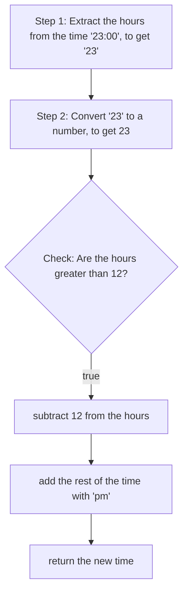
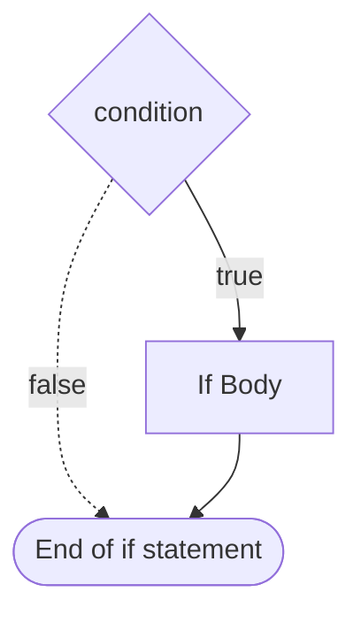
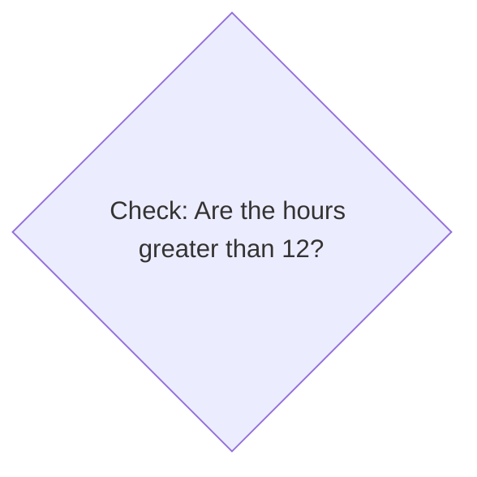

+++
title = 'prep'
layout = 'prep'
emoji= '📝'
menu_level = ['sprint']
weight = 1
backlog= 'Module-JS1'
backlog_filter= 'Week 3'
+++


## Prerequistes

## Learning objectives

## Notes

### 12 vs 24 hour clock 🕥

A typical time can be written in one of 2 ways: 24 hour clock or 12 hour clock.

In 12 hour clock time the hours reset after midday, so an hour after midday is written as 1 pm. The pm means "in the afternoon".

For 24 hour clock, the hours continue counting up after midday.  
So in 24 hour clock, 1 hour after midday would be 13:00 and so on.
We can write a short table summarising some of the times and how they are converted from 24 hour to 12 hour:

|   Time in 24 hour clock   |   Time in 12 hour clock   |
|---------------------------|---------------------------|
|           09:00           |          9:00 am          |
|           10:00           |          10:00 am         |
|           11:00           |          11:00 am         |
|           12:00           |          12:00 pm         |
|           13:00           |          1:00 pm          |
|           14:00           |          2:00 pm          |
  

</br>
</br>

### 🧩 Problem

Let's suppose we have the following problem: given any time in 24 hour clock, we want to format it as 12 hour clock time.  
To achieve this goal, we're going to implement a function `formatAs12HourClock` that will take any string representing a time in 24 hour clock and convert it to the corresponding time in 12 hour clock.


> Given any string input representing a 24 hour clock time,  
> when this input is passed to `formatAs12HourClock`,  
> it should return the time in 12 hour clock format

### ⚖️ Comparing output with expectation

We can call functions and log their return values to the console. However we can also **compare** 2 values.
Given the problem we stated above, whenever we call `formatAs12HourClock` we expect it to return a particular value.
For example, we expect `formatAs12HourClock("08:00")` to have a return value of `"8:00 am"`  
Given the input "08:00", we want to compare the function `formatAs12HourClock`'s current return value with its expected output. 

To compare 2 values or expressions in JavaScript, we can use a comparison operator `===` and write the following expression:

```js
formatAs12HourClock("08:00") === "8:00 am"
```

`===` is the strictly equality operator: it will check the value on the left of the operaror and the value on the right to see if they’re the same. This begs the question:

In other words we can think of the expression above as saying:

Does formatAs12HourClock("08:00") have the same value as "20:00" ?

This begs the question:
> What will `formatAs12HourClock("08:00") === "8:00 am"` evaluate to?


### 1️⃣ 0️⃣ Boolean values

Some values are best represented as strings: any piece of text, a name, address, etc will most likely be stored using the string data type. 
Similarly, the number data type will be used to store any numerical data where we'll need to do standard numerical operations with those numbers.
However, if we're comparing values or expressions then we have one of 2 different states: true or false.
This brings to the boolean data type: which has only values of `true` or `false`

Whenever we compare 2 expressions with a comparison operator then the comparison itself will evaluate to a boolean value: `true` or `false`.
For example:
```js
// comparison expression
42 === 10 + 32
// evaluates to true
```
The comparison expression above is asking whether `42` has the same value as `10 + 32`. These values are the same when we evaluate them: so the whole comparison expression evaluates to `true`.

### Writing an assertion


Now that we can check the function’s output, we can write an **assertion**. 

> 🔑 An assertion is a check that our code behaves in a particular way: this check can either be `true` or `false`.

Up to now we've access the log function off `console`.
However, we can also access `assert` to write assertions other than log. We can use console.assert:


```js
function formatAs12HourClock() {
}
console.assert(formatAs12HourClock("08:00") === "20:00");
```

The documentation for `console.assert` states that a message will be written to the console if the condition is false. We can see above that convertAs12HourClock("08:00") will evaluate to false so we’ll get an error printed to the console. 
It would be useful to have slightly more information as to why this assertion failed.
 We can pass additional arguments to console.assert:


```js
function formatAs12HourClock() {
}

console.assert(formatAs12HourClock("08:00") === "20:00",
"current function output: %s, expected output: %s",
formatAs12HourClock("08:00"),
"20:00");
```

Let's break down these arguments to make sense of what's going on:

1. first argument - `formatAs12HourClock("08:00") === "20:00"` - the condition we're checking  

2. second argument - `"current function output: %d, expected output: %d"` - a message string that will be logged to the console if the condition is false.

3. third argument - `formatAs12HourClock("08:00")` - this value will get substituted into the message string at the first "%d"  

4. 4th argument - `"20:00"` - this value will get substituted into the message string at the second "%d"

We can tidy up the assertion even further. As we’re reusing the same expressions and values, we should store these in variable and refer to these variables again.


```js
function formatAs12HourClock() {
}

const currentOutput = convertTo12HourClock("08:00");
const expectedOutput = "8:00 am";
console.assert(
   currentOutput === expectedOutput,
   "current output: %s, expected output: %s",
    currentOutput,
    expectedOutput
);
```

Now we get a log in the console:

```bash
Assertion failed: current output: undefined, expected output: 08:00 am
```

Let’s consider the following problem: we want to convert any time in 24 hour clock to 12 hour clock. 

The function is being passed a single argument so we can parametrise and label this input as time. According to our assertion we get an input of "08:00" and need to create output of "8:00 am". So we can start by accessing the string inside the function. So we’ll need to add "am" to the time and to get the required output. We can make use of a template literal and set the return value, and then re-run our assertion.
We can continue checking our assertion to see if our function’s current behaviour meets our expectations.
So we have the following:


```js title="problem.js"
function convertTo12HrClock(time) {
   return `${time} am`
}

const currentOutput = convertTo12HrClock("08:00");
const expectedOutput = "8:00 am";
console.assert(
   currentOutput === expectedOutput,
   "current output: %s, expected output: %s",
    currentOutput,
    expectedOutput
);
```


The current output is 


This is very close! However, the hours still has a zero in front of the function’s current output.
One approach can be to access the hours section of the string. 


### Asserting more cases


So far we’ve only created assertions that check the function’s behaviour for times after midnight and before midday. In these cases, there is a clear pattern: 
Take the current time and append the "am" string to the current time. 
However, we need to assert the function behaves correctly cases when the time is later than midday. Let’s create an assertion for our function when passed an input of "23:00"


```js title="problem.js"
function convertTo12HrClock(time) {
   return `${time} am`
}

const currentOutput = convertTo12HrClock("08:00");
const expectedOutput = "8:00 am";
console.assert(
   currentOutput === expectedOutput,
   "current output: %s, expected output: %s",
    currentOutput,
    expectedOutput
);


const currentOutput = convertTo12HourClock("23:00");
const expectedOutput = "11:00 pm";
console.assert(
   currentOutput === expectedOutput,
   "current output: %s, expected output: %s",
    currentOutput,
    expectedOutput
);
```


### Reusing variable names

When we run the file with Node, we get an error in the console:
```bash
SyntaxError: Identifier 'currentOutput' has already been declared
```

An identifier is the name of a variable, so in a variable declaration like

```js
const currentOutput = convertTo12HourClock("08:23");
```
`currentOutput` is the **identifier**.  

When an error is thrown, it means the execution of the program stops at this point and an error report is sent to the user.
We want to do multiple assertions whilst using the same variables.

### Block scope

We can make use of a block declaration as follows:

```js
{
  StatementList 
}
```
A block is a set of curly braces in which we write any number of statements. As with function scope, block scope means that variables declared inside a given block are only accessible inside the given block. This means we can declare a variable with the same name in 2 different blocks and we won't get an error!


```js title="problem.js"
function convertTo12HrClock(time) {
   return `${time} am`
}

{
const currentOutput = convertTo12HourClock("08:00");
const expectedOutput = "8:00 am";
console.assert(
   currentOutput === expectedOutput,
   "current output: %s, expected output: %s",
    currentOutput,
    expectedOutput
);
}
{
// ❌ this assertion now fails
const currentOutput = convertTo12HourClock("23:00");
const expectedOutput = "11:00 pm";
console.assert(
   currentOutput === expectedOutput,
   "current output: %s, expected output: %s",
    currentOutput,
    expectedOutput
);
}
```
✅ this code now doesn't error!


### Describing the approach 

Our function works we pass an input a time in the morning like `"08:00"`. In this case, the function returns `"08:00am"` as expected.

We need to describe our approach when dealing with the case of an input like `"23:00"`, when our function should return `"11:00pm"`.


Earlier on we observed that when the time goes beyond midday then we can subtract 12 from the hours time to get the new hours for the 12 hour clock time.

_Before_ writing code, we can define our approach in steps:

Starting with an input like `"23:00"`:



This approach involves running some **conditionally**. In this case, we're only going to continue doing something if the condition **hours are greater than 12** is `true`.


### Conditionally executing code

In programming, an `if` statement will execute some code when a given condition is `true`.  
In JavaScript, we can write an `if` statement as follows:

```js {title="main.js"}
if (condition) {
      // do some code in here
}
```

The `if` statement consists of:
1. `if` keyword: this is the start of the `if` statement
2.  `(condition)`: some conditional expression that is wrapped in parentheses.
3. `{}`: a block statement: any code we want to execute if the condition is true goes inside the curly braces here

We can represent this with a diagram too:



</br>
</br>

### Applying new knowledge

So for `formatAs12HourClock` we said part of the strategy for handling "23:00" would involve the following check:  

>   ❓ Check: Are the hours greater than 12?

We want to check that some value hours value is less than 12. For this purpose, we can use another comparison operator: `>` operator. This will check if the value on the left of the operator is less than the value on the right of the operator.  
So `3 > 12` would evaluate to be `false`, as 3 is not greater than 12.  
So provided we have an expression for the hours from the time, then we can write a conditional statement as follows:

```js
if (expressionsForHours < 12) {}
```

> 🎯 Aim: Find an expression for the hours digits from the `time` input 

### Accessing strings


So given a string `"23:00"` we want to access the hours portion of the string - the _first 2 characters_ of the string.

We say that strings are **zero-indexed**.
In this context, **index** means **position**, so **zero-indexed** means we start counting character positions from 0 onwards.

Here are the positions/indexes for `"23:00"`

|   index   |  0  |  1  | 2   | 3   | 4   |
|:---------:|:---:|:---:|-----|-----|-----|
| character | `"2"` | `"3"` | `":"` | `"0"` | `"0"` |

In JavaScript, we can use square bracket notation to access specific characters in the string using the index.

```js
time[0] // evaluates to "2"
time[1] // evaluates to "3"
time[2] // evaluates to ":"
// etc
```

We want to access the hours section of the string. If we can access "23" from the string time we can convert it to a number. 

However at the moment, square bracket access wil only give a single character.
So we must use another method to extract _multiple_ characters from the given string,


### Extracting a slice

We can use a function called `slice`.

[`slice`](https://developer.mozilla.org/en-US/docs/Web/JavaScript/Reference/Global_Objects/String/slice) is a function that can take 2 arguments: a start index and an end index. `slice` will return a section of the string from the start index up to but not including the start index. 


`time // "23:00"`

`time.slice(0,2)` will access the characters below:
 
|   index   |  0  |  1  | 
|:---------:|:---:|:---:|
| character | `"2"` | `"3"` |

<br>
<br>
 
### 🏗️ Assembling the parts

Now we can return to our conditional statement and write:

```js
if (+time.slice(0,2) > 12) {

}
```

If the time is `"23:00"` then the condition `+time.slice(0,2) > 12` will evaluate to true and the code inside the curly braces will be executed. 

It is important to note that this `if` statement is implementing this part of our diagram:




Now we can format the string as with our approach from earlier:
We’ll need to append "pm" to the string expression and subtract 12 from the hours. So we get the following:

```js
if (+time.slice(0,2) > 12) {
	return `${time.slice(0,2) - 12}:00 pm`
}
```

Now we can recheck our assertions:


### Improving the code


The function’s output satisfies the assertions: in other words, our function’s current output matches with the expected output described in the previous assertions. In our code at the moment, we’re making use of the same expression twice. time.slice(0,2). This means we’re calling the function slice twice. Additionally, expressions like inside curly braces and parentheses can often be difficult to read. In this situation it makes sense to label a particularly useful expression so we can reuse wherever necessary in our code. 

Let’s create a variable called hours.

```js
const hours = +time.slice(0,2)

if (hours > 12) {
	return `${hours - 12}:00 pm`
}
```
