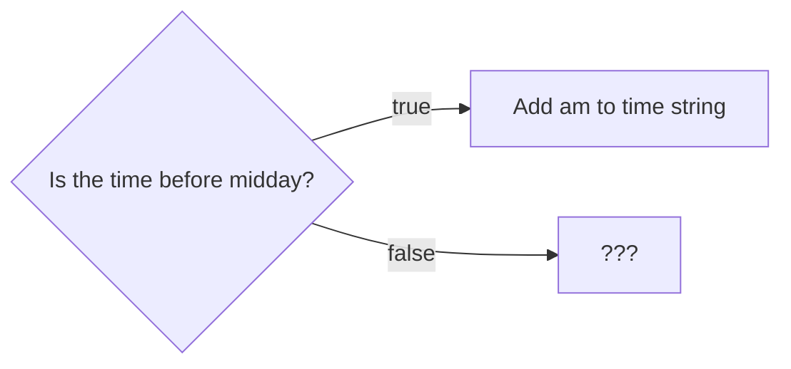
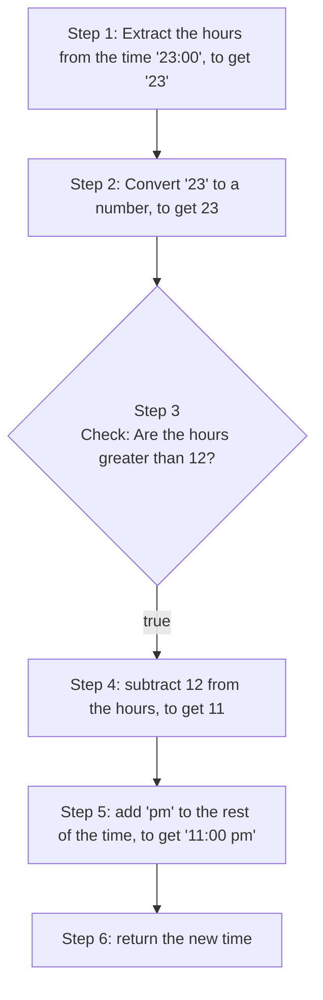
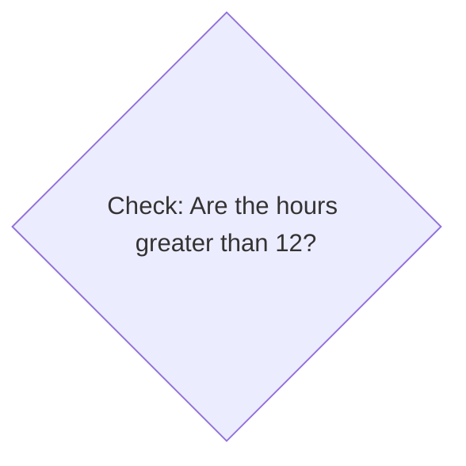
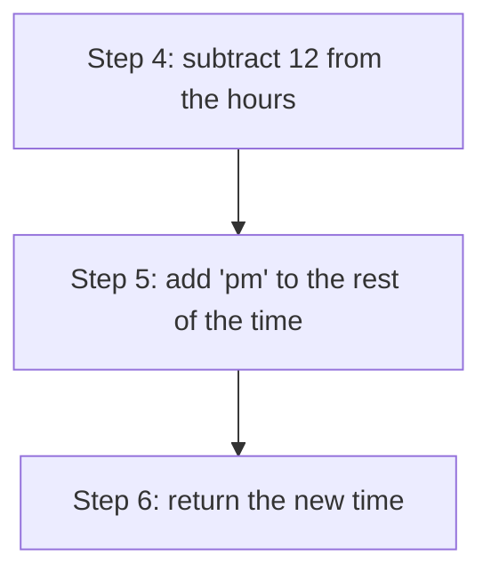

+++
title = 'prep'
layout = 'prep'
emoji= '📝'
menu_level = ['sprint']
weight = 1
backlog= 'Module-JS1'
backlog_filter= 'Week 3'
+++

## Pre-requisites

## Learning objectives

- Write an assertion for a function that implements a solution to a given problem
- Given an assertion and a function declaration, identify and explain whether the assertion will pass or fail
- Explain when to use the `===` operator in a program
- Construct a flow diagram that describes how to produce an output from a given input
- Explain when it is necessary to use a conditional statement
- Identify the syntactic features of an `if` statement
- Describe the difference between `console.log` and `console.assert`
- Evaluate an expression that uses a comparison operator
- Describe how to convert a string into a number in JavaScript
- Implement a piece of functionality specified in an assertion
- Define _block scope_
- Define _zero-indexing_
- Given a short program, determine the return value of a call to `slice` before execution
- Given a problem, suggest potential sub-goals required to reach a solution
- Determine the output of a program that uses a conditional statement
- Analyse a conditional statement to determine whether or not the statement will be executed
- Predict and explain how conditional statements involving `else`, `else if` and `while` will be executed
- Explain why _refactoring_ is necessary in the production of software
- Propose a strategy for solving a problem
- Write an assertion to check for some behaviour of a given function
- Identify a pattern between a set of inputs and outputs produced by a given function
- Propose alternative implementations to a problem
- Suggest several appropriate ways to refactor a given piece of code

## Notes

### 🕥 12 vs 24 hour clock

A typical time can be written in one of 2 ways: 24 hour clock or 12 hour clock.

In 12 hour clock time the hours reset after midday, so an hour after midday is written as 1 pm. The pm means "in the afternoon".

For 24 hour clocks, the hours continue counting up after midday.  
So in 24 hour clock, 1 hour after midday would be 13:00 and so on.
We can write a short table summarising some of the times and how they are converted from 24 hour to 12 hour:

| Time in 24 hour clock | Time in 12 hour clock |
| --------------------- | --------------------- |
| 09:00                 | 09:00 am              |
| 10:00                 | 10:00 am              |
| 11:30                 | 11:30 am              |
| 12:00                 | 12:00 **pm**          |
| 13:43                 | 1:43 **pm**           |
| 14:00                 | 2:00 **pm**           |

Often we use the notation "HH:MM" for a time to denote the fact that the first 2 digits represent hours and then the digits after the ":" represent the minutes.

### 🧩 Stating the problem

Let's pose a problem: given any time in 24 hour clock, we want to format it as a 12 hour clock time.

To achieve this goal, we're going to implement a function `formatAs12HourClock`.

> `formatAs12HourClock` is a function that should take any string representing a time in 24 hour clock
> and return a string of the same time represented in 12 hour clock.
>
> Examples:  
>  `formatAs12HourClock("09:00")` should return `"09:00 am"`  
>  `formatAs12HourClock("14:19")` should return `"2:19 pm"`
> etc...

### ⚖️ Comparing current and target output

Let's start with a function declaration of `formatAs12HourClock` like this:

```js {linenos=table,linenostart=1}
function formatAs12HourClock() {}
```

Whenever we call `formatAs12HourClock` we expect it to return a particular value, which we call the 🎯 **target output**.
For example, we expect `formatAs12HourClock("08:00")` to return `"08:00 am"`.
In this case, `"08:00 am"` is the 🎯 **target output**.

However, the **current output** is what the function actually returns given its current implementation.



Let's continue with `formatAs12HourClock` defined like this:

```js {linenos=table,linenostart=1}
function formatAs12HourClock() {}
```

a) Suppose we call the function like this:

```js
formatAs12HourClock("20:10");
```

For the call above, what is the
i) the current output?
ii) the 🎯 target output?

b) Suppose we now call the function like this:

```js
formatAs12HourClock("05:30");
```

For the call above, what is the
i) the current output?
ii) the 🎯 target output?



Previously we learned how to log values to the console, but we can also **compare** two values.
Comparisons are essential whenever we want to check that a function produces some target output.

We can compare the current output of `formatAs12HourClock("08:00")` with the target output of `"08:00 am"` and ask: **are these 2 values the same?**.
We can use a comparison operator to compare 2 expressions and check if they evaluate to the same value. In particular, we can use the strict equality operator `===`, a comparison operator used to check if two values are the same.

We can write an expression as follows:

```js
formatAs12HourClock("08:00") === "8:00 am";
```

In the code above, `===` will check the values on the left and the right of the operator to see if they’re the same.

We can think of `formatAs12HourClock("08:00") === "8:00 am"`

as being like the question:

Is the return value of `formatAs12HourClock("08:00")` equal to `"8:00 am"` ?

This leads to the question:

> What will the expression `formatAs12HourClock("08:00") === "8:00 am"` evaluate to?

### ✅ ❌ Boolean values

Some values are best represented as strings: any piece of text, a name, address, etc will most likely be stored using the string data type.
Similarly, we can use the number data type to store any numerical data where we'll need to use standard numerical operations like addition, multiplication etc.
However, if we're comparing values or expressions, we have one of 2 different states: **true** or **false**.
This leads us to the **boolean data **type, which only has true or false values.
Whenever we compare 2 values with a comparison operator, we end up with a boolean value: `true` or `false`.

For example:

```js
// comparison expression
42 === 10 + 32;
// evaluates to true

10 * 5 === 60;
// evaluates to false
```



Look at the code below and then try predicting what each expression will evaluate to. You may want to use the Node REPL to help you check your answers. Check out some relevant documentation if you've not seen a particular operator before.

```js {linenos=table,linenostart=1}
true === false;
5 == 2 + 4;
4 * 5 == "20";
4 * 5 === "20";
3 * 2 === 6;
4 = 4;
Math.min(3,4,5) === 4;
let mhairiName = "Mhairi";
let mhairiAge = 28;
let isMhairOldEnoughToDrive = true;
"hello Mhairi" === `hello ${Mhairi}`;
`Mhairi is 28` === `mhairi is ${mhairiAge}`;
"${mhairiName} is 28" === `Mhairi is ${mhairiAge}`;
isMhairOldEnoughToDrive;
isMhairOldEnoughToDrive === true;
mhairiAge >= 18;
mhairiAge >= 28;
29 <= mhairiAge;
let kilometersMhairiDrivesToWork = 9.4;
Math.round(9.4) === 9
```




Trickier 🧩

Look at the code below and then try predicting what the expression will evaluate to. Be sure to explain your answer too. Try using the Node Repl to check your answer. Does the REPL output make sense?

```js {linenos=table,linenostart=1}
console.log(10 + 32) === 42;
```



### ✏️ Writing an assertion

We now have 2 new concepts: **booleans** and **comparisons**. From these concepts, we can now write an assertion about the function `formatAs12HourClock`.

> 🔑 An assertion is a _check_ that our code behaves in a particular way: this check can either be `true` or `false`.

Up to now we've used the log function `console.log`.
However, we can also write assertions using another function: `console.assert`. Let's look at an example using this function:

```js
function formatAs12HourClock() {}
console.assert(formatAs12HourClock("08:00") === "20:00");
```

The documentation for `console.assert` states that a message will be written to the console if a condition is `false`.



Predict and explain if the assertion above is true or false. Pay particular attention to the return value of `formatAs12HourClock` above.



It would be useful to have more information as to why this assertion failed.
We can pass additional arguments to `console.assert`:

```js
function formatAs12HourClock() {}

console.assert(
  formatAs12HourClock("08:00") === "08:00 am",
  "current function output: %s, target output: %s",
  formatAs12HourClock("08:00"),
  "20:00"
);
```

Let's break down these arguments to make sense of what's going on:

1. first argument - `formatAs12HourClock("08:00") === "20:00"` - the condition we're checking

2. second argument - `"current function output: %d, target output: %d"` - a message string that will be logged to the console if the condition is false.

3. third argument - `formatAs12HourClock("08:00")` - this value will get substituted into the message string at the first "%d"

4. 4th argument - `"20:00"` - this value will get substituted into the message string at the second "%d"

We can tidy up the assertion even further. As we’re reusing the same expressions, we can store these in variables so we can reuse them and give them more meaning:

```js {linenos=table,linenostart=1}
function formatAs12HourClock() {}

const currentOutput = formatAs12HourClock("08:00");
const targetOutput = "08:00 am";
console.assert(
  currentOutput === targetOutput,
  "current output: %s, target output: %s",
  currentOutput,
  targetOutput
);
```

When the code above executes, we now get a log in the console:

```bash
Assertion failed: current output: undefined, target output: 08:00 am
```

### 🧰 Implementing the functionality

On line 4, the function is being passed a single argument `"08:00"`. We can parametrise the function and label the input as `time`:

```js
function formatAs12HourClock(time) {}
```

According to our assertion we get an input of `"08:00"` and need to create output of `"08:00 am"`.

So we can add `"am"` to the `time` to get the target output.
We can make use of a template literal, set the return value and then _re-run_ our assertion to check the function is returning the correct value.

📓 We can and should continually check our assertions to see if our function’s current output meets our target output.

So we have the following:

```js {linenos=table,linenostart=1}
function formatAs12HourClock(time) {
  return `${time} am`;
}

const currentOutput = formatAs12HourClock("08:00");
const targetOutput = "08:00 am";
console.assert(
  currentOutput === targetOutput,
  "current output: %s, target output: %s",
  currentOutput,
  targetOutput
);
```

✅ Nothing is printed to the console, so this assertion is working 😎

### 💼 Checking different cases

So far we’ve only created assertions that check the function’s behaviour for times _after midnight and before midday_. In these cases, there is a clear pattern: take the current time and add `"am"` to the end.

However, we need to assert that the function behaves correctly when the time is later than midday. Let’s create an assertion for our function when passed an input of `"23:00"`:

```js {linenos=table,linenostart=1,hl_lines=["15-21"]}
function formatAs12HourClock(time) {
  return `${time} am`;
}

const currentOutput = formatAs12HourClock("08:00");
const targetOutput = "08:00 am";
console.assert(
  currentOutput === targetOutput,
  "current output: %s, target output: %s",
  currentOutput,
  targetOutput
);

const currentOutput = formatAs12HourClock("23:00");
const targetOutput = "11:00 pm";
console.assert(
  currentOutput === targetOutput,
  "current output: %s, target output: %s",
  currentOutput,
  targetOutput
);
```

### 🔄 Reusing variable names

When we run the file with Node, we get an error in the console:

```bash
SyntaxError: Identifier 'currentOutput' has already been declared
```

In this case, identifier means name of a variable, so in a variable declaration like

```js
const currentOutput = formatAs12HourClock("08:23");
```

`currentOutput` is the **identifier**.

When an error is thrown, it means the execution of the program stops at this point and an error report is sent to the user.
However, we want to do multiple assertions whilst using the same variables.

To reuse variable names, we can make use of a block declaration as follows:

```js
{
  StatementList;
}
```

🔑 A **block** is a region of code defined by a set of curly braces in which we write any number of statements.

As with function scope, **block scope** means that variables declared inside a block are only accessible inside that block. This means we can declare a variable with the same name in 2 different blocks and we won't get a `SyntaxError`:

```js title="problem.js"
function formatAs12HourClock(time) {
  return `${time} am`;
}

{
  const currentOutput = formatAs12HourClock("08:00");
  const targetOutput = "08:00 am";
  console.assert(
    currentOutput === targetOutput,
    "current output: %s, target output: %s",
    currentOutput,
    targetOutput
  );
}

{
  // ❌ this assertion now fails
  const currentOutput = formatAs12HourClock("23:00");
  const targetOutput = "11:00 pm";
  console.assert(
    currentOutput === targetOutput,
    "current output: %s, target output: %s",
    currentOutput,
    targetOutput
  );
}
```

Now the second assertion fails with the following message:

```bash
Assertion failed: current output: 23:00 am, target output: 11:00 pm
```



✏️ Write another assertion that checks `formatAs12HourClock` returns the target output when passed another _time input in the afternoon._



### ↙️ ↘️ Making a choice

Our function works for morning inputs like `"08:00"`.
In this case, the function returns the target output of `"08:00 am"` as required.

However, at the moment, `formatAs12HourClock("23:00")`'s current output is `"23:00 am"`.

> 💡 We need to execute some different logic when the time is beyond midday

We can interpret this behaviour as a question:



We need to work out what to do in the case when the time input is later than midday.

### 🧭 Describing the strategy

Let's describe the strategy for dealing with an input that is after midday.

Earlier we observed that when the time goes beyond midday then **we can subtract 12 from the hours time to get the new hours for the 12 hour clock time**.

_Before_ writing code, we can define our approach in steps using a flowchart:

Starting with an input like `"23:00"`:



This approach involves running some **conditionally**. In this case, we're only going to continue doing Steps 4-6 if the condition **hours are greater than 12** is `true`.

### ❓ Conditionally executing code

In programming, we can use an `if` statement to execute some code when a given condition is `true`.  
In JavaScript, we can write an `if` statement as follows:

```js {title="main.js"}
if (condition) {
  // do some code in here
}
```

The `if` statement consists of:

1. `if` keyword: this is the start of the `if` statement
2. `(condition)`: condition is an expression that evaluates to true or false
3. `{}`: a block statement: any code we want to execute if the condition is true goes inside the curly braces here

We can represent this with a diagram too:



Write a program that defines a variable `eleniAge`.

If Eleni is less than 18, the program should print out nothing to the console.

If Eleni is 18 years old or older, the program should print out:

```bash
Eleni is old enough to drive
```





Modify the program above so that if Eleni is less than 18 the program prints out:

```bash
Eleni is not old enough to drive
```



### 🧠 Applying new knowledge

So for `formatAs12HourClock` we said part of the strategy for handling `"23:00"` would involve checking that the `hours` value is less than 12. For this purpose, we can use another comparison operator: `>`.
`>` will check if the value on the left of the operator is less than the value on the right of the operator.
So `3 > 12` would evaluate to be `false`, as `3` is not greater than `12`.

So provided we have an expression for the hours from the time, we can write a conditional statement as follows:

```js
if (expressionsForHours < 12) {
  // do code to format the 12 hours
}
```

To complete the logic, we now have to achieve a sub-goal:

> 🎯 Sub-goal: Find an expression for the hours from the `time` input

### 🧶 Accessing strings

Given a `time` string we need to access the _first 2 characters_ of the string which represent the hours.

Strings are **zero-indexed**.
**Index** means **position**, so **zero-indexed** means we start counting character positions from `0` onwards.

Here are the positions/indexes for `"23:00"`

|   index   |   0   |   1   | 2     | 3     | 4     |
| :-------: | :---: | :---: | ----- | ----- | ----- |
| character | `"2"` | `"3"` | `":"` | `"0"` | `"0"` |

In JavaScript, we can use square bracket notation to access specific characters in the string using the index.

```js
time[0]; // evaluates to "2"
time[1]; // evaluates to "3"
time[2]; // evaluates to ":"
// etc
```

However at the moment, square bracket access wil only give a single character.
So we must use another method to extract _multiple_ characters from the given string.

### ✂️ Extracting a slice

We can use a function called `slice` to extract 1 or more characters from a string.

[`slice`](https://developer.mozilla.org/en-US/docs/Web/JavaScript/Reference/Global_Objects/String/slice) is a function that can take 2 arguments: a start index and an end index. `slice` will return a section of the string from the start index up to but not including the start index.

```js
time; // holds the value "23:00"
```

```js
time.slice(0, 2); // will access the characters below
```

|   index   |   0   |   1   |
| :-------: | :---: | :---: |
| character | `"2"` | `"3"` |

So `time.slice(0,2)` will evaluate to `"23"` when the `time` is `"23:00"`. Finally we must convert `"23"` to the number `23`, otherwise we can't compare this value properly. We can use the `+` operator to convert strings to numbers by writing the following:

```js
+time.slice(0, 2); // evaluates to 23
```

### 🏗️ Assembling the parts

Earlier we had an `if` statement in the form:

```js
if (expressionForHours > 12) {
}
```

So now we've found an expression for the `hours`, we can write:

```js
if (+time.slice(0, 2) > 12) {
}
```

If the time is `"23:00"` then the expression `+time.slice(0,2) > 12` will evaluate to `true` and the code inside the curly braces will be executed.

This `if` statement is implementing the following part of the diagram from earlier:



Now we can format the string using our approach from earlier:
we’ll need to append `"pm"` to the string expression and subtract 12 from the hours. So we get the following:

```js
if (+time.slice(0, 2) > 12) {
  return `${time.slice(0, 2) - 12}:00 pm`;
}
```

The `return` statement above implements the following steps we set out earlier:



Now we can **re-run** our assertions from earlier to check our function behaves as target.

### 🧹 Improving the code

Now the assertions pass: in other words, our function’s current output matches with the target output described in the assertions.

However, at the moment, we’re making use of the same expression twice: `+time.slice(0,2)`. This means we’re calling the function `slice` twice. Additionally, expressions embedded inside curly braces and parentheses can often be difficult to read. In this situation it makes sense to label the recurring expression so we can reuse wherever it we need to in our code.

Let’s create a variable called `hours` and assign to it our expression's [evaluation] result.

```js
function formatAs12HourClock(time) {
  const hours = +time.slice(0, 2);

  if (hours > 12) {
    return `${hours - 12}:00 pm`;
  }
  return `${time} am`;
}
```

Note that the behaviour of the function hasn't changed: it is still returning the same outputs from the given inputs. We've just improved the implementation without changing the underlying behaviour.
