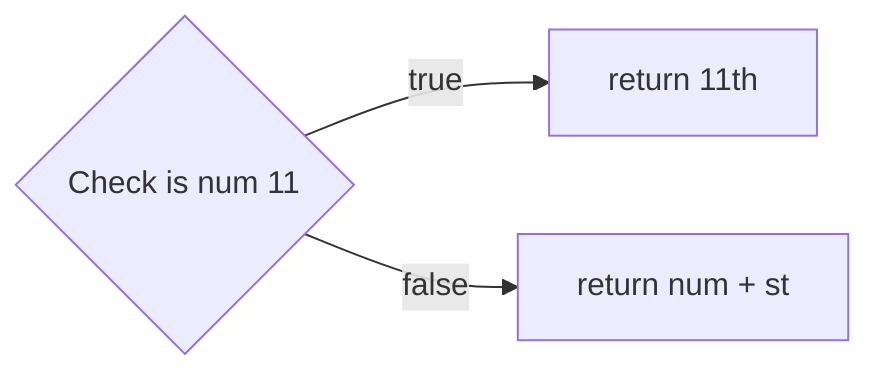

+++
title = 'prep'
layout = 'prep'
emoji= '📝'
menu_level = ['sprint']
weight = 1
backlog= 'Module-JS1'
backlog_filter= 'Week 4'
+++

## Pre-requisites

## Learning objectives

- Execute a test script
- Isolate a test case in a test suite
- Differentiate between running code with `node` command and with an `npm` script, such as `npm test`
- Interpret documentation to determine how part of an 3rd API behaves
- Define the term _API_
- Identify the unit under test in a given test case
- Outline the effect of running `npm test`
- Define _dependency_
- Explain why we use interfaces in programming
- List the benefits of using a 3rd party software library when programming
- Explain the purpose of each syntactic element of a test case implemented in Jest
- Implement a test case to describe the behaviour of a function
- Outline the effects of running an installation command, e.g. `npm install`
- Describe what `toBe` checks in the Jest library
- Suggest potential Jest matchers to check a specified behaviour for a function
- Predict and justify the test output for a given function and test case
- Determine the line an error occurred from some test output
- State the current return value of a function and the target output from some test output
- Explain the process involved in looking up how to write tests for someone using a language other than JavaScript
- Express an acceptance criterion as a test case

## Notes

### 🧮 Ordinal numbers

Let's imagine you're working in a 10 storey office building - so there are 10 different levels.
We need a way to describe each level of the building.

We start on the **ground floor** of the building - level with the ground.

We can use an **ordinal number** to describe the other levels in the building.

Up from the ground floor, we are then on the 1**st** floor (fir**st** floor)
Up from the **1st floor**, we are on the 2**nd** floor (seco**nd** floor)

To form the ordinal number we take a number and add the correct **suffix**:

> number + **suffix** -> ordinal number
> e.g.
> 1 + '**st**' -> '1st'
> 2 + '**nd**' -> '2nd'

The suffix comes from the word used to describe each number, like fir**st**, seco**nd**, thi**rd** etc.

Here is a list of the first 10 ordinal numbers.

| number | ordinal number |
| ------ | -------------- |
| 1      | 1**st**        |
| 2      | 2**nd**        |
| 3      | 3**rd**        |
| 4      | 4**th**        |
| 5      | 5**th**        |
| 6      | 6**th**        |
| 7      | 7**th**        |
| 8      | 8**th**        |
| 9      | 9**th**        |
| 10     | 10**th**       |



Using the information from above, try to answer the following questions:

a) What will the ordinal number be for 21?
b) What will the ordinal number be for 40?
c) What will the ordinal number be for 49?
d) What will the ordinal number be for 13?





### 📆 Using dates

Use ordinal numbers to write the dates of the following events:

a) Tomorrow
b) A week from now
c) Easter sunday 2024
d) When is Eid expected to occur in 2024



Let's consider a function called `getOrdinalNumber` that needs to work as follows:

- it takes one argument - a whole number, like 1, 2, 3, etc
- returns a _string_ that represents the ordinal number

E.g.

```js
getOrdinalNumber(1); // returns "1st";
getOrdinalNumber(2); // returns "2nd";
getOrdinalNumber(6); // returns "6th";
```

The requirements above form a specification of how the function `getOrdinalNumber` should behave.


A **specification** is a description of how a piece of software works.
In other words, a specification is a set of requirements for how a piece of software should behave.


Once we have a specification for how the function should work we can create many cases showing how we expect the function `getOrdinalNumber` to behave when it is called with certain inputs.

### 🖼️ Using a test framework

To implement a function like `getOrdinalNumber` we can try specifying a single case:

- Case 1 💼

```js
const input = 1;
const currentOutput = getOrdinalNumber(input);
const targetOutput = "1st";
```

Case 1 states that when `getOrdinalNumber` is called with an input of 1, it has a target output of "1st".

Our aim is to check that `getOrdinalNumber` works as we described in the case above.

We can write **tests** to check our code is behaving in a particular way.

> 🔑 A test is any piece of code that runs an **assertion** on the code we're testing

In addition, we want our tests to:

- be easy to write
- be easy to read
- to give clear feedback on what the current output is
- to give clear feedback on what the target output is
- easily write multiple test cases

We can use a **test framework** to help us build test cases like this.


A **test framework** is a set of tools we can use to build tests efficiently.


we can use a short dialogue to think about _why_ we want to use a testing framework:

> "We need to implement a function"
>
> "Cool, how are you going to check it works?"
>
> "We can use tests to check that the function gives the target output as described in the specification"
>
> "No problem, how are you going to write a lot of tests efficiently?"
>
> "We can make use of a testing framework - this will help us to write test cases quickly. And it will ensure that the tests give us fast, reliable feedback."

### 🎒 Starting a project

Let's imagine we've started a brand new project in a directory called `week-4-example`.



### 💻 Follow along

Set up a new directory on your local machine called `week-4-example`.
Make sure you're inside the `cyf` directory you created earlier in the course.
Change directory into the this place and double check your current working directory.

```bash
$ pwd
.../cyf/week-4-example
```



To start, we need to create a file called `package.json` in our project.

> A `package.json` is used to store useful information about our current project, like the name, description, version etc.

We can create a `package.json` file and add the following to it:

package.json

```json
{
  "name": "week-4-test-example"
}
```

Anyone using this project can now check the `package.json` to get the name of the project.
We can also add a description:

```json
{
  "name": "week-4-test-example",
  "description": "An example application showing how to write tests using the jest framework"
}
```

We can continue adding more information about our project as the project grows.
For now we can double check we only have a `package.json` in our project:

```bash
$ ls
package.json
```

### 📦 Using packages

When writing software, we need to continually make use of **packages** written by other developers.

A **package** is a set of programs which are grouped together to provide some functionality.

Different programming languages give developers different ways of accessing packages for use in their code.

In JavaScript, we can use **npm**.

> **npm** is a tool used for accessing packages that can be downloaded and used to help developers write applications. The **npm registry** is an online collection of packages that we can download using **npm** commands.

### 🃏 Installing Jest

Our next step will be to figure out how to install the Jest package on our machine.

We can find out more about the Jest framework from the [documentation online](https://jestjs.io/docs/getting-started).


In the **Getting started** section of the documentation, Jest gives us the following command:

```bash
npm install --save-dev jest
```

- `npm` is an online database of packages, like Jest, that we can fetch and install on to our machines. It also provides us with
- in the terminal, we can use the `npm` command to install packages on the

`install` - download a package on to our machine.

- `--save-dev` - this indicates that Jest is a package we only use when our application is being developed.

- `jest` - this is the name of the package we want to install on our machine

So overall we can think of this command as saying:
_"Please go to the npm database, find the Jest package and install it on my local machine"_

Let's execute this command in the same directory as the `package.json`.
To double check this we can run `pwd`:

```bash
$ pwd
.../cyf/week-4-example
```

`pwd` is telling us we're in the `week-4-example` directory.

We need to double check the `package.json` is also there too.

```bash
$ ls
package.json
```

Now we can execute the command

```bash
npm install --save-dev jest
```

Our project structure will now look as follows:

```raw
week-4-example
├── get-ordinal-number.test.js
├── package-lock.json
└── package.json

1 directory, 3 files
```

After running the command, we now have a directory called `node_modules` in our project too.

> The `node_modules` directory contains all the code from the dependencies like Jest we installed in our project. You won't need to look inside the node_modules directory - you just need to know it contains the code for Jest and any other libraries we install in our project.

The `package.json` should also be updated:

```json
{
  "name": "week-4-test-example",
  "description": "An example application showing how to write tests using the jest framework",
  "devDependencies": {
    "jest": "^29.5.0"
  }
}
```

We've now got some additional information inside the `package.json`:

```json
"devDependencies" : "^29.5.0"
```

A **dependency** is a package that your project depends upon. Now that we're using Jest in our project, we **depend** on the Jest package. In particular, a **devDependency** is a **developer dependency** - a **dependency** we use for developing and testing our application.



### 🔍 Figure it out

There should be one more change to your project after running the installation command. Use documentation or ChatGPT to figure out what this change is for.


### 🕹️ Application Programming Interface

With Jest installed, we need to figure out _how to use the Jest framework_ to write tests.
Jest provides an **API** so we can use its functionality.

API stands for

- **Application**
- **Programming**
- **Interface**.

We've encountered the word **interface** already.

But we can break down each word in this acronym to understand it altogether.

- An **application** is a program or piece of software designed to serve some purpose.
- **Programming** refers to the process of writing code or software.
- An 🕹️**interface** is a shared boundary across which two or more systems.



An **API** is a boundary between a programmer and an application, enabling a programmer to use an application’s functionality without being concerned with how the application was built.

We’ve encountered several functions like `console.log`, `Math.round` already.
`console.log` and `Math.round` are **API**s.





Explain why `Math.round` is an **API**





### 🔍 Figure it out

There should be one more change to your project after running the installation command. Use documentation or ChatGPT to figure out what this change is for.


### 🖌️ First test case

> 🎯 Goal: Write the a test for the case below, using Jest:

- Case 1 💼

```js
const input = 1;
const currentOutput = getOrdinalNumber(input);
const targetOutput = "1st";
```

To work out how to write a test using Jest, we can check out the documentation.

We can create a file called `get-ordinal-number.js` and in there write our first test.
We can figure out how to write this test using the Jest documentation. We can start writing a test:

get-ordinal-number.test.js

```js
test("converts 1 to an ordinal number", function () {});
```

Let's break down this syntax.
The `test` function is part of the Jest API: it is an interface we use to perform a particular task.
In particular, we're using `test` to create a test case.

Let's break down the arguments we're passing to `test`:

- 1st argument: `"converts 1 to an ordinal number"`, which describes the behaviour we're testing for
- 2nd argument: `function () {}`, we will write some assertions in this `function () {}` to check the behaviour

### ⚖️ Creating assertions

Now we have

get-ordinal-number.test.js

```js
test("converts 1 to an ordinal number", function () {});
```

We need to write an **assertion** inside the body of `function () {}`

> 🗣️ Recall: The assertion is the part of the test code that actually checks to see if something is true or not.

In this example, we want to check that the following is true:

We expect `getOrdinalNumber(1)` to be `"1st"`

An assertion in Jest looks like this:

```js
expect(getOrdinalNumber(1)).toBe("1st");
```

The function `toBe` is used to check that the current output of `getOrdinalNumber(1)` and the target output of `"1st"` are equal to each other.
`toBe` is just one example of a function called a [matcher](https://jestjs.io/docs/using-matchers).
A matcher is a function we use to compare values in Jest.

So we can combine this with the test we wrote earlier, to get our first complete test case:

```js
test("converts 1 to an ordinal number", function () {
  expect(getOrdinalNumber(1)).toBe("1st");
});
```

### 👟 Running tests

We can try running the file index.test.js with node in the following way:

```bash
node index.test.js
```

but we get an error:

```bash
ReferenceError: test is not defined
```

This is because `test` isn’t defined anywhere in the file.

So we need to execute this file so that the Jest API is available in our file. We can do this by adding executing the test file using Jest: we do this using an npm script.

The "scripts" section of the `package.json` is where we can write useful commands we'll use in our project. We can add a "scripts" section to the `package.json` so that it reads as follows:

```json {linenos=table,hl_lines=["4-6"],linenostart=1}
{
  "name": "week-4-test-example",
  "description": "An example application showing how to write tests using the jest framework",
  "scripts": {
    "test": "jest"
  },
  "devDependencies": {
    "jest": "^29.5.0"
  }
}
```

Finally, we'll need to run our tests.
Now we can run the command `npm test`.

When we execute the command, `npm test`, the command will look inside the "scripts" section of the package.json and look up the commmand for "test" - in this case, "jest".

### Understanding test feedback

We currently have a project structure like this:

```raw
week-4-test-example
├── get-ordinal-number.test.js
├── package.json
├── package-lock.json
└── node_modules

1 directory, 3 files
```

And `get-ordinal-number.test.js`
looks like this

```js
test("converts 1 to an ordinal number", function () {
  expect(getOrdinalNumber(1)).toBe("1st");
});
```

After running the test above, we should get feedback indicating whether or not the test has passed.


Predict what the test feedback will say when the test above is executed.


### 🚢 Defining the function

At the moment, our test feedback gives the following:


The test code is throwing a **ReferenceError**.

We can define `getOrdinalNumber` in our test file.

```js
function getOrdinalNumber() {}

test("converts 1 to an ordinal number", function () {
  expect(getOrdinalNumber(1)).toBe("1st");
});
```

Now we can run the tests again and check the test feedback.

### Assertion errors

We now get the following feedback:


Jest tells us 3 main things:

1. The test case that failed
2. The targetOutput and the currentOutput
3. The line number where error occurred

Jest defines **Expected** and **Received** in the test feedback:

- Received: `undefined`
- Expected: "1st"



What are the values of Expected and Received in the test output?
How do Received and Expected match up with the targetOutput and expectedOutput ?

What line number did the test case fail on?



### Passing `getOrdinalNumber`

We can now make the test pass by implementing functionality for the first test case.
We could write the following:

get-ordinal-number.test.js

```js {linenos=table,hl_lines=["2"],linenostart=1}
function getOrdinalNumber() {
  return "1st";
}

test("converts 1 to an ordinal number", function () {
  expect(getOrdinalNumber(1)).toBe("1st");
});
```

### 🗄️ Generalising further

In English, ordinal numbers mostly follow the same pattern.

> Numbers ending in 1 will generally have an ordinal number ending in "st".

Here are some examples of this pattern,

1st, 11**th**, 21st, 31st, 41st,...

All the numbers ending in 1 will continue to end in ` "st"``, with the exception of 11.
11 is slightly different and ends with a  `"th"`.

We can now create a test case to check that `getOrdinalNumber` works for _any_ number ending in 1.

get-ordinal-number.test.js

```js {linenos=table,hl_lines=["5-9"],linenostart=1}
function getOrdinalNumber() {
  return "1st";
}

test("works for any number ending in 1", function () {
  expect(getOrdinalNumber(1)).toBe("1st");
  expect(getOrdinalNumber(11)).toBe("11th");
  expect(getOrdinalNumber(21)).toBe("21st");
});
```

We've also updated the test description because we're adding more assertions and checking slightly different functionality.



What do you think the test output will be when the test runs? Remember to think in terms of targetOutput and currentOutput.

How can you approach implementing the logic for this function each time?

Can we add any more assertions to this test case?



### 🧰 Handling outliers

We can now implement functionality for `getOrdinalNumber`.

Our strategy might be something like this:



Most of the time we just need to return the number with "st" on the end.
However, 11 is an outlier: it doesn't conform to the pattern.

So our current strategy for this test case will be to check if the number is 11 first and do something differently ( return `"11th"` ): otherwise we return the default value of num with `"st"` on the end.

Here's the implementation:

```js {linenos=table,hl_lines=["1-5"],linenostart=1}
function getOrdinalNumber(num) {
  if (num === 11) {
    return "11th";
  }
  return `${num}st`;
}

test("works for any number ending in 1", function () {
  expect(getOrdinalNumber(1)).toBe("1st");
  expect(getOrdinalNumber(11)).toBe("11th");
  expect(getOrdinalNumber(21)).toBe("21st");
});
```

###  🧭 Future strategies

Now, we've handled any numerical inputs ending in 1. We can try to build up functionality for _any_ number ending in 2.

We can start simply by adding a test case that only asserts something about the input of 2.

```js {linenos=table,hl_lines=["14-16"],linenostart=1}
function getOrdinalNumber(num) {
  if (num === 11) {
    return "11th";
  }
  return `${num}st`;
}

test("works for any number ending in 1", function () {
  expect(getOrdinalNumber(1)).toBe("1st");
  expect(getOrdinalNumber(11)).toBe("11th");
  expect(getOrdinalNumber(21)).toBe("21st");
});

test("converts 2 to an ordinal number", function () {
  expect(getOrdinalNumber(2)).toBe("2nd");
});
```



Predict what the feedback will be for the test case "converts 2 to an ordinal number"? Does it pass or fail, if so why?

Before coding, outline a strategy for handling the second test case.





How can you update the test second test case to check `getOrdinalNumber` works for any numerical input ending in 2?


