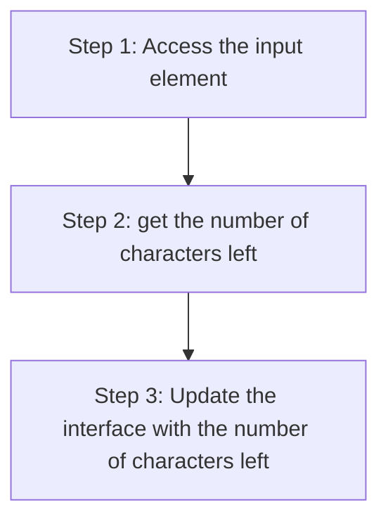

+++
title = '🛑 Character limit'
headless = true
time = 20
facilitation = false
emoji= '🧩'
[objectives]
    1='Use the Teach Tech Together guide to construct your objectives'
+++

Let’s define a problem.

Suppose we're working on a website where users will need to send messages. They'll provided with an input box where they can type their message. However, there is a _character limit_ of 120. As users type in to the box they should get feedback on how many characters they've got left.



We can define the problem more clearly:

> _Given_ an input box and a character limit of 120,
> _When_ I type characters into the input box
> _Then_ I should be told how many characters I’ve got left

### 🧭 Strategy

We can outline a strategy:

This strategy gives us a rough guide for the road ahead. However, as we learn more about this problem, we may need to update our strategy.
