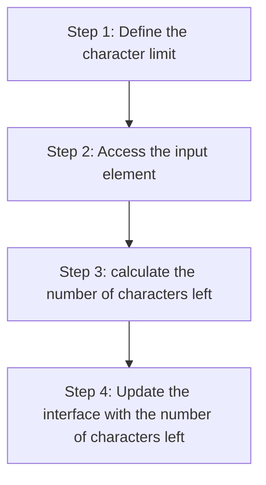

+++
title = '📈 Check progress'
headless = true
time = 30
facilitation = false
emoji= '🧩'
[objectives]
    1='Use the Teach Tech Together guide to construct your objectives'
+++



Let's consider our code at the moment:

```js
const characterLimit = 120;

const input = document.querySelector("#word-limit-input");

function handleKeyup() {}

input.addEventListener("keyup", handleKeyup);
```

We've done the following⚓

- [x] defined a `characterLimit`
- [x] accessed the input element
- [x] registered an event handler `handleKeyup`

We must still work out the following:

- [ ] Step 3: Calculate the number of characters left
- [ ] Step 4: Update the user interface with the number of characters left

To obtain the characters left, we can calculate the difference between `characterLimit` and the number of characters in the `input` element:





```js
const characterLimit = 120;
const input = document.querySelector("input");

function handleKeyup() {
  const charactersLeft = characterLimit - input.value;
  console.log(`${charactersLeft} characters remaining`);
}

input.addEventListener("keyup", handleKeyup);
```





```html
<section>
  <h4>Character limit</h4>
  <input id="word-limit-input" type="text" />
  <label id="word-limit-label" for="input">120 characters remaining</label>
</section>
```





Typing in to the `input` element, we should see a string like `"118 characters left"` printed to the terminal each time a key is released. However, we have one final step. We must now **update** the DOM label with the information about how many characters are left.
