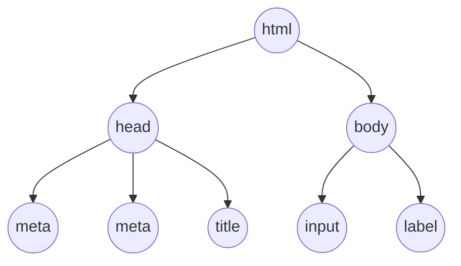

+++
title = '🌲 Document Object Model'
headless = true
time = 20
facilitation = false
emoji= '🧩'
[objectives]
    1='Define the Document Object Model'
+++

We can start by inspecting the DOM - short for **D**ocument **O**bject **M**odel. The DOM is an API.
When the browser renders a web page it creates the DOM - a representation of the web page. We can use JavaScript to interact with the DOM. This is what enables us to write programs that update the web page.


JavaScript is a programming language. It is a set of rules for writing instructions that are understood by computers.


### 🌳 DOM tree

The DOM is a tree-like structure.


We can start solving the character limit problem by defining some HTML.
You can also view the DOM tree


```html
<!DOCTYPE html>
<html lang="en">
  <head>
    <meta charset="UTF-8" />
    <meta name="viewport" content="width=device-width, initial-scale=1.0" />
    <title>Document</title>
  </head>
  <body>
    <input />
    <label>120 words remaining</label>
  </body>
</html>
```









Node is a runtime environment: it is an application that runs JavaScript code. Using Node, we can develop applications inside JavaScript. However, Node wasn’t the first runtime environment for JavaScript.
