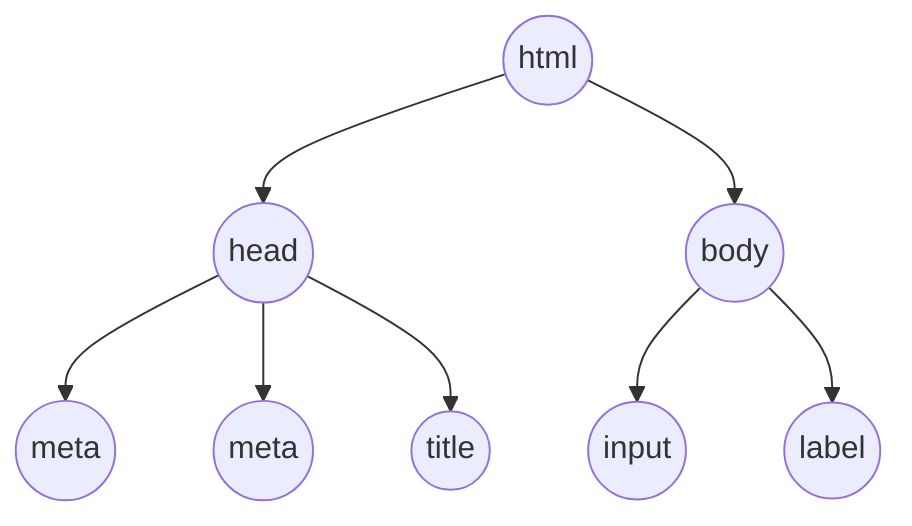

+++
title = '🌲 Document Object Model'
headless = true
time = 20
facilitation = false
emoji= '🧩'
[objectives]
    1='Define the Document Object Model'
+++

We can start by inspecting the **DOM** - short for  The Document Object Model is a data representation of the content in a web page. All html elements are represented as objects that can be accessed, modified and deleted..
When the browser first renders a web page it creates the DOM. We can then write JavaScript programs programs with the DOM API to interact with the elements in the web page.

### 🌳 DOM tree

The DOM is a tree-like structure.


We can start solving the character limit problem by defining some HTML.
You can also view the DOM tree


```html
<!DOCTYPE html>
<html lang="en">
  <head>
    <meta charset="UTF-8" />
    <meta name="viewport" content="width=device-width, initial-scale=1.0" />
    <title>Document</title>
  </head>
  <body>
    <section>
      <h1>Character limit</h1>
      <textarea id="comment-input" name="withHint" rows="5"></textarea>
      <label for="comment-input"
        >Please enter a comment in fewer than 200 characters
      </label>
      <p id="character-limit-info">You have 200 characters remaining</p>
    </section>
  </body>
</html>
```









Node is a runtime environment: it is an application that runs JavaScript code. Using Node, we can develop applications inside JavaScript. However, Node wasn’t the first runtime environment for JavaScript.
