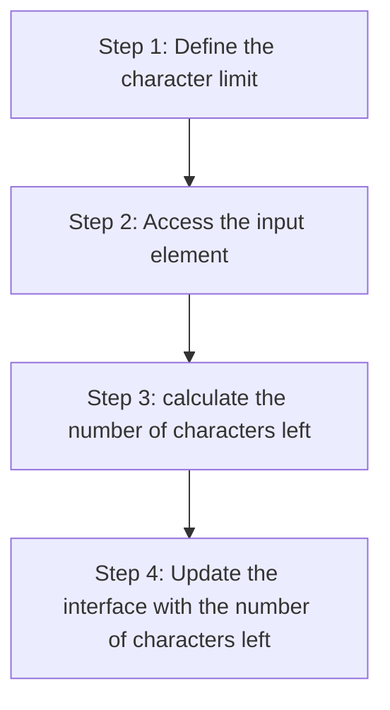

+++
title = '🎬 Events'
headless = true
time = 30
facilitation = false
emoji= '🧩'
[objectives]
    1='Describe an event in the browser environment'
+++

In the case of the input box, we want to update the label text **every time the user types inside the input**. In other words, we want our application to **_react_** to the **_user typing on the keyboard_**. Currently our plan looks like this:

However, there is a missing step in our plan. We need to find a way of running some code in response to an **event**.


[Events](https://developer.mozilla.org/en-US/docs/Learn/JavaScript/Building_blocks/Events) are things that happen in the browser, which the browser tells you about so your code can react to them.


An event is something that occurs in a programming environment. In a browser context, events could be a user clicking on a button, a user typing something into an input box, a page loading etc.

In the case of the input box, there are lots of events occurring. The input box value is changing, a keyboard button is released every time the user types and so on.

### Reacting to events

To react to an event, we can define a
