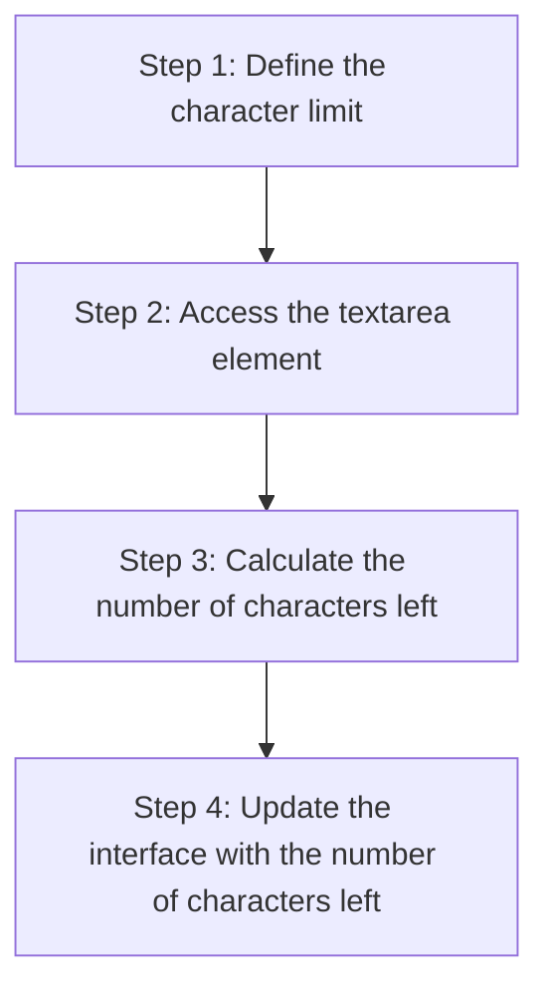
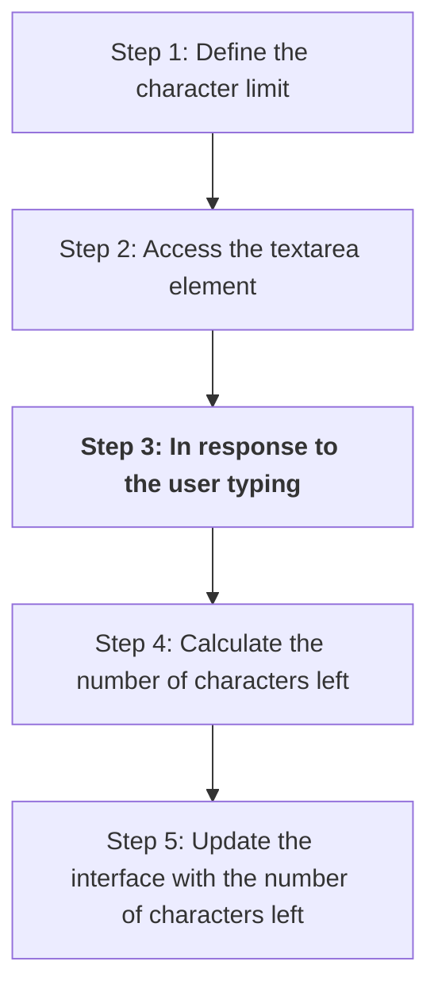

+++
title = '🎬 Events'
headless = true
time = 60
facilitation = false
emoji= '🧩'
[objectives]
    1='Describe an event in the browser environment'
    2='Update the strategy for implementing a character limit component'
+++

In the case of the ` textarea` element, we want to update the `p` element text **every time the user types inside the textarea**. In other words, we want our application to **_react_** to the **_user typing on the keyboard_**. Currently our plan looks like this:

However, we're missing a step in our plan. We need to find a way of running some code in response to an **event**.


An [event](https://developer.mozilla.org/en-US/docs/Learn/JavaScript/Building_blocks/Events) is something that occurs in a programming environment.


Events are things that happen in the browser, which the browser tells you about so your code can react to them. In a browser context, events could be a user clicking on a button, a user typing something into a textarea box, submitting a form etc. You can find a [complete reference all the different event types](https://developer.mozilla.org/en-US/docs/Web/Events) on MDN.

In the case of the `textarea` element, there are lots of events occurring. The `textarea` value is changing, a keyboard button is released every time the user types and so on. We can update our plan as follows:

