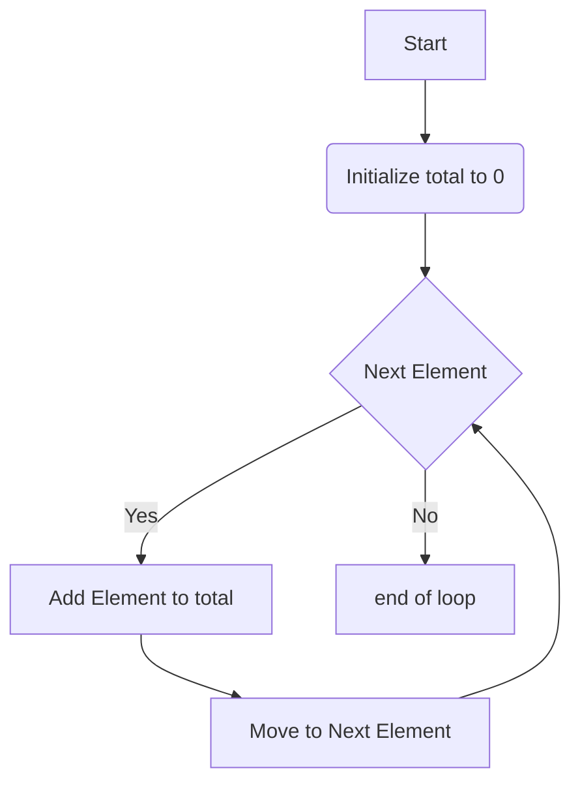

+++
title = '🔁 iterating'
headless = true
time = 30
facilitation = false
emoji= '🧩'
[objectives]
    1='Define iteration'
    2='Explain why iteration is relevant in a particular problem'
+++

In programming, we use **iteration** when we want to repeat a particular set of steps.

Let's visualise how iteration works.



We can use a `for...of` loop to implement this sequence of steps.

```js
function calculateMean(list) {
  let total = 0;
  for (const item of list) {
    total += item;
  }
}
```





<iframe title="for..of loop" width="800" height="500" frameborder="0" src="https://pythontutor.com/iframe-embed.html#code=function%20calculateMean%28list%29%20%7B%0A%20%20let%20total%20%3D%200%3B%0A%20%20for%20%28const%20item%20of%20list%29%20%7B%0A%20%20%20%20total%20%2B%3D%20item%3B%0A%20%20%7D%0A%7D%0A%0AcalculateMean%28%5B10,20,30,40,50%5D%29%3B&codeDivHeight=400&codeDivWidth=350&cumulative=false&curInstr=0&heapPrimitives=nevernest&origin=opt-frontend.js&py=js&rawInputLstJSON=%5B%5D&textReferences=false"> </iframe>



