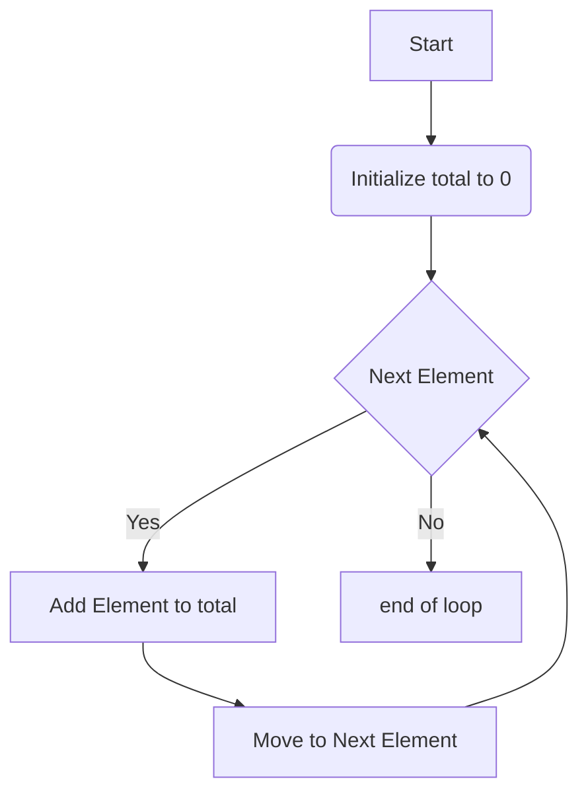

+++
title = '🔁 iterating'
headless = true
time = 30
facilitation = false
emoji= '🧩'
[objectives]
    1='Define iteration'
    2='Explain why iteration is relevant in a particular problem'
+++

In programming, we use **iteration** when we want to repeat a particular set of steps.

Let's visualise how iteration works.



We can use a `for...of` loop to implement this sequence of steps.

```js
function calculateMean(list) {
  let total = 0;
  for (const item in list) {
    total += item;
  }

  return total / list.length;
}
```
