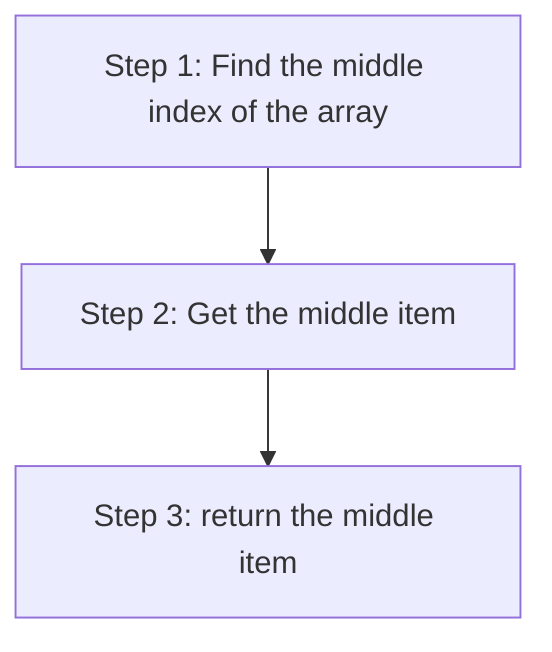

+++
title = '📊 Calculating the median'
headless = true
time = 25
facilitation = false
emoji= '🧩'
[objectives]
1='Describe how to calculate the median of a list in JavaScript' 
+++

Now we're familiar with arrays, let's define a new problem.

We want to calculate the [median](https://www.bbc.co.uk/bitesize/guides/zwhgk2p/revision/2) value from an array of numbers.

_Given_ an array of numbers in _ascending order_,
_When_ we call `calculateMedian` with this array
_Then_ we get the median value

We calculate the median of a list of numbers by finding the middle value in the list.

Let's start with a test to check the **return value** of `calculateMedian` given an array of numbers.

```js
test("calculates the median of a list of odd length", function () {
  const list = [10, 20, 30, 50, 60];
  const currentOutput = calculateMedian(list);
  const targetOutput = 30;

  expect(currentOutput).toBe(targetOutput);
});
```

### 🔨 Implementing `calculateMedian`

So we can implement `calculateMedian`.

We can summarise our approach as follows.



In code we can we can use [`splice`](https://developer.mozilla.org/en-US/docs/Web/JavaScript/Reference/Global_Objects/Array/splice) to to get the middle item.

```js
function calculateMedian(list) {
  const middleIndex = Math.floor(list.length / 2);
  const median = list.splice(middleIndex, 1)[0];

  return median;
}
```




Try writing a test case to check `calculateMedian` works in the case when it is passed an _array of even length_.

Use [documentation](https://www.bbc.co.uk/bitesize/guides/zwhgk2p/revision/2) to check how the median is computed in this case.




Once you've written your test case for `calculateMedian` try implementing the functionality for this case.




