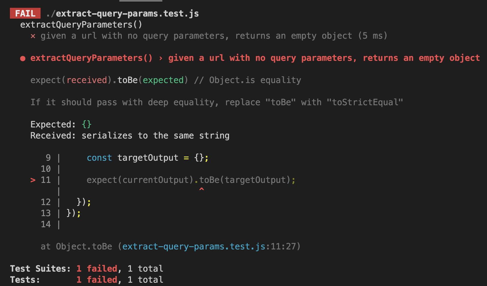

+++
title = '❓ No parameters'
headless = true
time = 20
facilitation = false
emoji= '🧩'
[objectives]
    1='Explain why toBe cannot be used to compare the contents of two objects'
+++

Let's look at an empty query string.

In this particular case, we need to think of an output that makes sense. In a situation where there are no query parameters we can just return an _empty object_.

We can write a test case as follows:

```js
test("given a query string with no query parameters, returns an empty object", function () {
  const input = "";
  const currentOutput = parseQueryString(input);
  const targetOutput = {};

  expect(currentOutput).toBe(targetOutput);
});
```

We can pass this test just by returning an empty object for now.
We can define a function `parseQueryString` as follows:
We can rerun the tests. However, we get the following feedback:


### Checking objects

In our test, `parseQueryString` returns a reference to an empty object.
So `currentOutput` is assigned this reference.
And `targetOutput` is assigned a reference to a **different object**.

If we perform the check with the `toBe` matcher we get a message back from Jest:

```terminal
If it should pass with deep equality, replace "toBe" with "toStrictEqual"
```

In other words, `toBe` checks **references** of two objects. As `currentOutput`and `targetOutput` point to different objects - this can never be true. However, we can use a different matcher that compares the **contents** of the two objects. We can use [`toStrictEqual`](https://jestjs.io/docs/expect#tostrictequalvalue) to check that both objects have exaclty the same contents.

```js
expect(currentOutput).toStrictEqual(targetOutput);
```
