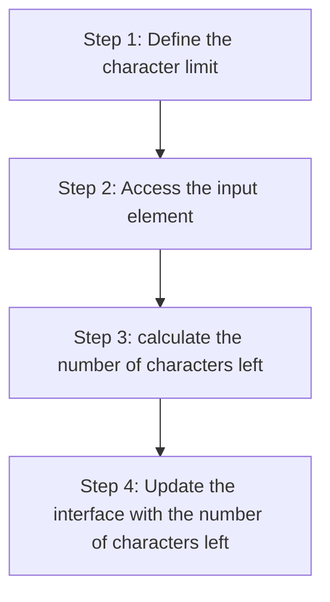

+++
title = '🧭 Strategy'
headless = true
time = 20
facilitation = false
emoji= '🧩'
[objectives]
    1='Break down a problem into a series of steps'
+++

We can outline a strategy:

This strategy gives us a rough guide for the road ahead. However, as we learn more about this problem, we may need to update our strategy.
