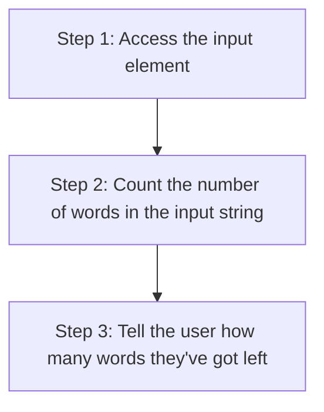

+++
title = '🛑 Word limits'
headless = true
time = 30
facilitation = false
emoji= '🧩'
[objectives]
    1='Use the Teach Tech Together guide to construct your objectives'
+++

Let’s define a problem.

We’ll start with an input element as defined by some HTML. We’ll have a word limit on this input box so that users can’t exceed a certain number of words. As users type in the box, they should get feedback on the number of words they’ve got left.

<html>
<section>
  <input id="word-limit-input" type="text" />

<label id="word-limit-label" for="input">Words remaining: </label>
<progress id="input" value="32" max="100">32%</progress>

</section>

</html>
We can define the problem more clearly:

Given an input box,
When I type characters into the input box
Then I should be notified about how many characters I’ve got left.

### 🧭 Strategy

We can describe a rough strategy as follows:

This strategy is approximate: it may need to change as we discover more about the environment and the problem we're working on. However,
