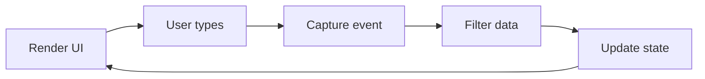

+++
title = '🧩 Break down the problem'
headless = true
time = "15"
facilitation = false
emoji= '🧩'
[objectives]
    1='Identify and sequence sub tasks'
+++

Let's think through building this film search interface step-by-step. Write down your sequence of steps to build this interface.

> _Given_ a view of film cards and search box
> _When_ a user types in the search box
> _Then_ the view should update to show only matching films







1. 🔍 Display search box and initial list of films
1. 🦻🏽 Listen for user typing in search box
1. 🎞️ Capture latest string when user types
1. 🎬 Filter films list based on search text
1. 📺 Update UI with filtered list




The key aspects we need to handle are capturing input and updating UI.

### 👂🏿 Capturing Input

We need to listen for the `input` event on the search box to react as the user types. When the event fires, we can read the updated string value from the search box input element.

### 🎬 Filtering Data

Once we have the latest search text, we can filter the list of films to only those whose titles contain the current search string. We can use JavaScript array methods like .filter() to return the matching films.

## Updating UI

With the latest filtered list of films in hand, we re-render these films to display the updated search results. We can clear the current film list and map over the filtered films to add updated DOM elements.

Thinking through these aspects separately helps frame the overall task. Next we can focus on each piece - listening for input, filtering data, and re-rendering UI with the films example.
