+++
title = '🪃 Callbacks'
headless = true
time = 20
facilitation = false
emoji= '🧩'
[objectives]
1='Define a callback'
2="Sketch the event loop"
3="Predict the order of logged numbers using the event loop model"
+++

Consider this visualisation of an asynchronous program:

<iframe title="code running out of order and off the thread" src="http://latentflip.com/loupe/?code=c2V0VGltZW91dChmdW5jdGlvbiB0aW1lb3V0KCkgewogICAgY29uc29sZS5sb2coIjEiKTsKfSwgMjAwMCk7CnNldFRpbWVvdXQoZnVuY3Rpb24gdGltZW91dCgpIHsKICAgIGNvbnNvbGUubG9nKCIyIik7Cn0sIDUwMCk7CnNldFRpbWVvdXQoZnVuY3Rpb24gdGltZW91dCgpIHsKICAgIGNvbnNvbGUubG9nKCIzIik7Cn0sIDApOwo%3D!!!" width="100%" height="480px"></iframe>

When we call [`setTimeout`](https://developer.mozilla.org/en-US/docs/Web/API/setTimeout) we send **a function call** to a client side Web API. The code isn't executing in our single thread any more, so we can run the next line. The countdown _is_ happening, but it's not happening _in our thread_.

When the time runs out, our Web API sends a message to our program to let us know. This is called an An event is a signal that something has happened.. Our API sends its message to our The event loop is a JavaScript mechanism that handles asynchronous callbacks.. And what message does the event loop send? It sends a **callback**. It sends _our_ call _back_.


A callback is our function call, sent back to us through the event loop.




**With a pen and paper**, draw a diagram of your mental model of the event loop.

Use your model to predict the order of logged numbers in the following code snippet:

```js
setTimeout(function timeout() {
  console.log("1");
}, 2000);
setTimeout(function timeout() {
  console.log("2");
}, 500);
setTimeout(function timeout() {
  console.log("3");
}, 0);
```

```mermaid
graph
  Callbacks{{🪃 Callbacks}} --> |run on| SingleThread[🧵 Single thread]
    SingleThread --> |handled by| EventLoop[🔁 Event Loop]
    EventLoop --> |queues| Callbacks
    SingleThread --> |send tasks to| ClientAPIs{💻 Client APIs}
    ClientAPIs --> | send| Callbacks
```






Did yours look different? There are many ways to visualise the event loop. Work on building your own mental model that helps you predict how code will run.


