+++
title = '🐕 Fetching data'
headless = true
time = 20
facilitation = false
emoji= '🧩'
[objectives]
    1='Update a problem statement using web APIs to fetch data'
+++

So far we have displayed films data stored in our JavaScript code. But real applications fetch data from servers over the internet. We can restate our problem as follows:

> _Given_ a **web API that serves** film data
> _When_ the page first loads
> _Then_ the page should fetch and display the list of film data, including the film title, times and film certificate

We will use [`fetch()`](https://developer.mozilla.org/en-US/docs/Web/API/Fetch_API/Using_Fetch), a 
A client side Web API lives in the browser. They provide programmatic access _to_ built-in browser functions _from_ JavaScript. . Fetch will fetch our data from the 
A server side Web API lives on a server. They provide programmatic access _to_ data or functions stored on the server _from_ JavaScript. .

_Using_ fetch is simple. But we want to understand what is happening more completely. So let's take ourselves on a journey through time.

```mermaid
graph TD
    fetch[(🐕 fetch)] --> |sends a| Request{📤 Request}
    Request --> |has a latency| TimeProblem[🗓️ Time Problem]
    Request --> |to| ServerAPIs
    fetch --> |is a| ClientAPIs

    TimeProblem --> |caused by| SingleThread[🧵 Single thread]
    Callbacks{{🪃 Callbacks}} --> |run on| SingleThread
    SingleThread --> |handled by| EventLoop[🔁 Event Loop]
    EventLoop --> |queues| Callbacks
    SingleThread --> |send tasks to| ClientAPIs
    SingleThread --> |handled by| Asynchrony

    TimeProblem --> |solved by| Asynchrony[🛎️ Asynchrony]
    Asynchrony --> |delivered with| Promise{{🤝 Promises}}
    Asynchrony --> | delivered with | ClientAPIs
    Promise --> |resolve to a| Response{📤 Response}
    Promise --> |join the| EventLoop{{Event Loop 🔁}}
    Promise --> |syntax| async{{🏃‍♂️ async}}
    async --> |syntax| await{{📭 await}}
    await --> |resolves to| Response
    Response ---> |sequence with| then{{✔️ then}}


    WebAPIs((🧰 Web APIs)) --> |live in your browser| ClientAPIs{💻 Client side APIs}
    ClientAPIs --> |like| setTimeout[(⏲️ setTimeout)]
    ClientAPIs --> |like| eventListener[(🦻🏾 eventListener)]
    WebAPIs --> |live on the internet| ServerAPIs{🌐 Server side APIs}
    ServerAPIs --> |serve our| Data[(💾 Data)]
    Data --> |as a| Response

```

 

👉🾠Unfurl to see the journey

😵‍💫 This is a lot to take in. Let's break it down and make sense of it.

