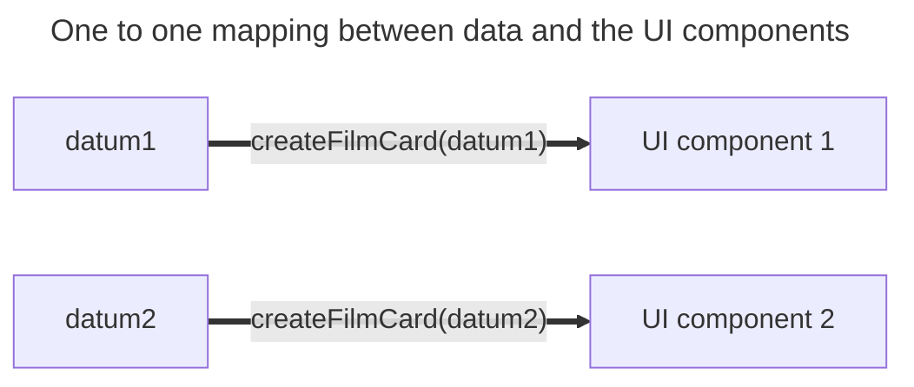

+++
title = 'One to one'
headless = true
time = 30
facilitation = false
emoji= '🧩'
[objectives]
    1='Describe how to render a list of data'
+++

We can now render _any_ film data object in the UI. However, to fully solve this problem we must render a list of data. For each film object, we need to render a corresponding film object in the UI. In this case, there is a A **one-to-one mapping** associates every element in a set to exactly one element in another setbetween the data array and the UI components on the web page. We can represent this diagrammatically by pairing up the data elements with their corresponding UI components:



To create an array of card components, we can iterate through the film data using the `for...of` loop:

```js
const films = [
  {
    title: "Killing of Flower Moon",
    director: "Martin Scoresee"
    times: ["15:35"],
    certificate: "15",
    duration: 112
  },
  {
    title: "Typist Artist Pirate King",
    directory: "Carol Morley"
    times: ["15:00", "20:00"],
    certificate: "12A",
    duration: 108
  },
];

const filmCards = [];
for (const item of films) {
  filmCards.push(createFilmCard(item));
}

document.querySelector("ul").append(...elements);
// invoke append using the spread operator
```

However, there are alternative methods for building this array of UI components.
