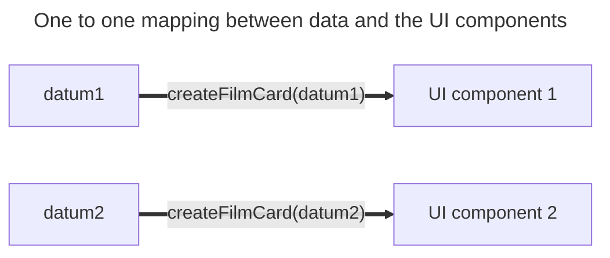

+++
title = 'One to one'
headless = true
time = 30
facilitation = false
emoji= '🧩'
[objectives]
    1='Describe how to render a list of data'
+++

We can now render _any_ film data object in the UI. However, to fully solve this problem we must render a list of data. For each film object we need to render a corresponding film object in the UI. There is a A **one-to-one mapping** associates every element in a set to exactly one element in another setbetween the data array and the UI components we see on the web page. We can represent this diagrammatically by pairing up the data elements with their corresponding UI components:



We can take any single film datum and render it in the UI. However, the main goal is to render a list of data in the user interface:

Let's consider an array of data like this:

```js
const films = [
  {
    title: "Killing of Flower Moon",
    director: "Martin Scoresee"
    times: ["15:35"],
    certificate: "15",
    duration: 112
  },
  {
    title: "Typist Artist Pirate King",
    directory: "Carol Morley"
    times: ["15:00", "20:00"],
    certificate: "12A",
    duration: 108
  },
];

const filmCards = [];
for (const item of films) {
  filmCards.push(createFilmCard(item));
}

document.querySelector("ul").append(...elements);
// invoke append using the spread operator
```

We want to map over this data and render it in the user interface.

```js
const films = [
  {
    title: "Killing of Flower Moon",
    director: "Martin Scoresee"
    times: ["15:35"],
    certificate: "15",
    duration: 112
  },
  {
    title: "Typist Artist Pirate King",
    directory: "Carol Morley"
    times: ["15:00", "20:00"],
    certificate: "12A",
    duration: 108
  },
];

const filmCards = [];
for (const item of filmCards) {
  const filmCard = createFilmCard(item);
  filmCards.push(filmCard);
}

document.querySelector("#main-content").append(...filmCards);
```

Now we have a situation where we want to map elements from the DOM to a user interface.
