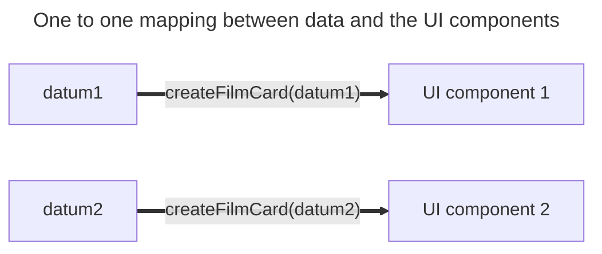

+++
title = 'One to one'
headless = true
time = 30
facilitation = false
emoji= '🧩'
[objectives]
    1='Define a one to one mapping'
+++

There is a A **one-to-one mapping** associates every element in a set to exactly one element in another setbetween the data array and the UI components. We can represent this diagrammatically by pairing up the data elements with their corresponding UI components:

