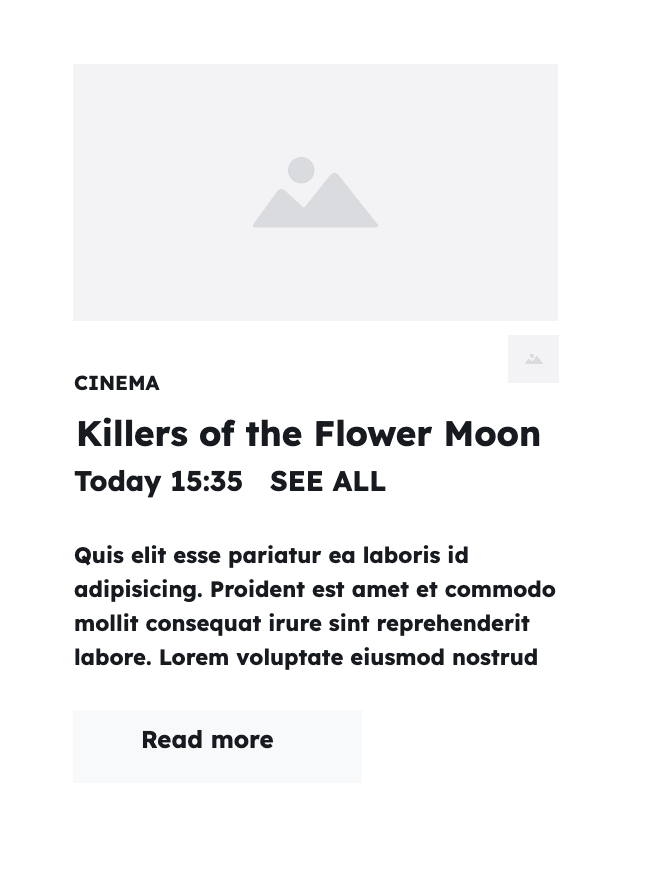

+++
title = '💽 Single datum'
headless = true
time = 30
facilitation = false
emoji= '🧩'
[objectives]
    1='Describe how to render a datum in the browser'
+++

To break down this problem, let's define a sub-goal:

> 🎯 Sub-goal: Render _any_ single film datum in the user interface

We'll consider how to render any single datum before doing this for the whole list. Let's start with an object like the one below:

```js
const film = {
    title: "Killing of Flower Moon",
    director: "Martin Scoresese"
    times: ["15:35"],
    certificate: "15",
    duration: 112
};
```

We'll focus _only_ on building this section of the user interface with the object:


