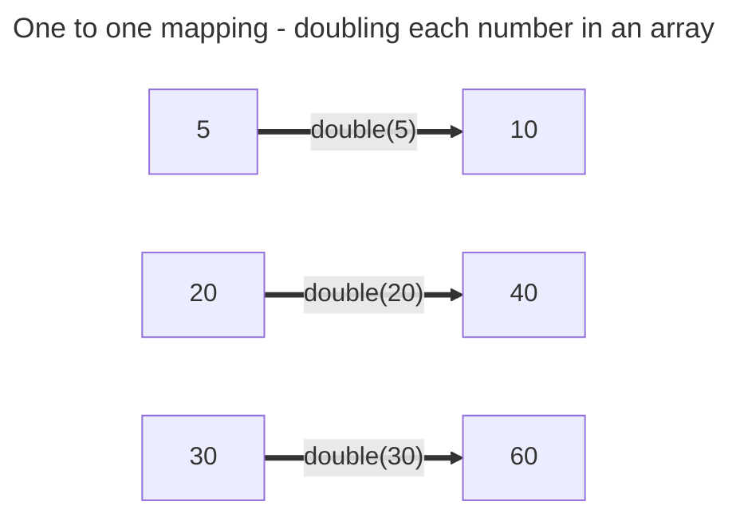

+++
title = '🗺️ Using map'
headless = true
time = 30
facilitation = false
emoji= '🧩'
[objectives]
    1='Describe how to use map'
    2='Describe why we use map instead of other iteration techniques'
+++

For every item in a starting array, we want to apply a function to each element in the starting array to create a new array. Earlier, we used a `for...of` statement to apply the function `createShowCard` to each element in the array. However, we can also use `map` to do this. `map` is a  A **higher order function** is a function that takes another function as an argument or returns a new function.. In this case, we pass a function to `map`, and use its return value to create a new array.

Let's consider an example with an array of numbers `[5, 20, 30]` and a function `double` that returns double its input. Our goal is to create a new array of doubled numbers given this array and function. Firstly, we can observe a one-to-one mapping:



In JavaScript code, we can think of this like calling the function `double` for every single item in the original array and using the return value each time as elements in the new array.

```js
function double(num) {
  return num * 2;
}

const arr = [5, 20, 30];
const doubledNums = [double(5), double(20), double(30)];
```

To build an array like this we can call `map`:

```js {linenos=table,hl_lines=["6"], linenostart=1}
function double(num) {
  return num * 2;
}

const arr = [5, 20, 30];
const doubledNums = arr.map(double);
```





<iframe title="array-visualiser" width="768" height="432" src="https://array-visualizer.codeyourfuture.io/" frameborder="0" scrolling="no" allow="fullscreen; clipboard-read; clipboard-write" allowfullscreen></iframe>

Use the array visualiser to observe what happens when `map` is used on the `arr`. Try changing the elements of `arr` and the function that is passed to `map`. Answer the following questions in the visualiser:

- What does `map` do?
- What does `map` return?
- What parameters does the `map` method take?
- What parameters does the callback function take?





<iframe title="play-computer-arrays" width="1100" height="400" frameborder="0" src="https://pythontutor.com/iframe-embed.html#code=function%20double%28num%29%20%7B%0A%20%20return%20num%20*%202%3B%0A%7D%0A%0Aconst%20arr%20%3D%20%5B5,%2020,%2030%5D%3B%0Aconst%20doubledNums%20%3D%20arr.map%28double%29%3B&codeDivHeight=400&codeDivWidth=350&cumulative=false&curInstr=0&heapPrimitives=nevernest&origin=opt-frontend.js&py=js&rawInputLstJSON=%5B%5D&textReferences=false"> </iframe>

Play computer with the example to see what happens when the `map` is called.




