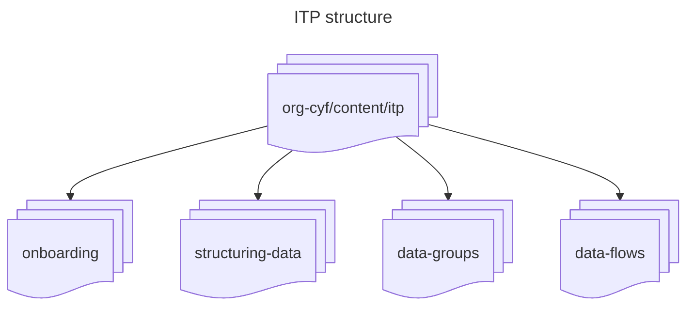
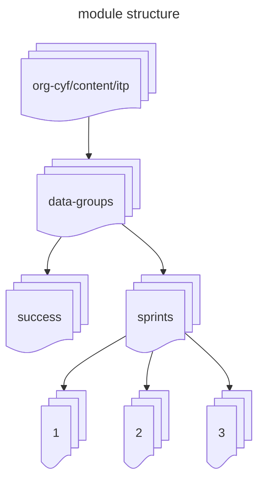
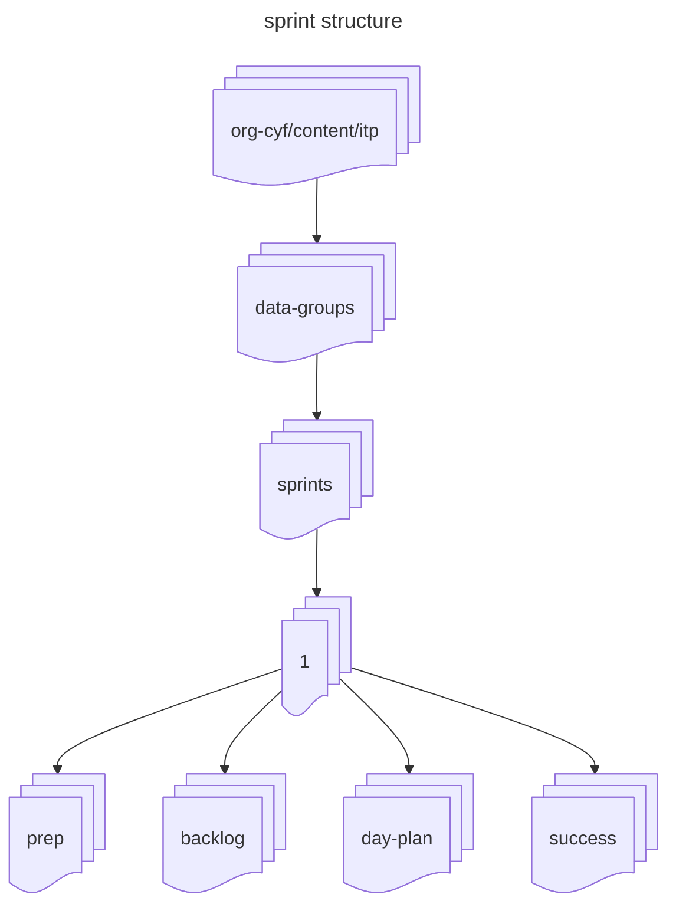
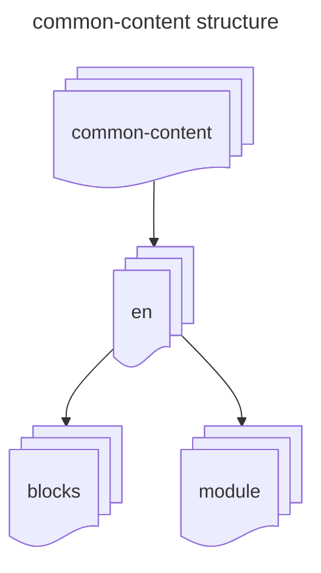

## Finding the Right Directory

CYF's curriculum is designed to be modular. Each part of the course has its own sub-directory within the `curriculum` repo, and each module within those courses has its own GitHub repo with relevant code examples and exercises. We define the structure of the curriculum by specifying where each piece of content can be found, either as a path within `curriculum` or as a GitHub url.

> [!NOTE]
> We will use the Data Groups module of the Intro to Programming course as an example here but others follow a similar pattern.

Within each course's directory there is a sub-directory for each module.



> [!NOTE]
> There will be additional folders with other information required to edit the page, eg. details of the next stage of the course in the `checkpoint` folder

Each module is broken into **sprints**. A sprint represents one week of work. The `success` folder contains the success criteria for a module.



Each sprint is made up of **prep** (material to be read before class), **backlog** exercises (exercises to attempt before class), the **day plan** (the structure of the saturday class) and **success** criteria.



## Adding Prep Work

The `prep` directory contains an `index.md` file listing all files to be included with a module. Each entry requires two pieces of information:

- `name` specifies the page's title in the page map
- `src` is the path to the file. This can either be a relative filepath from `curriculum/common-content/en` or a url to an external source, eg. GitHub. 

Within `common-content` prep material is split across two directories:

- `blocks` contains content which can be reused across different courses
- `module` contains content specific to a particular module, subdivided by topic



When adding new content:

1. Create a new directory in the appropriate place. These can be nested within `blocks` or `modules`.
2. In your directory create `index.md`
3. Provide the appropriate front matter:

```md
+++
title = "Document Title"
<!-- duration in minutes -->
time = 120
<!-- learning objectives as strings. -->
objectives = [
  "Learning objective 1",
  "Learning objective 2",
  "Learning objective 3",
]
<!-- build config - no need to edit this -->
[build]
  render = "never"
  list = "local"
  publishResources = false
+++
```

4. Write your content using markdown. Notes on styling and using render hooks can be found in the [Common documentation](https://common.codeyourfuture.io/).
5. Add the path to your content to `index.md` in the `prep` directory.

If your content is loaded from an external GitHub url you can skip steps 1 and 2.

Changes made to prep content should appear immediately when the site is rebuilt locally. If they do not you likely need to clear a cached version of the site.

### Code Examples

If code examples are required for a task they can be stored in the module's repository. Every module has its own repo named `Module-<MODULE-NAME>`, eg. [Module-Data-Groups](https://github.com/CodeYourFuture/Module-Data-Groups). Add code to the appropriate sprint and include a link to it in your markdown.


## Adding Backlog Items

The backlogs for each sprint are generated by importing issues from GitHub. The [issues page](https://github.com/CodeYourFuture/Module-Data-Groups/issues) of each module's repo lists all exercises associated with the module with labels used to identify which sprint they belong to.

To add a new backlog exercise, open a new issue and complete the template with the required information. Check out a [current backlog](https://curriculum.codeyourfuture.io/itp/data-groups/sprints/1/backlog/) to see examples of what is required. 

To remove an item from a backlog you can close the relevant issue.

> [!CAUTION]
> Other internal systems reference these issues - every issue **must** have labels for `sprint`, `submission` and `priority`.

To prevent unnecessary calls to the GitHub API responses are cached. When testing locally the cache will need to be cleared in order to see changes made to GitHub issues.


## Updating the Day Plan

Similar to prep work, the `day-plan` directory contains an `index.md` file laying out the structure of the day. It covers two types of content:

- Activities repeated across multiple classes (energisers, lunch breaks, etc.). These are stored in `common-content/en/blocks`.
- Workshops for that class.

Workshops can be defined in various places. Some are stored in `common-content/en/module` similar to prep content.

Most workshops are stored in the [CYF-Workshops repository](https://github.com/CodeYourFuture/CYF-Workshops#:~:text=Welcome%20to%20CYF%20Workshops) and imported to `day-plan/index.md` using their url. There are some additional features available through this repository explained in its README. 

Workshops may also be created in stand-alone repositories if needed. 


## Updating Success Criteria

At the sprint level, the [End of Sprint Review](https://curriculum.codeyourfuture.io/itp/data-groups/sprints/1/success/) page lists all learning objectives defined in prep work and backlog exercises. This is generated at build time and does not need to be manually edited. If your learning objectives are not showing up here check they are formatted correctly.

The [End of Module Review](https://curriculum.codeyourfuture.io/itp/data-groups/success/) lists the criteria for passing the module. These criteria are referenced by other teams within the organisation - please **do not edit them** without prior discussion with a member of the core team.