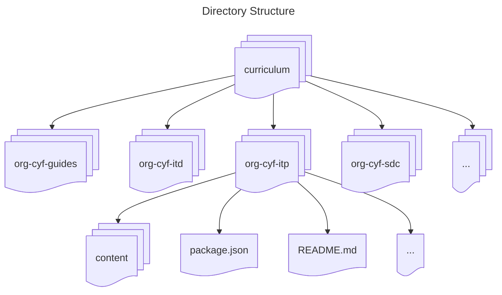

## Required Packages

Our curriculum is built on top of [Hugo](https://gohugo.io/) and requires some packages to be installed:

- `go`
- `hugo`
- `npm`

> [!WARNING]
> We require `v0.136.5-extended` of `hugo` which can be downloaded from [GitHub](https://github.com/gohugoio/hugo/releases/tag/v0.136.5) and manually added to your `$PATH`.
> 
> Later versions will induce an error and building will fail.
> 
> Updating this is an [open issue](https://github.com/CodeYourFuture/curriculum/issues/1505) - help welcome!

## GitHub Token

When building the curriculum content is pulled from a number of different CYF repos via the GitHub API. To build locally you will need to create a fine-grained GitHub API token which can be generated from the [developer settings page](https://github.com/settings/personal-access-tokens).

1. Click the "Generate new token" button
    - Name can be anything
    - Duration is not important, but if you are contributing regularly you will need to repeat this process if your token expires
    - Ensure "resource owner" is your own account
    - "Repository access" should be `Public Repositories (read-only)`
    - You do not need account permissions
2. Clone the `curriculum` repository if you haven't already done so
3. Make a copy of `/curriculum/.env.example`
4. Rename your copy `/curriculum/.env`
5. Update the `HUGO_CURRICULUM_GITHUB_BEARER_TOKEN` property to contain the access token you just generated

## Directory Structure

Each part of the CYF course is deployed to its own microsite with its own url. For example, the Intro to Programming content is found at [itp.codeyourfuture.io](https://curriculum.codeyourfuture.io/itp/) and the Software Development Course is at [sdc.codeyourfuture.io](https://curriculum.codeyourfuture.io/sdc/). 

Each module has its own directory within `curriculum` named `org-cyf-<MODULE>`, eg. `org-cyf-itp`. 

Within each directory is a `content` folder laying out the material for the module and a `package.json` file. To build a module:

- Navigate to `org-cyf-<MODULE>`
- `npm i` 
- `npm run start:dev`
- In a browser, go to `localhost:1313`

## Common Problems

### Caching

To limit unnecessary requests to the GitHub API content is cached when a module is built locally. If your changes require content to be reloaded from GitHub (eg. modifying the layout of the backlog issues) it may be necessary to manually delete the cache between builds. On a mac this is located in `/Library/Caches/hugo_cache`. Each module is cached separately.