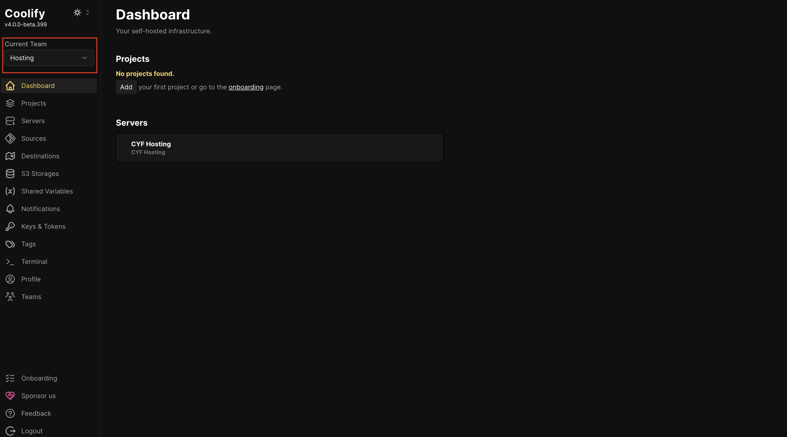
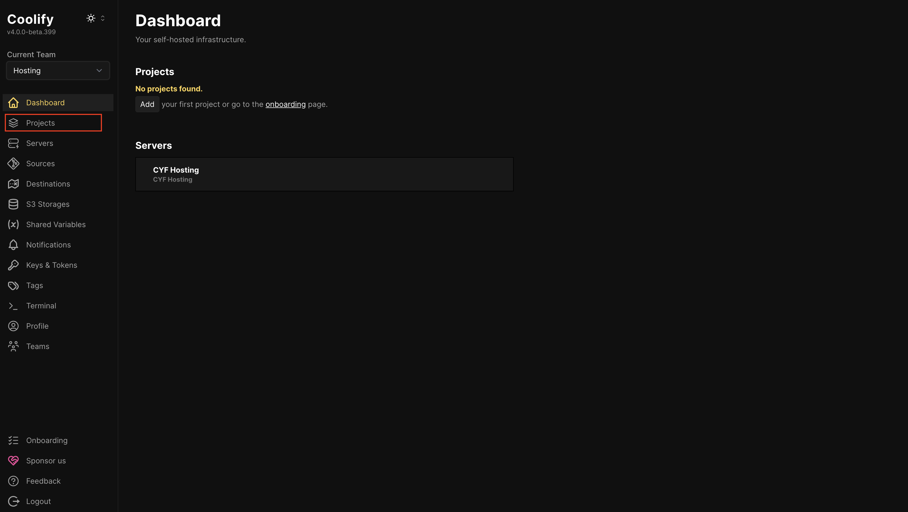
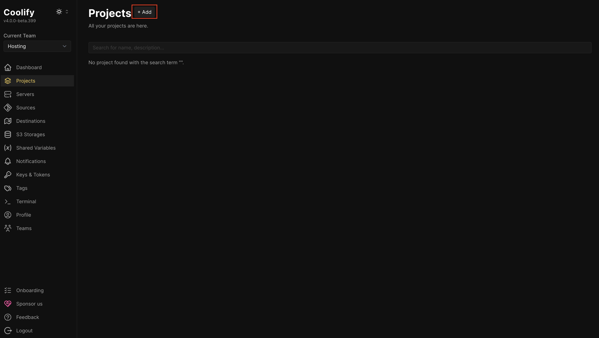
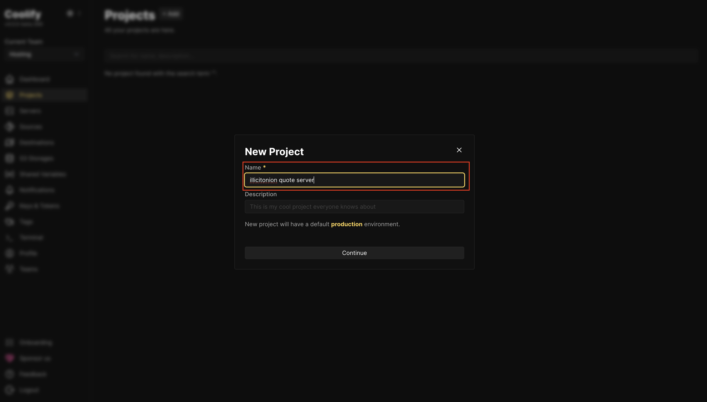
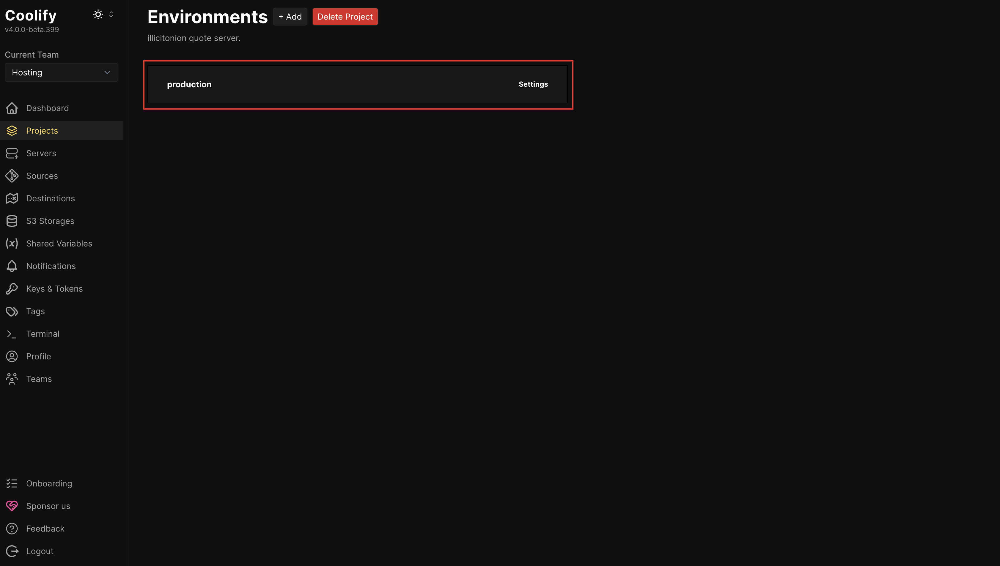

CodeYourFuture has [a hosting service](https://hosting.codeyourfuture.io/) which is offered to current trainees and recent graduates.

We attempt to make this environment reliable, fast to load, and simple to deploy to.

If you need support, please ask [on Slack in #cyf-devops](https://codeyourfuture.slack.com/archives/CB8NTK7PW).

The CYF hosting service is a shared environment. You can access other users' project config, and other users can access your project config. You should not host anything sensitive on it. We trust you to only modify your own projects.

## Projects

Each website you host should be added as a project.

A project can consist of multiple components, for instance a project can contain a frontend, a backend, a database, and more. You do not need to create separate projects for your frontend and backend.

Because the CYF hosting service is a shared resource, you **must** start your project name with your GitHub username. We will delete any project which does not have a GitHub username as the first word of its name.

### Making a project

After logging into https://hosting.codeyourfuture.io/:

**Make sure your "Current Team" is set to "Hosting"**

**Click on the "Projects" menu item**

**Click "Add"**

**Enter a project name** - this **must** start with your GitHub username.

Each project may have multiple environments - we will just use the **production** environment - **click into the production environment**.

## Next, follow guides for adding specific components:

Each component is a "Resource".
