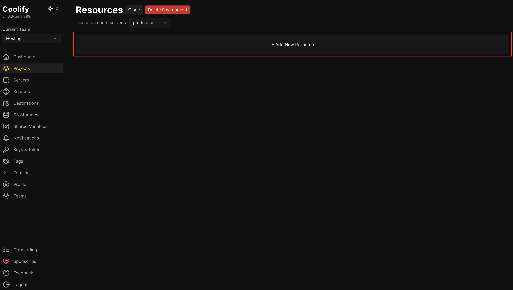
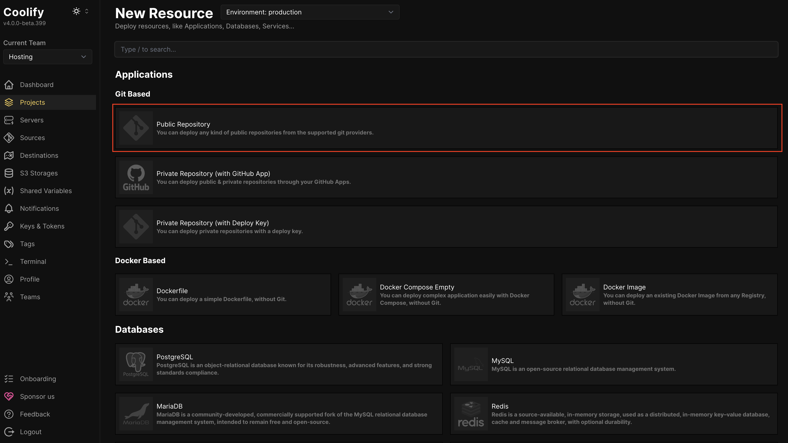
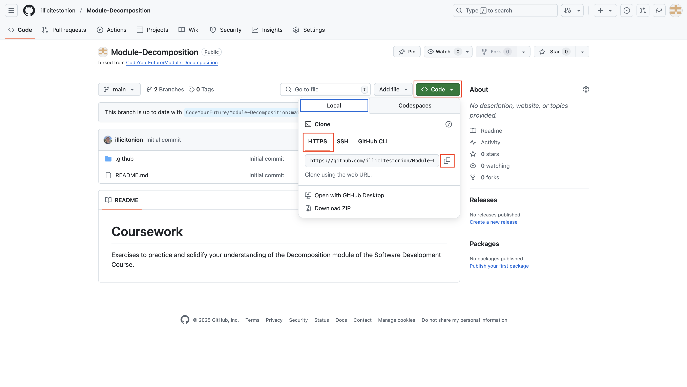
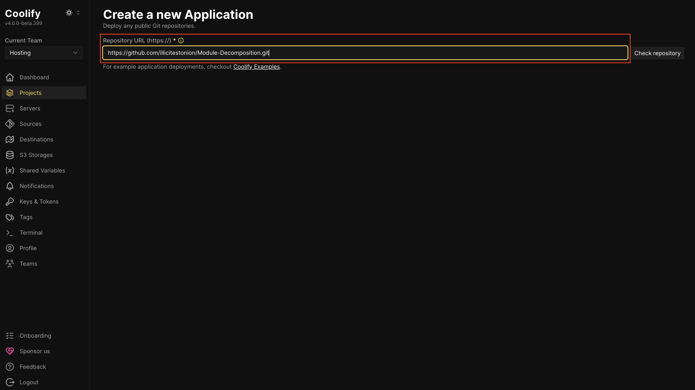
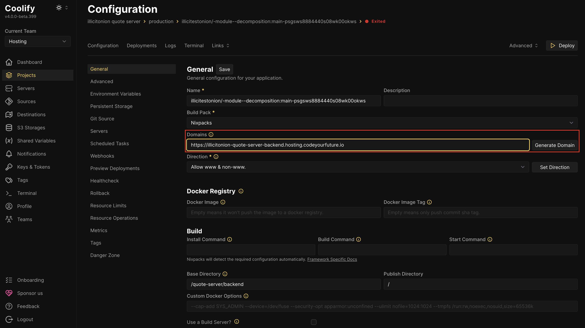
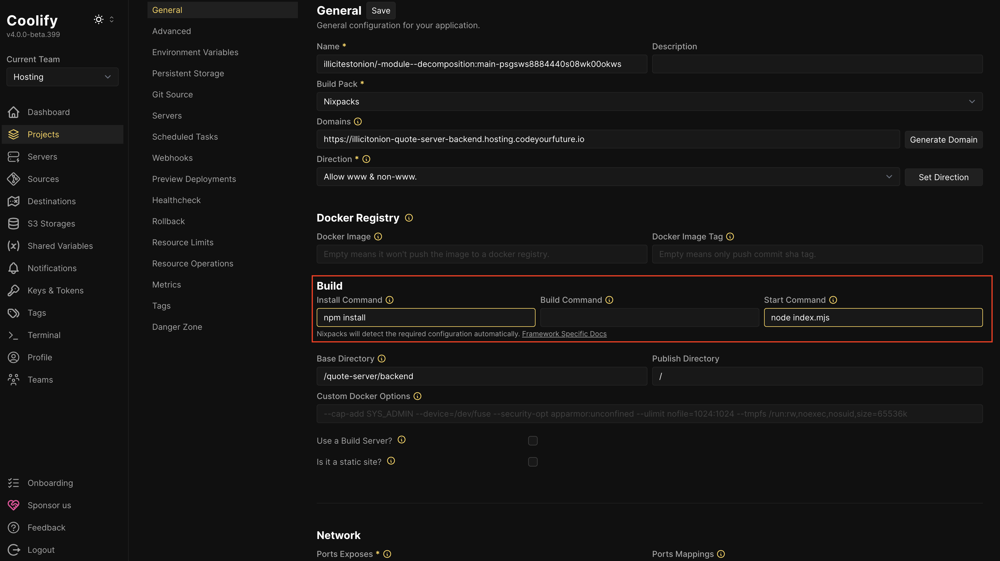
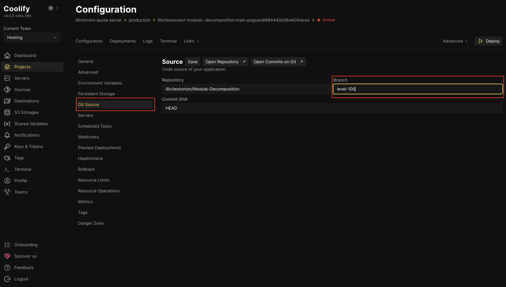
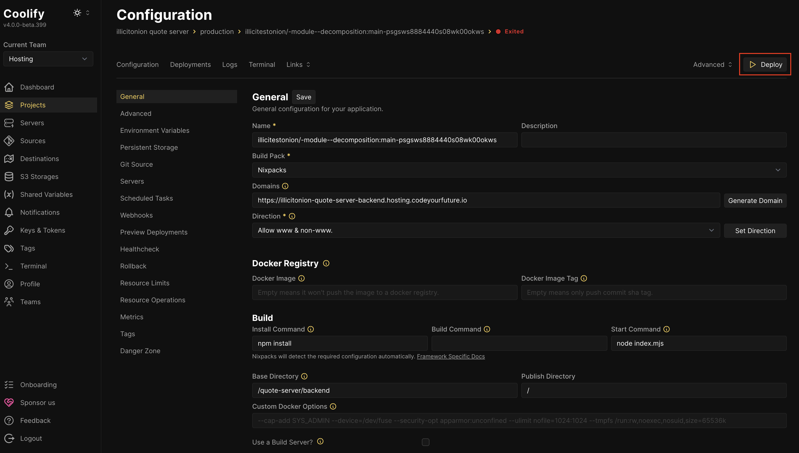

## Creating a backend

**Click "Add New Resource"**

**Add the GitHub repository**

The hosting platform needs to know where to get your backend from.

You probably want to add a "Public Repository" Git Based repository, to tell it your project is in GitHub.

If you want your application to auto-deploy when you push changes to it, you'll need to instead choose "Private Repository (with GitHub App)" and set up a GitHub App yourself.

Open your GitHub in another tab, and **copy the HTTPS Clone URL**

Go back to the CYF Hosting and **paste the URL into the "Repository URL" field**

**Click "Check repository"**.

If your backend is in a sub-directory of your GitHub repository, update the **Base Directory** (e.g. to `/quote-server/backend` if that's where your backend is).

Make sure the **Port** field contains the correct port number that your backend will listen on.

Press **Continue**.

## Configuring the backend

Most things should Just Work.

There are some things you may want or need to configure. If you do change any, you need to press the **Enter** key to save the change.

You may want to choose a friendly/memorable **Domain**:

If things aren't auto-detected properly, you may need to explicitly enter the commands used to **Install** your dependencies, **Build** your backend, or **Start** your backend:

If you want to deploy from a branch that isn't `main`, you need to configure this in the Git Source tab:

## Add NODE_ENV to Your Project

**Required for:** All JavaScript/Node.js projects (frontend and backend)

### Steps

1. Click on **"Environment Variables"** in the left sidebar
2. Click the **"+ Add"** button

3. Fill in the form:
   - **Name:** `NODE_ENV`
   - **Value:** `{{team.NODE_ENV}}`
   - Check **"Available at Runtime"** ✅ 

4. Click **"Save"**

## Deploying the backend

When everything is configured correctly, press the **Deploy** button:

Watch the logs. Fix anything that goes wrong. When the deploy is finished, you can test out your backend.
