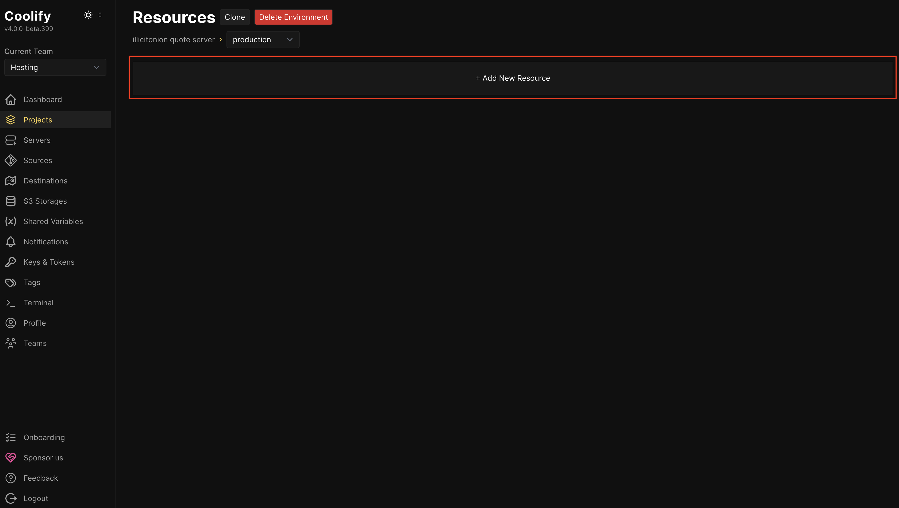
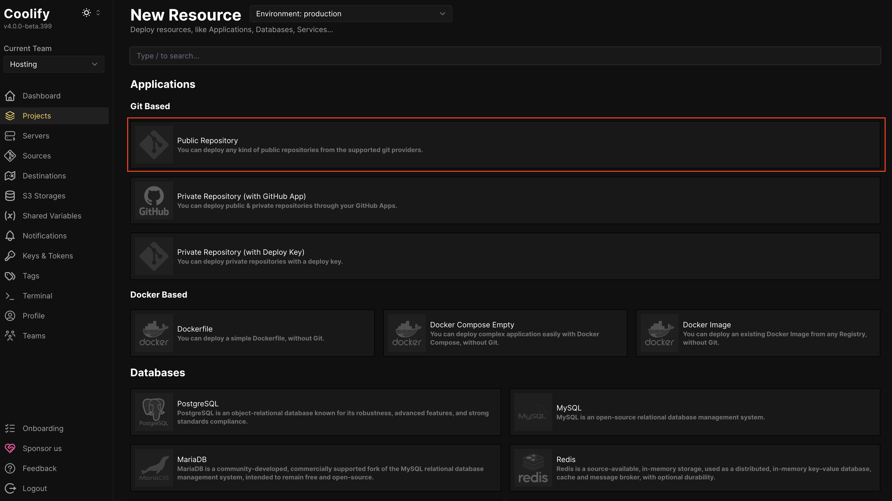
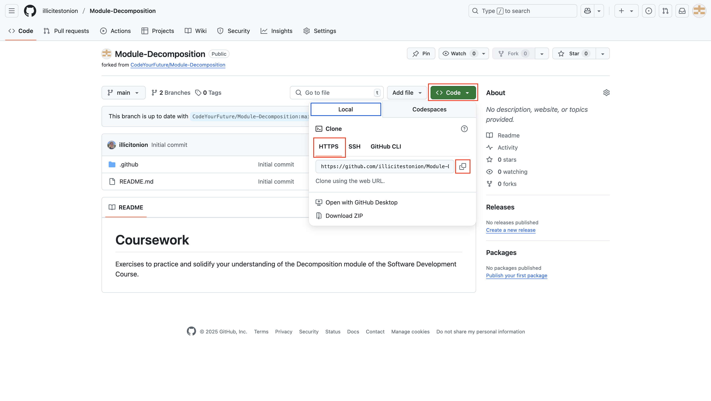
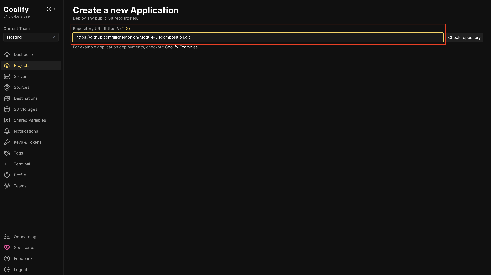
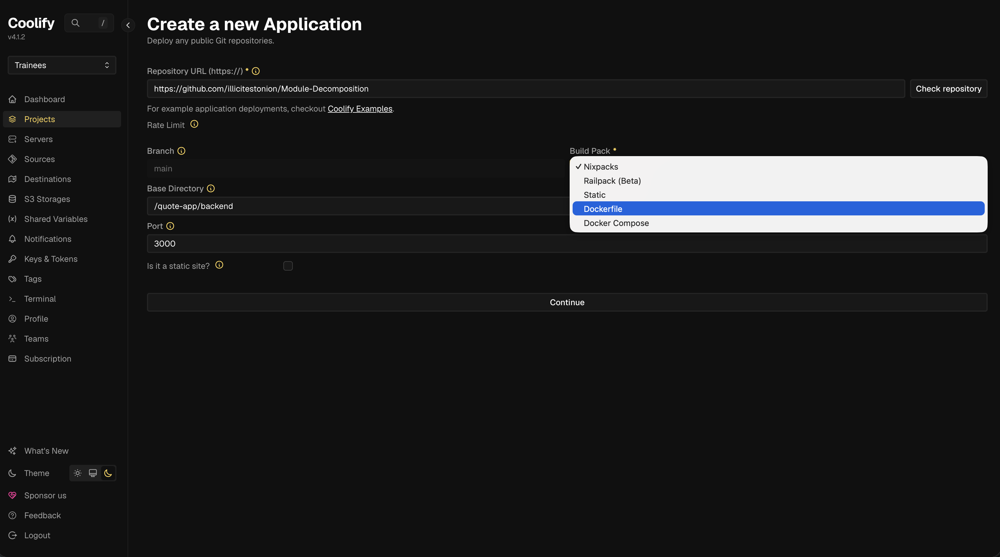
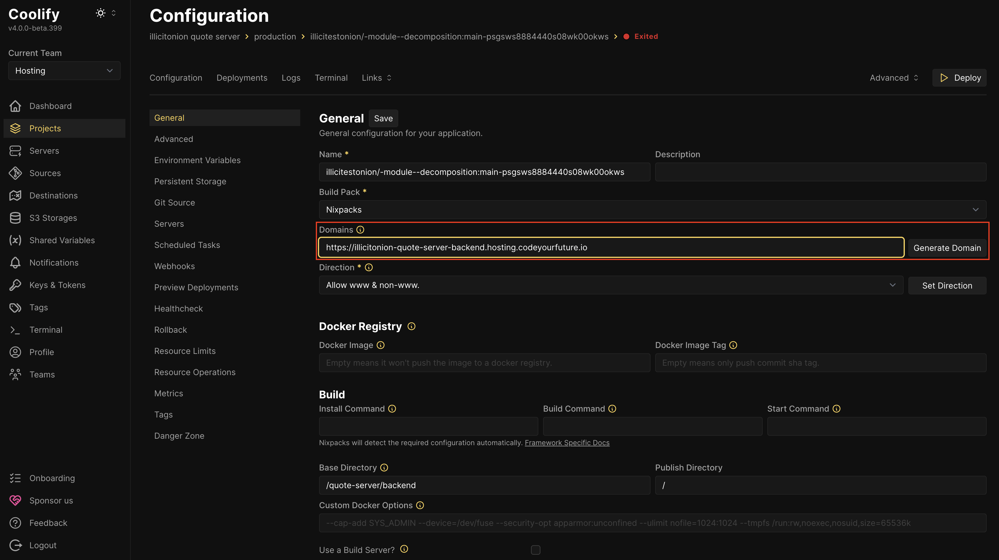
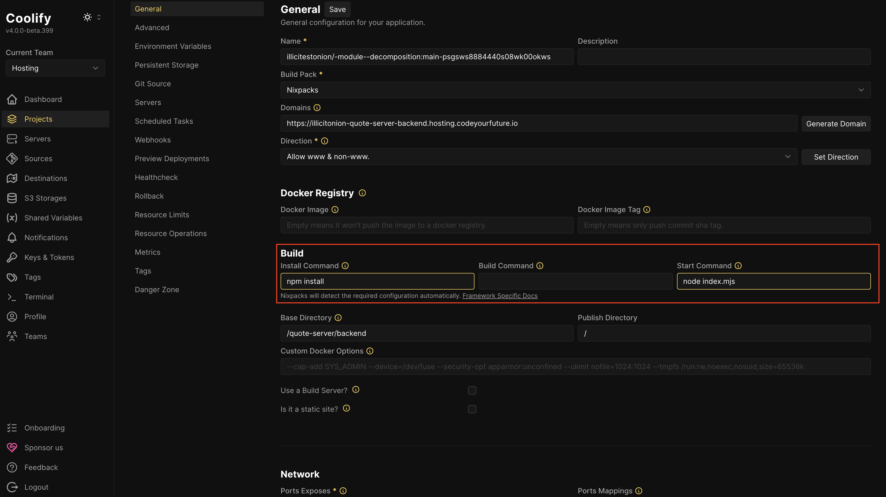
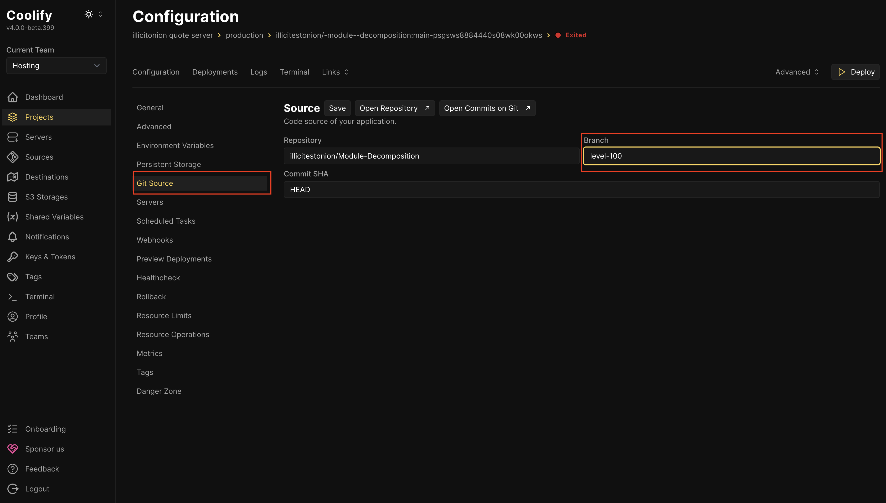
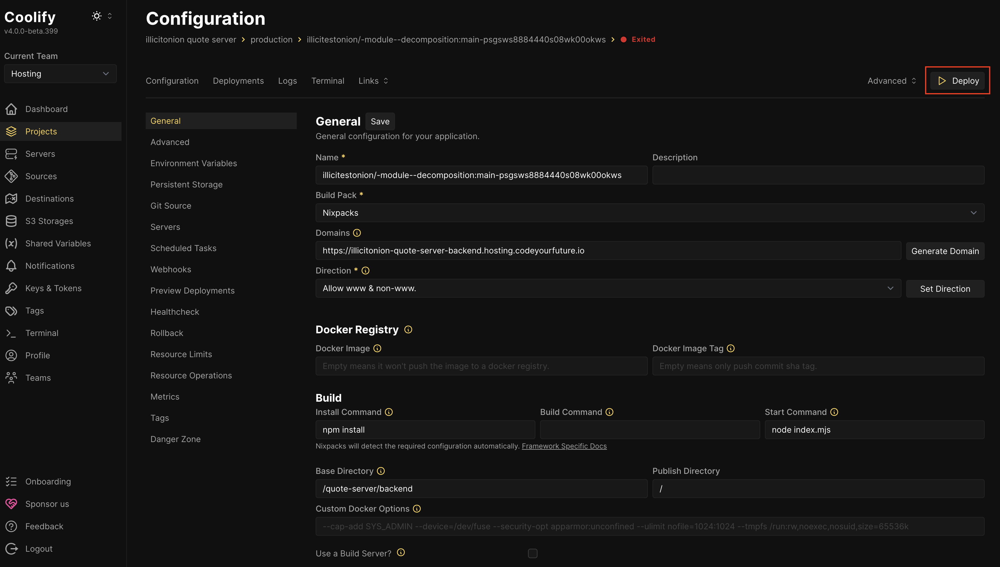

## Building your backend

It is easier for us to run this service if you use a Dockerfile to build your project. How you do this depends on the language you're using.

### Node.js / JavaScript

If your backend uses Node.js (i.e. is written in JavaScript), you should make sure you build it with Docker. For most projects, this means you need to:

**Create a Dockerfile**

This is a filed named `Dockerfile` in the directory of your project. The following contents will probably work (you may need to change the `"index.mjs"` to be the entry-point of your project):

```dockerfile
FROM node:alpine
ENV NODE_ENV=production
COPY . /app
WORKDIR /app
RUN npm install
ENTRYPOINT ["node", "index.mjs"]
```

Check this file into your repository.

To test this locally before deploying, `cd` into the file containing the `Dockerfile` and run the following command:

```
docker build -t test-build . && docker run -it --rm -p 3000:3000 test-build
```

If your program successfully starts and runs, you're set. If not, you'll need to debug this (and if you're stuck, ask on Slack!)

### Other languages

You may need to research how to dockerise your backend. If you're stuck, ask for help on Slack.

## Creating a backend

**Click "Add New Resource"**



**Add the GitHub repository**

The hosting platform needs to know where to get your backend from.

You probably want to add a "Public Repository" Git Based repository, to tell it your project is in GitHub.

If you want your application to auto-deploy when you push changes to it, you'll need to instead choose "Private Repository (with GitHub App)" and set up a GitHub App yourself.



Open your GitHub in another tab, and **copy the HTTPS Clone URL**



Go back to the CYF Hosting and **paste the URL into the "Repository URL" field**



**Click "Check repository"**.

If your backend is in a sub-directory of your GitHub repository, update the **Base Directory** (e.g. to `/quote-server/backend` if that's where your backend is).

> [!IMPORTANT]
>
> **For projects building with Docker (e.g. Node.js projects)**
>
> Make sure to select "Dockerfile" from the "Build Pack" menu:
>
> 
>
> **For projects that are not using Docker**
>
> Make sure the **Port** field contains the correct port number that your backend will listen on.

**For everyone**

Press **Continue**.

## Configuring the backend

Most things should Just Work.

There are some things you may want or need to configure. If you do change any, you need to press the **Enter** key to save the change.

You may want to choose a friendly/memorable **Domain**:



If things aren't auto-detected properly, you may need to explicitly enter the commands used to **Install** your dependencies, **Build** your backend, or **Start** your backend:



If you want to deploy from a branch that isn't `main`, you need to configure this in the Git Source tab:



## Deploying the backend

When everything is configured correctly, press the **Deploy** button:



Watch the logs. Fix anything that goes wrong. When the deploy is finished, you can test out your backend.
